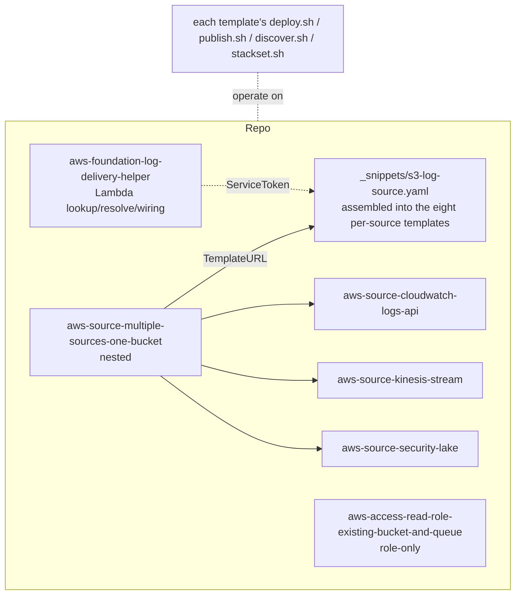
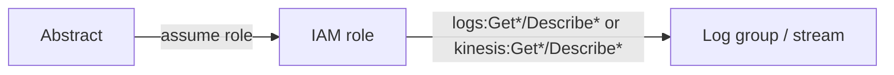
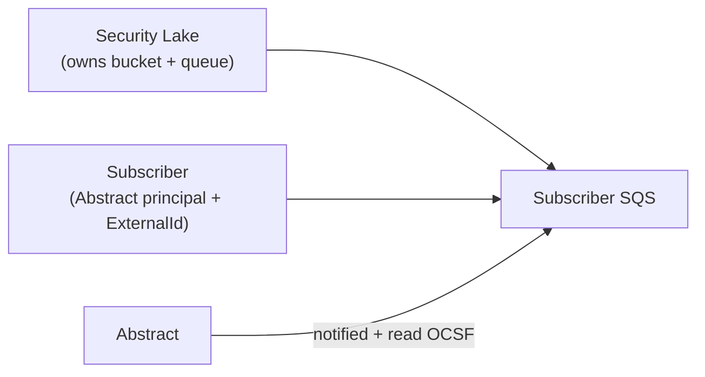

# Architecture

How the templates are structured, how data flows for each source family, and the design
decisions behind them.

## Component map



The **universal source** (`templates/aws/_snippets/s3-log-source.yaml`) is the workhorse: one authored template whose `SourceType` parameter
selects one of eight S3 + SQS sources. `python -m tools.templates generate` specializes it into one folder per source (`SourceType` fixed, the other sources' resources and parameters removed), so each source deploys as its own template. It centralizes the per-source differences in a
`Mappings` table (`SourceConfig`) and a set of `Conditions`, so the same battle-tested bucket
/ queue / SNS / KMS / IAM code path serves every source. The standalone templates exist
because their sources don't use S3 + SQS at all (CloudWatch Logs, Kinesis) or are owned by a
different service (Security Lake).

## Data flow per family

### ① S3 + SQS

```mermaid
flowchart LR
  P["Producer<br/>(service principal per source)"] -->|PutObject| B[("S3 bucket<br/>SSE, versioned, PAB")]
  B -->|s3:ObjectCreated:*| Q["SQS queue"]
  B -. or .->|event| T["SNS topic"] --> Q
  P -. CloudTrail native .-> T
  Q --> DLQ["Dead-letter queue"]
  R["IAM role / user"] -->|GetObject + Receive/Delete| B & Q
  ABS[Abstract] -->|assume role / key| R
```

- The **producer** writes to S3 using a source-specific service principal
  (`SourceConfig.Principal`). The bucket policy grants exactly that principal `PutObject`
  (and `GetBucketAcl` where the source needs the ACL handshake).
- **Notification** routes via `NotificationPath`: S3→SQS, S3→SNS→SQS, or (CloudTrail)
  Trail→SNS→SQS. SNS enables fan-out to multiple consumers.
- Abstract **assumes the role** (or uses the access key) to `GetObject` from the bucket and
  `ReceiveMessage`/`DeleteMessage` on the queue.

### ② API-poll (CloudWatch Logs, Kinesis)



No storage or queue — Abstract calls the service API on a schedule. The template only
creates the scoped IAM identity (and, optionally, the Kinesis stream itself).

### ③ Security Lake



Security Lake provisions the OCSF data bucket and notification; the template registers
Abstract as a subscriber with `AccessType=S3` and an SQS notification.

## Key design decisions

| Decision | Why |
| --- | --- |
| One universal S3+SQS template, not eight | Single hardened code path; per-source differences are data (Mappings/Conditions), not duplicated YAML. |
| `Mappings.SourceConfig` for principal + ACL default | Console-visible, no logic in the resource bodies; override via `LogDeliveryPrincipalOverride`/`RequireAclHeader`. |
| `!If [Cond, <stmt>, !Ref "AWS::NoValue"]` for variable policy statements | Lets one bucket/queue policy serve every source without separate templates. |
| `DeletionPolicy: Retain` on the bucket | Logs survive an accidental stack delete. |
| Producers only when the stack **owns** the bucket | CloudFormation can't attach a policy/notification to a bucket it didn't create; for existing buckets you wire the producer and use `NotificationPath=None`. |
| CloudTrail forced through SNS | CloudTrail's native delivery is SNS; this also guarantees the topic policy exists before the trail (ordering). |
| `AllowedValues` everywhere enumerable | Native console dropdowns; headless-deploy-safe (unlike AWS-specific typed params, which can't be blank). |
| `ExportToSsm` writes outputs to Parameter Store | Makes a stack's role/queue/bucket discoverable by other stacks, regions, and tooling. |
| Optional Secrets Manager for access keys | Keeps long-lived secrets out of stack outputs. |
| Lookup/wiring as a separate Lambda helper, not baked into the core | Keeps the universal template pure-CFN and quick-create-friendly; the helper is opt-in and reused via an exported `ServiceToken`. |
| Observability (alarms/dashboard) optional and off by default | No surprise CloudWatch/SNS cost; turn on per source or via the master. |
| Embedded Lambda via inline `ZipFile` | No external artifact/bucket needed; deploys with quick-create. CI compiles it on every push. |

## The helper (lookup / resolve / producer-wiring)

`aws-foundation-log-delivery-helper` deploys a Python Lambda fronted by
a `Custom::AbstractHelper` resource. Read operations (`ResolveKmsKey`, `ResolveQueue`,
`ValidateBucket`, `ResolveStream`, `ResolveWebAcl`, `CheckLogGroup`) use read-only APIs and
return the resolved ARN/URL in the stack outputs. Write operations (`EnableS3SourceLogging`,
`EnableAlbAccessLogs`) wire a producer and are only granted IAM permissions when selected (or
when `AllowProducerWiring=true`). The function exports its `ServiceToken`, so other stacks can
declare their own `Custom::AbstractHelper` resources against it. The handler always returns a
signed CloudFormation response (success or failure with the reason) and no-ops on `Delete`.

## Observability

When enabled on an S3+SQS source, the template adds a dedicated alarm SNS topic (optionally
email-subscribed), a **DLQ-not-empty** alarm (Abstract failing to process), a
**queue-age** alarm (ingestion lag), and a **CloudWatch dashboard** (backlog, oldest-message
age, send/receive/delete rates). All are off by default and require `QueueMode=CreateNew`.

## Conditions & rules

The universal template uses **Rules** (pre-deploy assertions shown in the console) to fail
fast on bad input — e.g. AssumeRole requires a principal + External ID, an org trail requires
an org ID, `UseExisting` modes require the corresponding ARN/name. **Conditions** drive which
resources are created (bucket, queue, SNS, KMS, each producer, role vs. user, SSM exports).

See [SOURCES.md](SOURCES.md) for the full parameter catalog and [SECURITY.md](SECURITY.md)
for the trust and least-privilege model.
