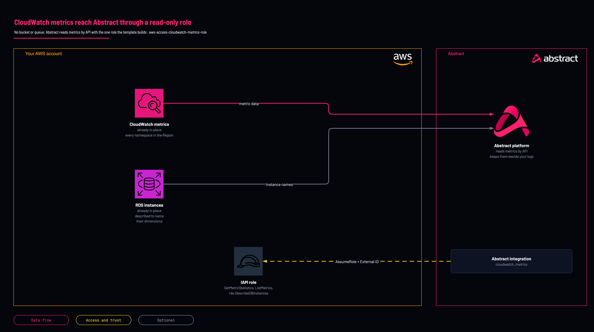

# CloudWatch metrics to Abstract: read-only role

<!-- Generated from template.yml by `python -m tools.templates generate`. Do not edit. -->

Creates only the read-only IAM role Abstract assumes, with an External ID, to read CloudWatch metrics and describe RDS instances for the AWS CloudWatch Metrics integration. There is no bucket and no queue. Deployed in a test account on 2026-10-07. The role was assumed with its External ID.

**Cloud:** aws · **Role:** access · **Scope:** account



Editable source: [diagram.drawio](diagram.drawio)

## When to use

You want infrastructure metrics in Abstract next to your logs, usually for correlation rather than detection.

**Not for:** You want log data; CloudWatch Logs has its own template (aws-source-cloudwatch-logs-api).

Not sure this is the right one, or what to deploy before it? Answer a few questions in [the setup guide](https://github.com/IamABS3C/abstract-cloud-templates/blob/main/docs/aws/GUIDE.md).

## Deploy

From a shell, in this folder:

```bash
./deploy.sh
```

## Prerequisites

- AWS CLI v2, authenticated, and jq for deploy.sh
- The Abstract principal ARN (or account ID) and External ID for your tenant, from the CloudWatch Metrics integration in the Abstract console
- The permission set is the platform's own cloudwatch_metrics_api_role (GetMetricStatistics, ListMetrics, DescribeDBInstances); if the integration reports missing metrics for a service, add that service's specific Describe action rather than a wildcard

## Parameters

| Name | Type | Required | Description | Find it |
|---|---|---|---|---|
| `NamePrefix` | string | no | Prefix for the created IAM role name. |  |
| `AbstractPrincipalArn` | string | no | The principal Abstract provides. Accepts a full IAM role/user/root ARN or a bare 12-digit account id (expanded to arn:aws:iam::&lt;acct&gt;:root). | `Abstract console: the AWS integration's role step shows the principal and the External ID` |
| `ExternalId` | securestring | no | External ID provided by Abstract, enforced on sts:AssumeRole. It is PER-TENANT: copy it from the integration in the Abstract console, once, and give the same value to whoever deploys the role. | `Abstract console: the AWS integration's role step shows the principal and the External ID` |
| `PermissionsBoundaryArn` | string | no | Optional IAM permissions-boundary policy ARN to attach to the role. Find it with: aws iam list-policies --scope Local --query Policies[].Arn | `aws iam list-policies --scope Local --query Policies[].Arn` |
| `MaxSessionDurationSeconds` | int | no | Maximum duration of an assumed session (3600-43200 seconds, the range IAM accepts for a role). |  |

## Permissions

- **Create IAM roles** on The target AWS account: Deployer: the template creates the role Abstract assumes; deploy.sh passes CAPABILITY_NAMED_IAM because it names the role.
- **sts:AssumeRole, conditioned on sts:ExternalId** on &lt;NamePrefix&gt;-role: Abstract: only the Abstract principal you supply can assume it, and only with the matching External ID.
- **cloudwatch:GetMetricStatistics, cloudwatch:ListMetrics** on Resource "*", because these two actions have no resource type in IAM: Abstract: read metric data points and list the metrics in a namespace.
- **rds:DescribeDBInstances** on All RDS instances in the account (the list action cannot be scoped to a resource): Abstract: resolve RDS instance dimensions to names.

## Creates

- An IAM role &lt;NamePrefix&gt;-role trusted only by the Abstract principal, conditioned on the External ID
- One inline policy with the CloudWatch metric reads and the scoped RDS describe

## Never touches

- Metrics, alarms, dashboards and RDS instances; the role can only read them
- IAM principals other than the role the stack creates

## Outputs

- `RoleArn`
- `AwsRegion`

## Verify

| Check | Command | Healthy when |
|---|---|---|
| The role ARN is available for the Abstract integration | `aws cloudformation describe-stacks --stack-name <stack-name> --query 'Stacks[0].Outputs' --output table` | RoleArn is present; paste it into the CloudWatch Metrics integration with the namespace and Region to read. |
| The role can read metrics | `aws cloudwatch list-metrics --namespace AWS/EC2 --max-items 5` | Run as the role (or an identity with the same policy), the call returns metrics instead of AccessDenied. |
