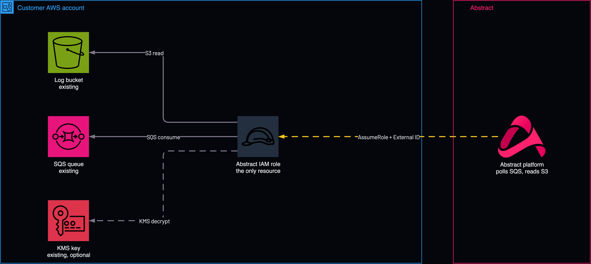

# Read role, existing bucket

<!-- Generated from template.yml by `python -m tools.templates generate`. Do not edit. -->

Creates only the least-privilege IAM role Abstract assumes, with an External ID, to read log objects from an existing bucket and consume notifications from an existing queue. It is the role-based option the Abstract S3 + SQS integration wizards refer to as Generate IAM Role Permissions.

**Cloud:** aws · **Role:** access · **Scope:** account



Editable source: [diagram.drawio](diagram.drawio)

## When to use

Logs already land in a bucket that notifies a queue, and Abstract only needs a role to read them.

Not sure this is the right one? See [the chooser](https://github.com/IamABS3C/abstract-cloud-templates/blob/main/docs/aws/CHOOSE.md).

## Deploy

[](https://us-east-1.console.aws.amazon.com/cloudformation/home?region=us-east-1#/stacks/create/review?templateURL=https%3A%2F%2Fabstract-cloud-templates-launch.s3.us-east-1.amazonaws.com%2Ftemplates%2Faws%2Faws-access-read-role-existing-bucket-and-queue%2Ftemplate.yaml&stackName=abstract-access-read-role-existing-bucket-and-queue)

Opens the CloudFormation console in us-east-1. For another Region, change `us-east-1` in both places in the link, or use the Region picker in the onboarding app.

Or from a shell, in this folder:

```bash
./deploy.sh
```

## Prerequisites

- AWS CLI v2, authenticated, and jq for deploy.sh
- An existing S3 bucket and an existing SQS queue that receives its notifications
- The Abstract principal ARN (or account ID) and External ID for your tenant
- The KMS key ARN, if the bucket or queue uses a customer-managed key
- The existing bucket's name (LogBucketName) and the existing queue's ARN (SqsQueueArn)

## Parameters

| Name | Type | Required | Description | Find it |
|---|---|---|---|---|
| `NamePrefix` | string | no | Prefix for created IAM resource names. |  |
| `AbstractPrincipalArn` | string | no | The principal Abstract provides. Accepts a full IAM/role/user ARN (arn:aws:iam::&lt;acct&gt;:root\|role/...\|user/...) or a bare 12-digit account id (which is expanded to arn:aws:iam::&lt;acct&gt;:root). | `Abstract console: the AWS integration's role step shows the principal and the External ID` |
| `ExternalId` | securestring | no | External ID provided by Abstract, enforced on sts:AssumeRole to prevent the confused-deputy problem. Abstract supplies this and it is PER-TENANT — copy it from the integration in the Abstract console. Note the console regenerates the External ID on each pass, so mint it once and give the SAME value to whoever deploys the role. | `Abstract console: the AWS integration's role step shows the principal and the External ID` |
| `LogBucketName` | string | yes | Name of the existing S3 bucket Abstract reads log objects from. Find it with: aws s3 ls | `aws s3 ls` |
| `LogBucketPrefix` | string | no | Optional key prefix to restrict reads (e.g. "AWSLogs/" or "cloudfront-logs/"). Leave blank to allow the whole bucket. |  |
| `SqsQueueArn` | string | yes | ARN of the existing SQS queue that receives the S3/SNS notifications. Find it with: aws sqs get-queue-attributes --queue-url QUEUE_URL --attribute-names QueueArn | `aws sqs get-queue-attributes --queue-url QUEUE_URL --attribute-names QueueArn` |
| `KmsKeyArn` | string | no | Optional KMS key ARN. If the bucket or queue is encrypted with a customer managed key, supply it here so the role is granted kms:Decrypt on that key Find it with: aws kms list-aliases only. Leave blank for SSE-S3 / SSE-SQS (AWS managed) encryption. | `aws kms list-aliases only. Leave blank for SSE-S3 / SSE-SQS (AWS managed) encryption.` |
| `PermissionsBoundaryArn` | string | no | Optional IAM permissions-boundary policy ARN to attach to the created role/user. Only if your account mandates a boundary on every role. Find it with: aws iam list-policies --scope Local --query Policies[].Arn | `aws iam list-policies --scope Local --query Policies[].Arn` |
| `MaxSessionDurationSeconds` | int | no | Maximum duration of an assumed session (3600-43200 seconds, the range IAM accepts for a role). |  |
| `CreateAccessKeyUser` | string | no | Create a long-lived IAM user + access key instead of (or in addition to) role-based auth. Prefer role-based auth; only use this when Abstract cannot assume a role (e.g. the Abstract instance is not on AWS). |  |

## Permissions

- **Create IAM roles and users** on The target AWS account: Deployer: The template creates the role Abstract assumes.
- **s3:ListBucket, s3:GetBucketLocation, s3:GetObject** on The named bucket, scoped to LogBucketPrefix when set: Abstract ingest role: Read the log objects.
- **sqs:ReceiveMessage, sqs:DeleteMessage, sqs:ChangeMessageVisibility, sqs:GetQueueAttributes, sqs:GetQueueUrl** on The named queue: Abstract ingest role: Consume the S3 or SNS notifications.
- **kms:Decrypt, kms:GenerateDataKey, kms:DescribeKey** on The KMS key, only when KmsKeyArn is supplied: Abstract ingest role: Read a bucket or queue protected by a customer-managed key.

## Creates

- An IAM role &lt;NamePrefix&gt;-role trusted only by the Abstract principal, conditioned on the External ID
- Inline policies for S3 read, SQS consume and, when KmsKeyArn is set, KMS decrypt
- Optional IAM user &lt;NamePrefix&gt;-user and access key (CreateAccessKeyUser=true, not recommended)

## Never touches

- The existing bucket, its notification configuration and the queue: the template only grants read access to them (derived from declared resources)

## Outputs

- `RoleArn`
- `AccessKeyId`
- `SecretAccessKey`

## Verify

| Check | Command | Healthy when |
|---|---|---|
| The role ARN is available for the Abstract integration | `aws cloudformation describe-stacks --stack-name <stack-name> --query 'Stacks[0].Outputs' --output table` | RoleArn is present; paste it into the integration as the Assume Role ARN. |
