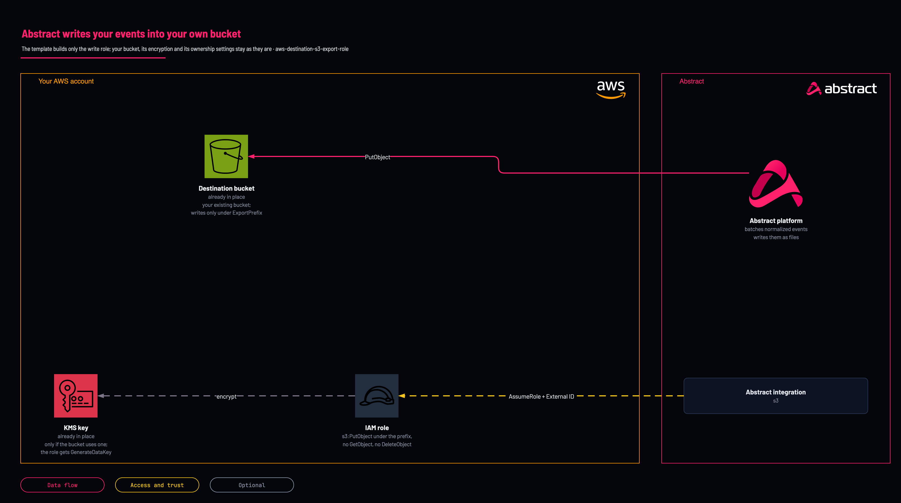

# Abstract to your S3 bucket: write-only export role

<!-- Generated from template.yml by `python -m tools.templates generate`. Do not edit. -->

Creates only the IAM role Abstract assumes, with an External ID, to write exported events into one existing S3 bucket under one prefix, for the S3 Export destination. The role cannot read your objects. Deployed in a test account on 2026-10-07. The role was assumed with its External ID.

**Cloud:** aws · **Role:** destination · **Scope:** account



Editable source: [diagram.drawio](diagram.drawio)

## When to use

Abstract should write its normalized events to your own bucket, for long-term storage, a data lake or another tool's ingest bucket.

**Not for:** You want Abstract to read logs from a bucket; use one of the source templates or the read-only role (aws-access-read-role-existing-bucket-and-queue).

Not sure this is the right one, or what to deploy before it? Answer a few questions in [the setup guide](https://github.com/IamABS3C/abstract-cloud-templates/blob/main/docs/aws/GUIDE.md).

## Deploy

From a shell, in this folder:

```bash
./deploy.sh
```

## Prerequisites

- AWS CLI v2, authenticated, and jq for deploy.sh
- An existing S3 bucket, with Object Ownership set to Bucket owner enforced so every object Abstract writes is owned by your account
- The Abstract principal ARN (or account ID) and External ID, from the S3 Export integration in the Abstract console
- The KMS key ARN, if the bucket's default encryption is a customer managed key; its key policy must let this account's IAM policies grant kms:GenerateDataKey and kms:Decrypt
- A lifecycle rule that aborts incomplete multipart uploads after a few days, so a failed upload does not leave billed parts behind

## Parameters

| Name | Type | Required | Description | Find it |
|---|---|---|---|---|
| `NamePrefix` | string | no | Prefix for the created IAM role name. |  |
| `AbstractPrincipalArn` | string | no | The principal Abstract provides. Accepts a full IAM role/user/root ARN or a bare 12-digit account id (expanded to arn:aws:iam::&lt;acct&gt;:root). | `Abstract console: the AWS integration's role step shows the principal and the External ID` |
| `ExternalId` | securestring | no | External ID provided by Abstract, enforced on sts:AssumeRole. It is PER-TENANT: copy it from the S3 Export integration in the Abstract console, once, and give the same value to whoever deploys the role. | `Abstract console: the AWS integration's role step shows the principal and the External ID` |
| `BucketName` | string | yes | Name of the existing S3 bucket Abstract writes to. One bucket per stack. Find it with: aws s3 ls | `aws s3 ls` |
| `ExportPrefix` | string | no | Key prefix the write grant is scoped to, matching the Path Format you set in the integration (e.g. abstract/exports/). Empty means the whole bucket. A prefix must end with '/', because S3 prefixes are string matches: 'exports' would also grant 'exports-other/'. |  |
| `KmsKeyArn` | string | no | Optional. The KMS key ARN when the bucket's default encryption is SSE-KMS with a customer managed key. The role then gets kms:GenerateDataKey and kms:Decrypt on it; the key policy must also allow this account's IAM policies to grant them. | `aws s3api get-bucket-encryption --bucket <bucket>` |
| `PermissionsBoundaryArn` | string | no | Optional IAM permissions-boundary policy ARN to attach to the role. Find it with: aws iam list-policies --scope Local --query Policies[].Arn | `aws iam list-policies --scope Local --query Policies[].Arn` |
| `MaxSessionDurationSeconds` | int | no | Maximum duration of an assumed session (3600-43200 seconds, the range IAM accepts for a role). |  |

## Permissions

- **Create IAM roles** on The target AWS account: Deployer: the template creates the role Abstract assumes; deploy.sh passes CAPABILITY_NAMED_IAM because it names the role.
- **sts:AssumeRole, conditioned on sts:ExternalId** on &lt;NamePrefix&gt;-role: Abstract: only the Abstract principal you supply can assume it, and only with the matching External ID.
- **s3:ListBucket, s3:GetBucketLocation** on The named bucket: Abstract: find the bucket's Region and confirm it exists before writing.
- **s3:PutObject, s3:AbortMultipartUpload** on The named bucket, under ExportPrefix: Abstract: write export files, including multipart uploads, and abandon a failed upload cleanly.
- **kms:GenerateDataKey, kms:Decrypt** on The KMS key, only when KmsKeyArn is supplied: Abstract: write into a bucket whose default encryption is a customer managed key (a multipart write needs both).

## Creates

- An IAM role &lt;NamePrefix&gt;-role trusted only by the Abstract principal, conditioned on the External ID
- An inline write policy scoped to the bucket and prefix and, when KmsKeyArn is set, a KMS policy for that key

## Never touches

- The bucket itself: its policy, encryption, ownership and lifecycle settings stay as they are
- Objects already in the bucket: the role has no s3:GetObject or s3:DeleteObject

## Outputs

- `RoleArn`
- `BucketNameOut`
- `AwsRegion`

## Verify

| Check | Command | Healthy when |
|---|---|---|
| The role ARN is available for the Abstract integration | `aws cloudformation describe-stacks --stack-name <stack-name> --query 'Stacks[0].Outputs' --output table` | RoleArn, BucketNameOut and AwsRegion are present; enter them in the S3 Export integration. |
| Abstract's first export file landed and your account owns it | `aws s3api list-objects-v2 --bucket <bucket> --prefix <export-prefix> --max-items 1 --fetch-owner` | An object appears within one batch timeout, and its Owner is your account, not Abstract's. |
