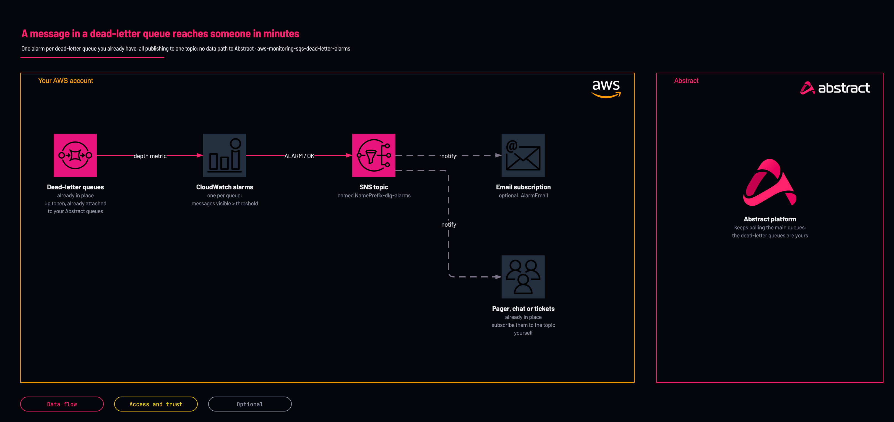

# Dead-letter queue alarms: email when Abstract cannot read

<!-- Generated from template.yml by `python -m tools.templates generate`. Do not edit. -->

Creates a CloudWatch alarm on each of up to ten existing SQS dead-letter queues and one SNS topic they publish to, with an optional email subscription, so a message Abstract could not process is seen within minutes. It creates no queue and changes none. Deployed in a test account on 2026-10-07. A message on the dead-letter queue put the alarm in ALARM.

**Cloud:** aws · **Role:** monitoring · **Scope:** account



Editable source: [diagram.drawio](diagram.drawio)

## When to use

Your Abstract queues have dead-letter queues and nobody would notice a message landing in one; do this for every source before go-live.

**Not for:** The queue was created by a source template here with EnableDlqAlarm=true; it already has this alarm.

Not sure this is the right one, or what to deploy before it? Answer a few questions in [the setup guide](https://github.com/IamABS3C/abstract-cloud-templates/blob/main/docs/aws/GUIDE.md).

## Deploy

From a shell, in this folder:

```bash
./deploy.sh
```

## Prerequisites

- AWS CLI v2, authenticated to the account and Region of the queues, and jq for deploy.sh
- Dead-letter queues that already exist and are attached to your Abstract notification queues by a redrive policy (every source template here creates one); this template does not attach a dead-letter queue to a queue that has none
- An alarm on a queue name that does not exist never fires, because a missing metric counts as not breaching: check each name with the first verify step

## Parameters

| Name | Type | Required | Description | Find it |
|---|---|---|---|---|
| `NamePrefix` | string | no | Prefix for the alarm and topic names. |  |
| `DeadLetterQueueNames` | array | yes | Names (not URLs or ARNs) of up to ten existing dead-letter queues in this account and Region, comma separated, e.g. abstract-CloudTrail-dlq,abstract-VPCFlow-dlq. Names beyond the tenth get no alarm, so deploy.sh refuses more than ten. | `aws sqs list-queues --queue-name-prefix abstract` |
| `AlarmThreshold` | int | no | The alarm fires when a queue holds MORE than this many visible messages. 0 fires on the first one. |  |
| `PeriodSeconds` | int | no | How often each queue's depth is evaluated. SQS publishes these metrics every minute at most. |  |
| `AlarmEmail` | string | no | Optional email address subscribed to the alarm topic. AWS sends a confirmation email that must be accepted. |  |

## Permissions

- **cloudwatch:PutMetricAlarm, sns:CreateTopic, sns:Subscribe** on The target AWS account and Region: Deployer: the template creates the alarms, the topic and the optional email subscription.

## Creates

- An SNS topic &lt;NamePrefix&gt;-dlq-alarms, with SNS's default settings: CloudWatch cannot publish to a topic encrypted with the AWS managed key, and the alarm messages carry no log data
- An optional email subscription to that topic (AlarmEmail), which AWS confirms by email
- One CloudWatch alarm per queue name, &lt;NamePrefix&gt;-&lt;queue&gt;-not-empty, on ApproximateNumberOfMessagesVisible (Maximum over PeriodSeconds, greater than AlarmThreshold, missing data treated as not breaching)

## Never touches

- The queues: the alarms only read their metrics; no redrive policy, queue policy or message is changed
- Any Abstract integration or IAM role

## Outputs

- `AlarmTopicArn`
- `WatchedQueues`

## Verify

| Check | Command | Healthy when |
|---|---|---|
| Every watched queue name is real and publishes metrics | `aws cloudwatch list-metrics --namespace AWS/SQS --metric-name ApproximateNumberOfMessagesVisible --dimensions Name=QueueName,Value=<queue-name>` | One metric is listed for each name in WatchedQueues. |
| The alarms exist and are not in alarm | `aws cloudwatch describe-alarms --alarm-name-prefix <NamePrefix>- --query 'MetricAlarms[].[AlarmName,StateValue]' --output table` | One alarm per queue, each OK (or INSUFFICIENT_DATA for a queue that has never held a message). |
| The email subscription is confirmed | `aws sns list-subscriptions-by-topic --topic-arn <AlarmTopicArn>` | The email endpoint shows a subscription ARN, not PendingConfirmation. |
