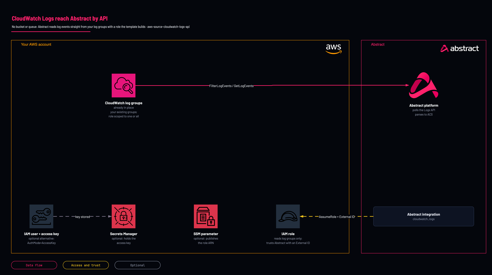

# CloudWatch Logs by API

<!-- Generated from template.yml by `python -m tools.templates generate`. Do not edit. -->

CloudWatch Logs is an API-poll source with no bucket or queue: Abstract reads log events directly. This template creates only the cross-account identity Abstract uses, scoped to one log group or to every log group in the account and region.

**Cloud:** aws · **Role:** source · **Scope:** account



Editable source: [diagram.drawio](diagram.drawio)

## When to use

Logs live in CloudWatch Logs and Abstract should read them by API, with no bucket or queue in between.

**Not for:** High-volume log groups, where an S3 export or a subscription to Kinesis is cheaper than API polling.

## Deploy

From a shell, in this folder:

```bash
./deploy.sh
```

## Prerequisites

- AWS CLI v2, authenticated, and jq for deploy.sh
- The Abstract principal ARN (or account ID) and External ID for your tenant
- The log group name, if access is to be scoped to one group
- The KMS key ARN, if the log groups use a customer-managed key

## Parameters

| Name | Type | Required | Description | Find it |
|---|---|---|---|---|
| `NamePrefix` | string | no | Prefix for created IAM resource names. |  |
| `AuthMode` | string | no | AssumeRole (recommended) or AccessKey (long-lived user + key). |  |
| `AbstractPrincipalArn` | string | no | Required for AssumeRole. Full IAM ARN or bare 12-digit account ID. Abstract supplies this and it is PER-TENANT — copy it from the integration in the Abstract console. Note the console regenerates the External ID on each pass, so mint it once and give the SAME value to whoever deploys the role. | `Abstract console: the AWS integration's role step shows the principal and the External ID` |
| `ExternalId` | securestring | no | Required for AssumeRole. Shared secret enforced on sts:AssumeRole. Abstract supplies this and it is PER-TENANT — copy it from the integration in the Abstract console. Note the console regenerates the External ID on each pass, so mint it once and give the SAME value to whoever deploys the role. | `Abstract console: the AWS integration's role step shows the principal and the External ID` |
| `MaxSessionDurationSeconds` | int | no | Maximum duration of an assumed-role session, in seconds. |  |
| `PermissionsBoundaryArn` | string | no | Only if your account mandates a permissions boundary on every role. Find it with: aws iam list-policies --scope Local --query Policies[].Arn | `aws iam list-policies --scope Local --query Policies[].Arn` |
| `StoreCredentialsInSecretsManager` | string | no | For AccessKey mode, store the key in Secrets Manager instead of stack outputs. |  |
| `ExportToSsm` | string | no | Publish the role ARN to SSM Parameter Store under /NamePrefix/cloudwatch-logs/role-arn for later lookup. |  |
| `LogGroupName` | string | no | Optional log group name to scope access to (e.g. /aws/lambda/my-fn). Blank = all log groups in this account/region. Find it with: aws logs describe-log-groups --query logGroups[].logGroupName | `aws logs describe-log-groups --query logGroups[].logGroupName` |
| `ScopeToSingleGroup` | string | no | If true and a LogGroupName is given, restrict permissions to that one group (and its streams). If false, grants read across all groups (Describe needs *). |  |
| `KmsKeyArn` | string | no | Supply if the log group(s) are encrypted with a customer-managed KMS key. Find it with: aws kms list-aliases | `aws kms list-aliases` |

## Permissions

- **Create IAM roles and users** on The target AWS account: Deployer: The template creates the identity Abstract uses.
- **logs:DescribeLogGroups, logs:DescribeLogStreams** on All log groups (Describe needs *): Abstract role: Enumerate groups and streams.
- **logs:GetLogEvents, logs:FilterLogEvents, logs:GetLogRecord, logs:StartQuery, logs:StopQuery, logs:GetQueryResults** on The named log group when ScopeToSingleGroup=true, otherwise every log group in the account and region: Abstract role: Read the log events.
- **kms:Decrypt, kms:DescribeKey** on The KMS key, only when KmsKeyArn is supplied: Abstract role: Read log groups encrypted with a customer-managed key.

## Creates

- An IAM role &lt;NamePrefix&gt;-role Abstract assumes with the External ID (AssumeRole), or an IAM user and access key (AccessKey)
- Optional Secrets Manager secret holding the access key instead of a stack output (StoreCredentialsInSecretsManager)
- Optional SSM parameter publishing the role ARN (ExportToSsm)

## Never touches

- Log groups, subscription filters or retention settings: the template declares only IAM, Secrets Manager and SSM resources (derived from declared resources)

## Outputs

- `AuthModeOut`
- `AwsRegion`
- `RoleArn`
- `AccessKeyId`
- `SecretAccessKey`
- `CredentialsSecretArn`

## Example parameter profiles

- `default.parameters.json`

## Verify

| Check | Command | Healthy when |
|---|---|---|
| The role ARN and region are available for the Abstract integration | `aws cloudformation describe-stacks --stack-name abstract-cloudwatchlogs --query 'Stacks[0].Outputs' --output table` | RoleArn and AwsRegion are present. |
| Abstract can assume the role and read |  | The integration saves and reads without an access error; on failure verify RoleArn and ExternalId, and the KMS grant for encrypted groups. |
