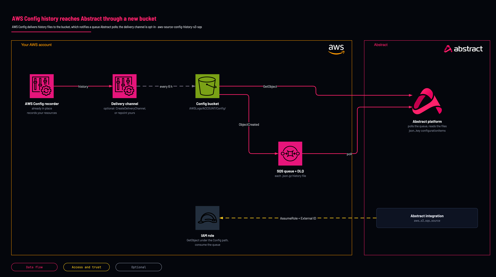

# AWS Config history to Abstract: new bucket and queue

<!-- Generated from template.yml by `python -m tools.templates generate`. Do not edit. -->

Creates a hardened bucket AWS Config may deliver to, the SQS queue it notifies for each configuration history file, the role Abstract assumes to read them and, only when you opt in, this Region's AWS Config delivery channel. Abstract reads it with the generic S3 source and a custom parser. Deployed in a test account on 2026-10-07. A Config history file reached the queue, and the role was assumed with its External ID.

**Cloud:** aws · **Role:** source · **Scope:** account



Editable source: [diagram.drawio](diagram.drawio)

## When to use

You want configuration changes and drift in Abstract, from AWS Config's history files.

**Not for:** You collect AWS Config through Security Lake or an organization aggregator you already read.

Not sure this is the right one, or what to deploy before it? Answer a few questions in [the setup guide](https://github.com/IamABS3C/abstract-cloud-templates/blob/main/docs/aws/GUIDE.md).

## Deploy

From a shell, in this folder:

```bash
./deploy.sh
```

## Prerequisites

- AWS CLI v2, authenticated to the account and Region, and jq for deploy.sh
- AWS Config recording in this Region (aws configservice describe-configuration-recorders)
- With an existing delivery channel (the usual case), leave CreateDeliveryChannel=false and repoint it after deploying. Save it first, every field, because it is the rollback: aws configservice describe-delivery-channels &gt; config-channel-backup.json. Then change only the bucket and drop the key prefix and KMS key, keeping the SNS topic and snapshot frequency: jq '.DeliveryChannels[0] \| .s3BucketName = "&lt;BucketNameOut&gt;" \| del(.s3KeyPrefix, .s3KmsKeyArn)' config-channel-backup.json &gt; config-channel-abstract.json, then aws configservice put-delivery-channel --delivery-channel file://config-channel-abstract.json. Confirm describe-delivery-channels shows no s3KeyPrefix: a prefix moves the files outside AWSLogs/&lt;account&gt;/Config/, where the bucket policy refuses them and the queue never hears of them. To roll back, put .DeliveryChannels[0] of the backup with put-delivery-channel: that restores every field, not only the bucket
- The Abstract principal ARN (or account ID) and External ID, from the AWS S3 SQS Source integration in the Abstract console
- In Abstract, the AWS S3 SQS Source with dataformat json and json_key configurationItems, and a parser built against a real ConfigHistory file. Abstract has no managed AWS Config integration
- Configuration snapshots re-send every recorded resource; this template does not schedule them. If you deliver snapshots on purpose, they reach the same queue

## Cost

S3 storage and one SQS message per history file (one per resource type every six hours that something changed).

## Parameters

| Name | Type | Required | Description | Find it |
|---|---|---|---|---|
| `NamePrefix` | string | no | Prefix for created resource names. Lowercase, because it is part of the bucket name. |  |
| `AbstractPrincipalArn` | string | no | The principal Abstract provides. Accepts a full IAM role/user/root ARN or a bare 12-digit account id (expanded to arn:aws:iam::&lt;acct&gt;:root). | `Abstract console: the AWS integration's role step shows the principal and the External ID` |
| `ExternalId` | securestring | no | External ID provided by Abstract, enforced on sts:AssumeRole. It is PER-TENANT: copy it from the integration in the Abstract console, once, and give the same value to whoever deploys the role. | `Abstract console: the AWS integration's role step shows the principal and the External ID` |
| `PermissionsBoundaryArn` | string | no | Optional IAM permissions-boundary policy ARN attached to every role the stack creates. Find it with: aws iam list-policies --scope Local --query Policies[].Arn | `aws iam list-policies --scope Local --query Policies[].Arn` |
| `MaxSessionDurationSeconds` | int | no | Maximum duration of Abstract's assumed session (3600-43200 seconds, the range IAM accepts for a role). |  |
| `LogRetentionDays` | int | no | Days to keep log objects in the bucket before they expire (0 = keep forever). |  |
| `QueueVisibilityTimeoutSeconds` | int | no | Visibility timeout of the notification queue(s); longer than Abstract takes to process one object. |  |
| `DlqMaxReceiveCount` | int | no | Receives before a notification moves to the dead-letter queue. 5 surfaces a permanent failure within minutes. |  |
| `CreateDeliveryChannel` | string | no | true creates this Region's AWS Config delivery channel pointing at the new bucket. Only when the account has a configuration recorder and NO delivery channel yet; an account has one per Region. Leave false to repoint an existing channel yourself. |  |

## Permissions

- **Create IAM roles, S3 buckets, SQS queues and (opt-in) AWS Config delivery channels** on The target AWS account and Region: Deployer: the stack creates the whole path; deploy.sh passes CAPABILITY_NAMED_IAM because it names the role.
- **s3:GetBucketAcl, s3:ListBucket, s3:PutObject (with bucket-owner-full-control), conditioned on aws:SourceAccount** on The bucket, PutObject only under AWSLogs/&lt;account&gt;/Config/ (bucket policy): AWS Config (config.amazonaws.com): check the bucket and deliver history files.
- **sts:AssumeRole, conditioned on sts:ExternalId** on &lt;NamePrefix&gt;-config-role: Abstract: only the Abstract principal you supply can assume it, and only with the matching External ID.
- **s3:ListBucket, s3:GetBucketLocation, s3:GetObject** on The bucket, under AWSLogs/&lt;account&gt;/Config/: Abstract: read the objects each notification points at.
- **sqs:ReceiveMessage, sqs:DeleteMessage, sqs:ChangeMessageVisibility, sqs:GetQueueAttributes, sqs:GetQueueUrl** on The history queue: Abstract: consume the notifications.

## Creates

- A hardened bucket &lt;NamePrefix&gt;-config-&lt;account&gt;-&lt;region&gt;: Block Public Access, ACLs disabled, HTTPS-only policy, versioning, lifecycle expiry, retained on stack delete
- An SQS queue and dead-letter queue (SSE-SQS), notified for each .json.gz file under AWSLogs/&lt;account&gt;/Config/, so the empty ConfigWritabilityCheckFile never reaches Abstract
- Only with CreateDeliveryChannel=true: this Region's AWS Config delivery channel, pointed at the bucket, with no periodic snapshots; deleting the stack deletes the channel, and AWS Config then delivers nothing
- A cross-account IAM role &lt;NamePrefix&gt;-config-role trusted only by the Abstract principal, with the External ID

## Never touches

- The configuration recorder, its recorded resource types and any AWS Config rules
- An existing delivery channel, unless you opt in (and an account has at most one per Region)

## Outputs

- `AwsRegion`
- `BucketNameOut`
- `RoleArn`
- `SqsQueueUrl`
- `SqsQueueArn`
- `SqsDeadLetterQueueUrl`

## Verify

| Check | Command | Healthy when |
|---|---|---|
| The stack outputs carry the values the Abstract integration needs | `aws cloudformation describe-stacks --stack-name <stack-name> --query 'Stacks[0].Outputs' --output table` | RoleArn, SqsQueueUrl, SqsQueueArn, BucketNameOut and AwsRegion are present. |
| AWS Config delivers to the new bucket | `aws configservice describe-delivery-channel-status` | configHistoryDeliveryInfo shows lastStatus SUCCESS for the new bucket after the next delivery (up to six hours). |
| Nothing is failing into the dead-letter queue | `aws sqs get-queue-attributes --queue-url <dead-letter-queue-url> --attribute-names ApproximateNumberOfMessagesVisible` | Zero messages. |
