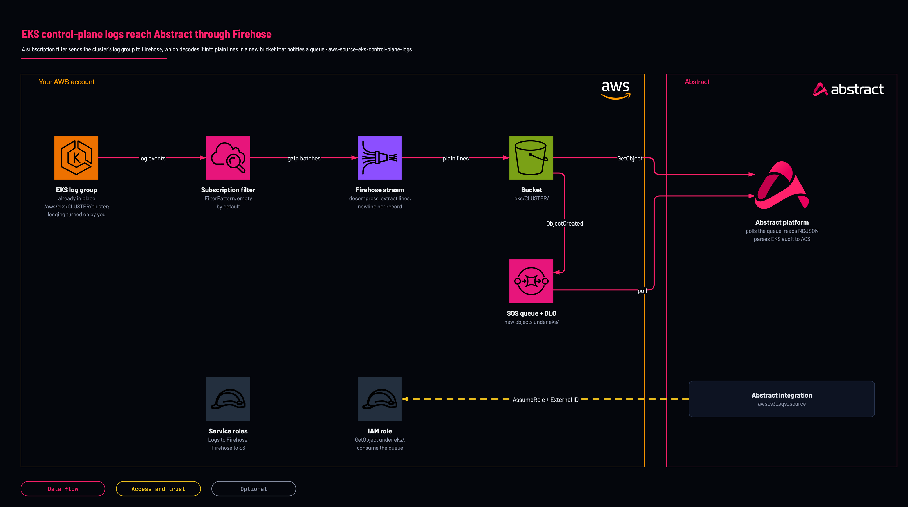

# EKS control-plane logs to Abstract: Firehose to S3

<!-- Generated from template.yml by `python -m tools.templates generate`. Do not edit. -->

Subscribes your EKS cluster's control-plane log group to a Firehose delivery stream that decompresses the records and writes one log line per line to a new hardened bucket, plus the SQS queue the bucket notifies and the role Abstract assumes to read them. For clusters too busy for the CloudWatch Logs API read. Not yet deployed by Abstract; canary pending.

**Cloud:** aws · **Role:** source · **Scope:** account



Editable source: [diagram.drawio](diagram.drawio)

## When to use

You want EKS control-plane (especially audit) logs in Abstract and the cluster is too busy for the CloudWatch Logs API read.

**Not for:** The cluster is quiet (use aws-source-cloudwatch-logs-api), or Security Lake already collects EKS audit logs (use aws-source-security-lake).

Not sure this is the right one, or what to deploy before it? Answer a few questions in [the setup guide](https://github.com/IamABS3C/abstract-cloud-templates/blob/main/docs/aws/GUIDE.md).

## Deploy

From a shell, in this folder:

```bash
./deploy.sh
```

## Prerequisites

- AWS CLI v2, authenticated to the account and Region of the cluster, and jq for deploy.sh
- Control-plane logging turned on for the log types you need, which creates the log group: aws eks update-cluster-config --name &lt;cluster&gt; --logging '{"clusterLogging":[{"types":["audit","authenticator"],"enabled":true}]}'. Audit at full verbosity on a busy cluster is one of the largest log sources in AWS
- The log group must have room for one more subscription filter
- The Abstract principal ARN (or account ID) and External ID, from the AWS S3 SQS Source integration in the Abstract console
- In Abstract, the AWS S3 SQS Source with dataformat nd and a parser for EKS audit JSON. Abstract has no managed EKS integration. Message extraction drops the log stream name, so authenticator and audit lines arrive mixed
- At low volume, the CloudWatch Logs API read (aws-source-cloudwatch-logs-api) is one role instead of six resources; with Security Lake, EKS audit logs are a native Security Lake source

## Cost

Firehose ingestion per GB plus S3 storage and one SQS message per object; the filter pattern is where volume and cost are controlled.

## Parameters

| Name | Type | Required | Description | Find it |
|---|---|---|---|---|
| `NamePrefix` | string | no | Prefix for created resource names. Lowercase, because it is part of the bucket name. |  |
| `AbstractPrincipalArn` | string | no | The principal Abstract provides. Accepts a full IAM role/user/root ARN or a bare 12-digit account id (expanded to arn:aws:iam::&lt;acct&gt;:root). | `Abstract console: the AWS integration's role step shows the principal and the External ID` |
| `ExternalId` | securestring | no | External ID provided by Abstract, enforced on sts:AssumeRole. It is PER-TENANT: copy it from the integration in the Abstract console, once, and give the same value to whoever deploys the role. | `Abstract console: the AWS integration's role step shows the principal and the External ID` |
| `PermissionsBoundaryArn` | string | no | Optional IAM permissions-boundary policy ARN attached to every role the stack creates. Find it with: aws iam list-policies --scope Local --query Policies[].Arn | `aws iam list-policies --scope Local --query Policies[].Arn` |
| `MaxSessionDurationSeconds` | int | no | Maximum duration of Abstract's assumed session (3600-43200 seconds, the range IAM accepts for a role). |  |
| `LogRetentionDays` | int | no | Days to keep log objects in the bucket before they expire (0 = keep forever). |  |
| `QueueVisibilityTimeoutSeconds` | int | no | Visibility timeout of the notification queue(s); longer than Abstract takes to process one object. |  |
| `DlqMaxReceiveCount` | int | no | Receives before a notification moves to the dead-letter queue. 5 surfaces a permanent failure within minutes. |  |
| `BufferIntervalSeconds` | int | no | Firehose writes an object at least this often (60-900 s). Longer means fewer, larger objects. |  |
| `BufferSizeMB` | int | no | Firehose writes an object when this much data is buffered (1-128 MB), whichever comes first. |  |
| `ClusterName` | string | yes | Name of your EKS cluster. Its log group /aws/eks/&lt;name&gt;/cluster must already exist. Find it with: aws eks list-clusters | `aws eks list-clusters` |
| `FilterPattern` | string | no | CloudWatch Logs filter pattern applied before Firehose bills anything. Empty sends every line. The group mixes JSON audit lines with plain-text lines, and a JSON pattern such as { $.verb != "get" } drops every plain-text line; use one only if you send audit logs alone. |  |

## Permissions

- **Create IAM roles, S3 buckets, SQS queues, Firehose delivery streams and CloudWatch Logs subscription filters** on The target AWS account and Region: Deployer: the stack creates the whole path; deploy.sh passes CAPABILITY_NAMED_IAM because it names the role.
- **firehose:PutRecord, firehose:PutRecordBatch** on This stack's delivery stream (a role CloudWatch Logs assumes, conditioned on aws:SourceArn): CloudWatch Logs: send the subscribed log events to Firehose.
- **s3:PutObject, s3:GetObject, s3:AbortMultipartUpload, s3:GetBucketLocation, s3:ListBucket, s3:ListBucketMultipartUploads** on The bucket, objects only under eks/ and firehose-errors/eks/ (a role Firehose assumes): Firehose: write batched log lines and its error objects.
- **sts:AssumeRole, conditioned on sts:ExternalId** on &lt;NamePrefix&gt;-eks-role: Abstract: only the Abstract principal you supply can assume it, and only with the matching External ID.
- **s3:ListBucket, s3:GetBucketLocation, s3:GetObject** on The bucket, under eks/: Abstract: read the objects each notification points at.
- **sqs:ReceiveMessage, sqs:DeleteMessage, sqs:ChangeMessageVisibility, sqs:GetQueueAttributes, sqs:GetQueueUrl** on The logs queue: Abstract: consume the notifications.

## Creates

- A subscription filter on /aws/eks/&lt;ClusterName&gt;/cluster (FilterPattern, empty by default): this adds to your log group, and deleting the stack removes it
- A Firehose delivery stream (encrypted with an AWS owned key) that decompresses CloudWatch Logs records, keeps only the log lines (message extraction), ends each record with a newline and writes uncompressed objects under eks/&lt;ClusterName&gt;/; failed records go under firehose-errors/eks/, which the queue never sees
- A hardened bucket &lt;NamePrefix&gt;-eks-&lt;account&gt;-&lt;region&gt;: Block Public Access, ACLs disabled, HTTPS-only policy, versioning, lifecycle expiry, retained on stack delete
- An SQS queue and dead-letter queue (SSE-SQS), notified for each new object under eks/&lt;ClusterName&gt;/
- Two service roles (CloudWatch Logs to Firehose, Firehose to S3) and the cross-account role &lt;NamePrefix&gt;-eks-role trusted only by the Abstract principal, with the External ID

## Never touches

- The cluster and its logging settings: turning control-plane log types on is a prerequisite, not done here
- The log group's retention and its other subscription filters

## Outputs

- `AwsRegion`
- `BucketNameOut`
- `RoleArn`
- `SqsQueueUrl`
- `SqsQueueArn`
- `SqsDeadLetterQueueUrl`
- `DeliveryStreamName`

## Verify

| Check | Command | Healthy when |
|---|---|---|
| The stack outputs carry the values the Abstract integration needs | `aws cloudformation describe-stacks --stack-name <stack-name> --query 'Stacks[0].Outputs' --output table` | RoleArn, SqsQueueUrl, SqsQueueArn, BucketNameOut and AwsRegion are present. |
| The log group is subscribed | `aws logs describe-subscription-filters --log-group-name /aws/eks/<cluster>/cluster` | The filter &lt;NamePrefix&gt;-eks-to-abstract points at the delivery stream. |
| Objects hold plain log lines, not gzipped envelopes | `aws s3 cp s3://<bucket>/<object-key> - \| head -3` | Each line is one JSON audit event (or one plain log line), with no messageType or logEvents wrapper. |
| Nothing lands under firehose-errors/ | `aws s3 ls s3://<bucket>/firehose-errors/ --recursive \| tail -3` | No objects. |
