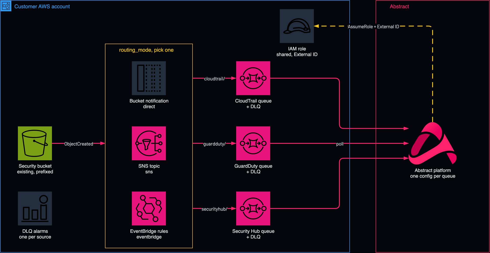

# Shared S3 bucket to Abstract: one queue per source

<!-- Generated from template.yml by `python -m tools.templates generate`. Do not edit. -->

A Terraform or OpenTofu module for a security bucket that holds several log sources under different key prefixes. Because an Abstract S3 + SQS configuration is scoped by its queue alone, the module builds one SQS queue per source and one routing layer in front of them: a direct bucket notification, SNS fan-out, or EventBridge.

**Cloud:** aws · **Role:** source · **Scope:** account



Editable source: [diagram.drawio](diagram.drawio)

## When to use

One security bucket holds several sources under different prefixes, and each source needs its own parser.

**Not for:** When the plan is to point two Abstract configurations at one queue: SQS is a competing-consumer service, so they split the stream at random with no error.

Not sure this is the right one, or what to deploy before it? Answer a few questions in [the setup guide](https://github.com/IamABS3C/abstract-cloud-templates/blob/main/docs/aws/GUIDE.md).

## Deploy

From a shell, in this folder:

```bash
./deploy.sh
```

## Prerequisites

- Terraform 1.5 or later and AWS credentials for the account that owns the bucket
- If the bucket already sends event notifications anywhere, keep manage_bucket_notification = false (the default). With true in direct or sns mode, apply replaces the bucket's entire notification configuration and destroy deletes it. Save it first either way: aws s3api get-bucket-notification-configuration --bucket &lt;bucket&gt; &gt; notification-backup.json
- Upgrading a deployment made before the default became false, that relied on it: set manage_bucket_notification = true explicitly before you apply. If terraform plan shows aws_s3_bucket_notification being destroyed, stop: the apply would empty the bucket's notification configuration and the feed would stop without an error
- Terraform or OpenTofu 1.10 or later, AWS provider 6.0 or later
- An existing bucket; point the provider at the bucket's region, because the queues must be in the same region
- Your tenant's Abstract-managed AWS account ID (per tenant, not a published constant)
- Every source needs a non-empty prefix; prefixes that also overlap on suffix are rejected
- For an SSE-KMS bucket, add the statement from the required_kms_key_policy_statement output to the key policy

## Cost

EventBridge routing has the richest filtering but costs per event.

## Parameters

| Name | Type | Required | Description | Find it |
|---|---|---|---|---|
| `routing_mode` | string | yes | How S3 ObjectCreated events reach the per-source SQS queues. "direct" Pattern A - one S3 bucket notification containing one prefix-filtered QueueConfiguration per source. Fewest moving parts. Requires Terraform to own the bucket notification. "sns" Pattern B - S3 -&gt; one SNS topic -&gt; one SQS queue per source, filtered with a MessageBody filter policy on the object key. Single fan-out origin; extra consumers can be added later. "eventbridge" Pattern C - S3 -&gt; EventBridge -&gt; one rule per source -&gt; one SQS queue per source. Richest filtering (any field, not just prefix) and the easiest to extend. Costs per event. Every mode produces the same contract: one SQS queue per source, because an Abstract S3+SQS configuration is scoped by `sqs_url` and nothing else. |  |
| `eventbridge_emit_s3_envelope` | bool | no | Only consulted when routing_mode is "eventbridge". An EventBridge S3 event puts bucket and key at detail.bucket.name and detail.object.key. A native S3 notification puts them at Records[].s3.bucket.name and Records[].s3.object.key. Different shapes. Support for the EventBridge shape is PER-INTEGRATION, not platform-wide. Evidence: default.vpc_flow had to ADD it in version 1.0.1 - "Support for receiving VPC Flow Log notifications via SNS-wrapped messages and AWS EventBridge events, in addition to the existing direct S3 event format." That it was a named feature addition is the point: integrations without that work only understand the direct S3 shape. default.cloudtrail 1.0.6's changelog makes no mention of EventBridge, and the Abstract setup doc for the generic S3+SQS source documents only S3 -&gt; SQS and S3 -&gt; SNS -&gt; SQS. Leaving this true attaches an input transformer that reshapes each event into the native S3 envelope, so the queue payload is correct for EVERY integration regardless of whether it learned the EventBridge shape. Set it to false only for an integration you have confirmed supports EventBridge natively, and only if you want the extra EventBridge metadata. One thing to test rather than trust. S3 documents that object keys in NATIVE notifications are URL-encoded - "red flower.jpg" arrives as "red+flower.jpg". AWS documents nothing either way about encoding in the EventBridge form, and the evidence is mixed, so this module does not assume an answer and neither should you. It makes no difference for keys built from ordinary path characters. If your keys can contain spaces or other characters requiring encoding, settle it empirically before go-live: enable EventBridge on a scratch bucket, copy in a file named "a b+c.txt", point a catch-all rule at a CloudWatch Logs group, and read the raw detail.object.key. Three minutes, and it turns a guess into a fact. |  |
| `bucket_name` | string | yes | Name of the EXISTING S3 bucket holding the security logs. This module never creates or deletes the bucket. The bucket and the SQS queues must be in the SAME AWS region - an Abstract documented requirement. This module creates the queues in the provider's region, so point the provider at the bucket's region. |  |
| `manage_bucket_notification` | bool | no | Whether this module writes to the bucket's notification configuration. Honored in EVERY routing mode, including "eventbridge". A bucket has exactly ONE notification configuration, so Terraform managing it will REPLACE whatever is there today, including notifications belonging to other teams. Set to false when you do not own the bucket. What false gives you, per mode: direct / sns queues, policies, and the IAM role are built; the notification is not written. Hand the rendered JSON in the `bucket_notification_plan` output to the bucket owner. eventbridge queues, rules, policies, and the IAM role are built; the bucket's EventBridgeConfiguration flag is NOT set, so the bucket emits nothing until someone sets it. The one-line command is in the `manual_bucket_steps` output. In "eventbridge" mode with this left true, the module sets only the independent EventBridgeConfiguration flag and does not touch QueueConfigurations - so it will not disturb another team's notifications the way "direct" mode would. Defaults to false, so nothing on the bucket changes unless you choose it. |  |
| `sources` | object | yes | One entry per log source in the bucket. The map key becomes the queue name suffix, so keep it short and DNS-ish (cloudtrail, guardduty, securityhub). prefix Key prefix that isolates this source, e.g. "cloudtrail/". suffix Optional key suffix filter, e.g. ".json.gz". description Free text, surfaced in the outputs to help whoever wires up the Abstract configurations. integration Abstract integration id to bind this queue to. Use the source-specific one where it exists so you inherit the managed parser; fall back to the generic S3+SQS source. dataformat json \| nd \| parquet \| conj. There is deliberately no csv option - the source decodes before the parser runs. Example: sources = { cloudtrail = { prefix = "AWSLogs/", suffix = ".json.gz", integration = "default.cloudtrail.1_0_6" } guardduty = { prefix = "guardduty/", integration = "default.guardduty.1_0_3" } securityhub = { prefix = "securityhub/", integration = "default.aws_s3_sqs_source.1_2_0" } } |  |
| `abstract_aws_account_id` | string | yes | The Abstract-managed AWS account that assumes the role this module creates. THIS IS PER-TENANT. It is not a published constant and it differs per Abstract tenant and environment. Using another tenant's value produces an sts:AssumeRole AccessDenied at configuration-validate time. Retrieve YOUR tenant's value with an API key for that tenant: POST /v1/integrations/permissions/aws/launch-url?download_template=true | `Abstract console: the AWS integration's role step shows the principal and the External ID` |
| `external_id` | securestring | no | sts:ExternalId for the assume-role trust condition. Leave null to generate a random UUID; read it back from the external_id output. |  |
| `role_name` | string | no | Name of the cross-account IAM role Abstract assumes. |  |
| `name_prefix` | string | no | Prefix for created SQS queues, SNS topic, and EventBridge rules. |  |
| `kms_key_arn` | string | no | Optional CMK ARN. Grants the Abstract role kms:Decrypt, and encrypts the queues (and the SNS topic in "sns" mode) with this key instead of the service-managed key. #################################################################### # YOU MUST ALSO EDIT THE CMK'S OWN KEY POLICY. THIS MODULE CANNOT. # #################################################################### Encrypting a queue with a CMK means the PRODUCER - S3, SNS, or EventBridge depending on routing_mode - needs kms:GenerateDataKey* and kms:Decrypt in the KEY POLICY of that CMK. An IAM policy is not sufficient; the key policy is authoritative. This module deliberately does not write your key policy, for the same reason it will not blindly overwrite a bucket notification: key policies are authoritative documents that usually belong to another team, and a careless write locks people out of their own key. The failure mode if you skip it is nasty and quiet. Terraform applies cleanly, the queue policy looks right, and then delivery fails with KMS.AccessDeniedException. The message never reaches the queue, so it never reaches the dead-letter queue either - the DLQ alarms in this module cannot see it. You get an empty queue and no signal. Apply the statement from the `required_kms_key_policy_statement` output BEFORE go-live, then send a probe object and confirm it arrives. |  |
| `scope_list_bucket_to_prefixes` | bool | no | Whether to condition s3:ListBucket on an s3:prefix StringLike matching only the configured prefixes. Default is false, which grants plain s3:ListBucket on the bucket. That sounds looser than it is: s3:prefix constrains the prefix PARAMETER a caller passes, not which keys come back, so the strict form breaks any list call that passes no prefix or a differently-shaped one - including the kind of "can this role see the bucket at all" check a connectivity test performs. It fails as AccessDenied on listing while GetObject and SQS keep working, which is a confusing partial failure to debug. The real confidentiality boundary is s3:GetObject, which this module always scopes per-prefix. Listing reveals key names, not contents. Set true if key names are themselves sensitive and you have confirmed the consumer always lists with a matching prefix. |  |
| `message_retention_seconds` | int | no | SQS retention for the live queues. 4 days by default; raise toward the 14-day maximum if Abstract may be paused for longer than a weekend. |  |
| `visibility_timeout_seconds` | int | no | SQS visibility timeout. Must exceed the time Abstract needs to fetch and parse one object, or the message reappears and is ingested twice. |  |
| `dlq_max_receive_count` | int | no | Deliveries attempted before a message is moved to the source's dead-letter queue. Without a DLQ a poison object retries until retention expires and then disappears with no trace. |  |
| `dlq_alarm_actions` | array | no | SNS topic ARNs notified when a dead-letter queue becomes non-empty. Empty list creates the alarms with no action, which still shows red in the console but pages nobody. |  |
| `create_dlq_alarms` | bool | no | Create a CloudWatch alarm per source that fires when its DLQ holds any message. |  |
| `tags` | object | no | Tags applied to every resource this module creates. |  |

## Permissions

- **sts:AssumeRole from abstract_aws_account_id, conditioned on sts:ExternalId** on The role this module creates: Abstract ingest role: abstract_aws_account_id is per tenant; another tenant's value gives AccessDenied.
- **s3:ListBucket, s3:GetObject** on The bucket, optionally limited to the source prefixes: Abstract ingest role: Read the log objects.
- **SQS consume actions** on The per-source queues: Abstract ingest role: Consume the notifications.
- **kms:Decrypt** on The CMK, only when kms_key_arn is set: Abstract ingest role: Read an SSE-KMS bucket.

## Creates

- One SQS queue per source, each with its own dead-letter queue and redrive policy
- Queue policies admitting the chosen routing layer
- The routing layer set by routing_mode: one prefix-filtered bucket notification (direct), one SNS topic with filtered subscriptions (sns), or one EventBridge rule and target per source (eventbridge)
- One cross-account IAM role Abstract assumes, with an inline access policy shared by every configuration
- A generated External ID when external_id is left null
- A CloudWatch alarm per source that fires when its dead-letter queue holds a message (create_dlq_alarms, on by default)

## Never touches

- The S3 bucket itself: the module never creates or deletes it
- The bucket's notification configuration, when manage_bucket_notification = false; the module then emits the JSON to hand to the bucket owner

## Outputs

- `abstract_configurations`
- `bucket_notification_plan`
- `dead_letter_queues`
- `eventbridge_rule_arns`
- `external_id`
- `manual_bucket_steps`
- `required_kms_key_policy_statement`
- `role_arn`
- `routing_mode`
- `sns_topic_arn`
- `verification_commands`

## Verify

| Check | Command | Healthy when |
|---|---|---|
| Run the module's own post-apply checks | `terraform output verification_commands` | The bucket notification is as expected, each probe object reaches exactly one queue, and every dead-letter queue is empty. |
| The bucket notification was not clobbered | `aws s3api get-bucket-notification-configuration --bucket <bucket-name>` | One entry per source, plus anything another team already had. |
