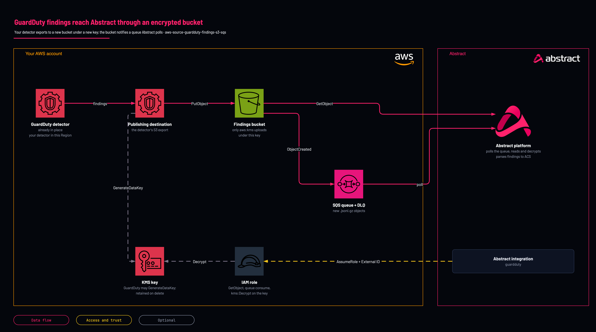

# GuardDuty findings to Abstract: new key, bucket and queue

<!-- Generated from template.yml by `python -m tools.templates generate`. Do not edit. -->

Creates the customer managed KMS key GuardDuty's S3 export requires, a hardened findings bucket, a publishing destination on your existing GuardDuty detector, the SQS queue the bucket notifies and the role Abstract assumes to read them. Not yet deployed by Abstract; canary pending.

**Cloud:** aws · **Role:** source · **Scope:** account



Editable source: [diagram.drawio](diagram.drawio)

## When to use

GuardDuty is on and you want its findings in Abstract, kept beyond GuardDuty's 90-day retention.

**Not for:** You already collect GuardDuty findings through Security Lake (aws-source-security-lake) or Security Hub; a second path would duplicate every finding.

Not sure this is the right one, or what to deploy before it? Answer a few questions in [the setup guide](https://github.com/IamABS3C/abstract-cloud-templates/blob/main/docs/aws/GUIDE.md).

## Deploy

From a shell, in this folder:

```bash
./deploy.sh
```

## Prerequisites

- AWS CLI v2, authenticated to the account and Region of the detector, and jq for deploy.sh
- GuardDuty enabled in this Region (the detector ID from aws guardduty list-detectors); for an organization, deploy in the delegated administrator account, whose detector exports findings for every member
- The Abstract principal ARN (or account ID) and External ID, from the GuardDuty integration in the Abstract console
- A detector exports to one S3 destination. If it already exports somewhere, set CreatePublishingDestination=false and repoint it yourself, or keep the old one
- Optional but recommended: set the finding-update frequency to 15 minutes, or updated findings reach the bucket (and Abstract) up to 6 hours after the console: aws guardduty update-detector --detector-id &lt;id&gt; --finding-publishing-frequency FIFTEEN_MINUTES
- AWS documents that GuardDuty does not create the folder it writes to. If creating the publishing destination fails on the bucket path, create it with aws s3api put-object --bucket &lt;bucket&gt; --key AWSLogs/&lt;account&gt;/GuardDuty/&lt;region&gt;/ and update the stack; this is the first thing the canary checks

## Cost

One KMS key per month plus its requests, S3 storage and one SQS message per findings object; GuardDuty findings volume is small.

## Parameters

| Name | Type | Required | Description | Find it |
|---|---|---|---|---|
| `NamePrefix` | string | no | Prefix for created resource names. Lowercase, because it is part of the bucket name. |  |
| `AbstractPrincipalArn` | string | no | The principal Abstract provides. Accepts a full IAM role/user/root ARN or a bare 12-digit account id (expanded to arn:aws:iam::&lt;acct&gt;:root). | `Abstract console: the AWS integration's role step shows the principal and the External ID` |
| `ExternalId` | securestring | no | External ID provided by Abstract, enforced on sts:AssumeRole. It is PER-TENANT: copy it from the integration in the Abstract console, once, and give the same value to whoever deploys the role. | `Abstract console: the AWS integration's role step shows the principal and the External ID` |
| `PermissionsBoundaryArn` | string | no | Optional IAM permissions-boundary policy ARN attached to every role the stack creates. Find it with: aws iam list-policies --scope Local --query Policies[].Arn | `aws iam list-policies --scope Local --query Policies[].Arn` |
| `MaxSessionDurationSeconds` | int | no | Maximum duration of Abstract's assumed session (3600-43200 seconds, the range IAM accepts for a role). |  |
| `LogRetentionDays` | int | no | Days to keep log objects in the bucket before they expire (0 = keep forever). |  |
| `QueueVisibilityTimeoutSeconds` | int | no | Visibility timeout of the notification queue(s); longer than Abstract takes to process one object. |  |
| `DlqMaxReceiveCount` | int | no | Receives before a notification moves to the dead-letter queue. 5 surfaces a permanent failure within minutes. |  |
| `DetectorId` | string | yes | The ID of your existing GuardDuty detector in this Region. Find it with: aws guardduty list-detectors | `aws guardduty list-detectors` |
| `CreatePublishingDestination` | string | no | true points the detector's findings export at this bucket. Set false when the detector already exports somewhere you cannot change (a detector has one S3 destination), then point it here yourself. |  |
| `GuardDutyServicePrincipal` | string | no | The GuardDuty service principal. In an opt-in Region AWS documents the Regional form, for example guardduty.me-south-1.amazonaws.com. |  |

## Permissions

- **Create IAM roles, KMS keys, S3 buckets, SQS queues and GuardDuty publishing destinations** on The target AWS account and Region: Deployer: the stack creates the whole path; deploy.sh passes CAPABILITY_NAMED_IAM because it names the role.
- **kms:GenerateDataKey, conditioned on aws:SourceAccount and aws:SourceArn (your detector)** on The new KMS key (key policy): GuardDuty: encrypt each findings object it exports.
- **s3:GetBucketLocation, s3:PutObject, conditioned on aws:SourceAccount and aws:SourceArn (your detector)** on The findings bucket (bucket policy, which also denies any GuardDuty upload not encrypted under this key): GuardDuty: write findings objects.
- **sts:AssumeRole, conditioned on sts:ExternalId** on &lt;NamePrefix&gt;-guardduty-role: Abstract: only the Abstract principal you supply can assume it, and only with the matching External ID.
- **s3:ListBucket, s3:GetBucketLocation, s3:GetObject** on The findings bucket: Abstract: read the objects each notification points at.
- **sqs:ReceiveMessage, sqs:DeleteMessage, sqs:ChangeMessageVisibility, sqs:GetQueueAttributes, sqs:GetQueueUrl** on The findings queue: Abstract: consume the notifications.
- **kms:Decrypt, kms:DescribeKey** on The new KMS key: Abstract: read the findings objects GuardDuty encrypted.

## Creates

- A customer managed KMS key with rotation, and an alias, retained when the stack is deleted
- A hardened findings bucket &lt;NamePrefix&gt;-guardduty-&lt;account&gt;-&lt;region&gt;: Block Public Access, ACLs disabled, HTTPS-only policy, versioning, lifecycle expiry, retained on stack delete
- An SQS queue and a dead-letter queue (SSE-SQS, redrive after DlqMaxReceiveCount), notified for each new .jsonl.gz findings object
- A publishing destination on your existing detector (CreatePublishingDestination=true): this changes the detector's findings export setting, and deleting the stack removes it
- A cross-account IAM role &lt;NamePrefix&gt;-guardduty-role trusted only by the Abstract principal, with the External ID

## Never touches

- The detector's other settings: its protection plans, suppression rules and finding-update frequency stay as they are
- GuardDuty in other Regions and member accounts

## Outputs

- `AwsRegion`
- `BucketNameOut`
- `RoleArn`
- `SqsQueueUrl`
- `SqsQueueArn`
- `SqsDeadLetterQueueUrl`
- `KmsKeyArnOut`

## Verify

| Check | Command | Healthy when |
|---|---|---|
| The stack outputs carry the values the Abstract integration needs | `aws cloudformation describe-stacks --stack-name <stack-name> --query 'Stacks[0].Outputs' --output table` | RoleArn, SqsQueueUrl, SqsQueueArn, BucketNameOut and AwsRegion are present. |
| The detector exports to the new bucket | `aws guardduty list-publishing-destinations --detector-id <detector-id>` | One S3 destination with Status PUBLISHING. |
| Findings objects are arriving | `aws s3 ls s3://<bucket>/ --recursive \| tail -5` | .jsonl.gz objects appear after the next export (generate sample findings with aws guardduty create-sample-findings --detector-id &lt;detector-id&gt; to test sooner). |
| Nothing is failing into the dead-letter queue | `aws sqs get-queue-attributes --queue-url <dead-letter-queue-url> --attribute-names ApproximateNumberOfMessagesVisible` | Zero messages. Messages here usually mean the role cannot decrypt (check the key's root statement). |
