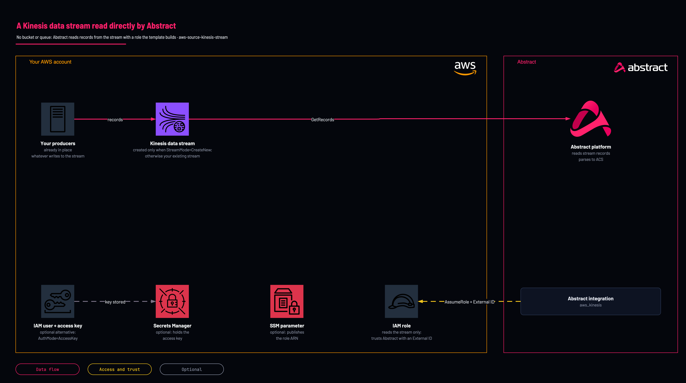

# Kinesis data stream

<!-- Generated from template.yml by `python -m tools.templates generate`. Do not edit. -->

Kinesis is an API-poll source: Abstract reads records directly from a stream. This template creates the cross-account identity Abstract uses, scoped to one stream or all streams, and can optionally create the stream itself.

**Cloud:** aws · **Role:** source · **Scope:** account



Editable source: [diagram.drawio](diagram.drawio)

## When to use

Records already flow into a Kinesis data stream (or should), and Abstract should read the stream directly.

## Deploy

From a shell, in this folder:

```bash
./deploy.sh
```

## Prerequisites

- AWS CLI v2, authenticated, and jq for deploy.sh
- The Abstract principal ARN (or account ID) and External ID for your tenant
- The stream name (required in both modes)
- The KMS key ARN, if the stream uses a customer-managed key

## Parameters

| Name | Type | Required | Description | Find it |
|---|---|---|---|---|
| `NamePrefix` | string | no | Prefix for every created resource name. |  |
| `AuthMode` | string | no | AssumeRole (recommended) creates a cross-account role Abstract assumes with an External ID; AccessKey creates an IAM user and access key. |  |
| `AbstractPrincipalArn` | string | no | The principal Abstract provides: a full IAM ARN or a bare 12-digit account ID. Required for AssumeRole. | `Abstract console: the AWS integration's role step shows the principal and the External ID` |
| `ExternalId` | securestring | no | The External ID from Abstract, enforced on sts:AssumeRole. Required for AssumeRole. | `Abstract console: the AWS integration's role step shows the principal and the External ID` |
| `MaxSessionDurationSeconds` | int | no | Maximum duration of an assumed-role session, in seconds. |  |
| `PermissionsBoundaryArn` | string | no | Only if your account mandates a permissions boundary on every role. Find it with: aws iam list-policies --scope Local --query Policies[].Arn | `aws iam list-policies --scope Local --query Policies[].Arn` |
| `StoreCredentialsInSecretsManager` | string | no | With AuthMode=AccessKey, store the access key in Secrets Manager instead of emitting it as a stack output. |  |
| `ExportToSsm` | string | no | Publish the role ARN to SSM Parameter Store under /NamePrefix/kinesis/role-arn for later lookup. |  |
| `StreamMode` | string | no | CreateNew provisions a Kinesis stream; UseExisting references one you already have. |  |
| `StreamName` | string | yes | Name of the stream (required for UseExisting; the name to create for CreateNew). Find it with: aws kinesis list-streams | `aws kinesis list-streams` |
| `ShardCount` | int | no | Shard count for a new PROVISIONED stream. |  |
| `ScopeToSingleStream` | string | no | Restrict permissions to the named stream (recommended). If false, grants ListStreams/Describe across all streams. |  |
| `KmsKeyArn` | string | no | Supply if the stream is encrypted with a customer-managed KMS key. Find it with: aws kms list-aliases | `aws kms list-aliases` |

## Permissions

- **Create IAM roles and users, and Kinesis streams when StreamMode=CreateNew** on The target AWS account: Deployer: The template creates the identity and, optionally, the stream.
- **kinesis:ListStreams, kinesis:ListShards** on All streams: Abstract role: Enumerate streams and shards.
- **kinesis:DescribeStream, DescribeStreamSummary, GetRecords, GetShardIterator, SubscribeToShard, DescribeStreamConsumer, ListShards** on The named stream when ScopeToSingleStream=true (the default), otherwise all streams: Abstract role: Read records.
- **kms:Decrypt, kms:DescribeKey** on The KMS key, only when KmsKeyArn is supplied: Abstract role: Read a stream encrypted with a customer-managed key.

## Creates

- An IAM role &lt;NamePrefix&gt;-role Abstract assumes with the External ID (AssumeRole), or an IAM user and access key (AccessKey)
- Optional new provisioned Kinesis stream (StreamMode=CreateNew; UseExisting is the default)
- Optional Secrets Manager secret for the access key, and optional SSM parameter for the role ARN

## Never touches

- An existing stream's configuration or producers: in UseExisting mode the stream is only referenced by name (derived from declared resources)

## Outputs

- `AuthModeOut`
- `AwsRegion`
- `StreamNameOut`
- `StreamArn`
- `RoleArn`
- `AccessKeyId`
- `SecretAccessKey`
- `CredentialsSecretArn`

## Example parameter profiles

- `default.parameters.json`

## Verify

| Check | Command | Healthy when |
|---|---|---|
| The values for the Abstract Kinesis integration are available | `aws cloudformation describe-stacks --stack-name abstract-kinesis --query 'Stacks[0].Outputs' --output table` | RoleArn, StreamNameOut and AwsRegion are present. |
