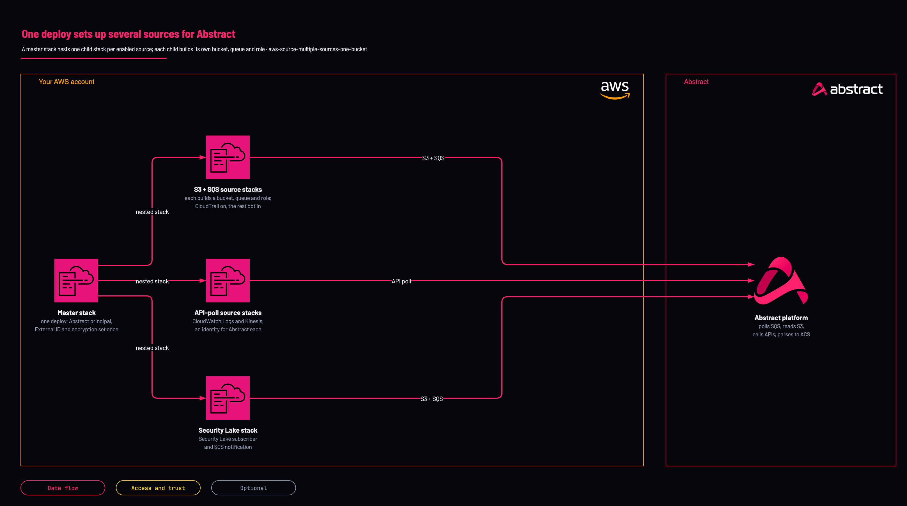

# Several sources, one stack

<!-- Generated from template.yml by `python -m tools.templates generate`. Do not edit. -->

A master stack nests the per-source child templates, so one deploy provisions any combination of CloudTrail, CloudFront, load balancer, Route 53 Resolver, S3 access, VPC Flow, WAF, CloudWatch Logs, Kinesis and Security Lake sources. The Abstract principal, External ID, encryption and alarm settings are entered once and flow down to every enabled child.

**Cloud:** aws · **Role:** source · **Scope:** account



Editable source: [diagram.drawio](diagram.drawio)

## When to use

Several AWS sources in the same account and region, where the shared identity and encryption should be set once.

**Not for:** When the child templates cannot be hosted at an https S3 URL; the master only references its children through TemplateBaseUrl.

## Deploy

From a shell, in this folder:

```bash
./deploy.sh
```

## Prerequisites

- AWS CLI v2, authenticated, and jq for deploy.sh
- AWS CLI v2, authenticated
- The Abstract principal ARN (or account ID) and External ID for your tenant; the console regenerates the External ID on each pass, so mint it once and use the same value on both sides
- An S3 bucket to host the child templates; TemplateBaseUrl must be an https S3 URL with no trailing slash
- Per enabled source: a VPC, subnet or ENI ID (VPC Flow Logs), a WebACL ARN (WAF), an existing stream name (Kinesis), or a data lake ARN (Security Lake)
- With Security Lake enabled, AbstractPrincipalArn must be a bare 12-digit account ID
- deploy.sh uploads the child templates from the sibling folders to s3://&lt;template-bucket&gt;/&lt;prefix&gt;/&lt;template-id&gt;.yaml before it deploys; CloudFormation refuses any TemplateURL that is not on S3

## Cost

Object count drives the S3 request, SQS and KMS charges more than byte volume. KMS decrypt requests, one per object, are the line nobody forecasts on high-object-count sources such as VPC Flow Logs.

## Parameters

| Name | Type | Required | Description | Find it |
|---|---|---|---|---|
| `TemplateBaseUrl` | string | yes | Base https URL where the child templates are hosted, no trailing slash (e.g. https://my-bucket.s3.amazonaws.com/abstract). The master appends /&lt;template-id&gt;.yaml, e.g. /aws-source-cloudtrail-s3-sqs.yaml. |  |
| `AuthMode` | string | no | AssumeRole (recommended) creates a cross-account role Abstract assumes with an External ID; AccessKey creates an IAM user and access key. |  |
| `AbstractPrincipalArn` | string | no | The principal Abstract provides: a full IAM ARN or a bare 12-digit account ID. Required for AssumeRole. | `Abstract console: the AWS integration's role step shows the principal and the External ID` |
| `ExternalId` | securestring | no | The External ID from Abstract, enforced on sts:AssumeRole. Required for AssumeRole. | `Abstract console: the AWS integration's role step shows the principal and the External ID` |
| `StoreCredentialsInSecretsManager` | string | no | With AuthMode=AccessKey, store the access key in Secrets Manager instead of emitting it as a stack output. |  |
| `ExportToSsm` | string | no | Publish each enabled source's non-secret outputs to SSM Parameter Store. |  |
| `BucketEncryption` | string | no | Bucket encryption for every enabled S3 + SQS source: SSE-S3 or SSE-KMS. |  |
| `QueueEncryption` | string | no | Queue encryption for every enabled S3 + SQS source: SSE-SQS or SSE-KMS. |  |
| `KmsMode` | string | no | With SSE-KMS: None, CreateNew (each child makes a key) or UseExisting (supply ExistingKmsKeyArn). |  |
| `ExistingKmsKeyArn` | string | no | Optional. Supply if the bucket, queue or stream uses a customer-managed key. Find it with: aws kms list-aliases | `aws kms list-aliases` |
| `EnableDlqAlarm` | string | no | Create a DLQ CloudWatch alarm for each enabled S3+SQS source. |  |
| `EnableDashboard` | string | no | Create a CloudWatch dashboard for each enabled S3+SQS source. |  |
| `AlarmEmail` | string | no | Optional email subscribed to the alarm topic(s). |  |
| `EnableCloudTrail` | string | no | Deploy the CloudTrail child stack. |  |
| `EnableCloudFront` | string | no | Deploy the CloudFront child stack. |  |
| `EnableLoadBalancer` | string | no | Deploy the LoadBalancer child stack. |  |
| `EnableRoute53` | string | no | Deploy the Route53 child stack. |  |
| `EnableS3AccessLogs` | string | no | Deploy the S3AccessLogs child stack. |  |
| `EnableVPCFlowLogs` | string | no | Deploy the VPCFlowLogs child stack. |  |
| `EnableWAF` | string | no | Deploy the WAF child stack. |  |
| `EnableCloudWatchLogs` | string | no | Deploy the CloudWatchLogs child stack. |  |
| `EnableKinesis` | string | no | Deploy the Kinesis child stack. |  |
| `EnableSecurityLake` | string | no | Deploy the SecurityLake child stack. |  |
| `VpcFlowResourceId` | string | no | vpc-/subnet-/eni- ID for VPC Flow Logs (if enabled). Find it with: aws ec2 describe-vpcs --query Vpcs[].VpcId | `aws ec2 describe-vpcs --query Vpcs[].VpcId` |
| `WafWebAclArn` | string | no | WAF WebACL ARN (if WAF enabled). Find it with: aws wafv2 list-web-acls --scope REGIONAL | `aws wafv2 list-web-acls --scope REGIONAL` |
| `KinesisStreamName` | string | no | Existing Kinesis stream name (if Kinesis enabled). Find it with: aws kinesis list-streams | `aws kinesis list-streams` |
| `SecurityLakeDataLakeArn` | string | no | Security Lake data lake ARN (if Security Lake enabled). Note: when Security Lake is enabled, AbstractPrincipalArn must be a bare 12-digit account ID (the Security Lake subscriber principal), not a full IAM ARN. Find it with: aws securitylake list-data-lakes | `aws securitylake list-data-lakes` |
| `SecurityLakeSourceName` | string | no | Security Lake AWS log source (if Security Lake enabled). |  |

## Permissions

- **Create IAM roles, S3 buckets, SQS queues, SNS topics and KMS keys** on The target AWS account: Deployer: The stack builds the whole path, including the cross-account role Abstract assumes.
- **sts:AssumeRole, conditioned on sts:ExternalId** on The role created per source: Abstract ingest role: How Abstract reads the queue and the objects; the External ID prevents a confused deputy.
- **s3:ListBucket, s3:GetBucketLocation, s3:GetObject** on The log bucket, scoped to LogPrefix when set: Abstract ingest role: Fetch the log objects each notification points at.
- **sqs:ReceiveMessage, sqs:DeleteMessage, sqs:ChangeMessageVisibility, sqs:GetQueueAttributes, sqs:GetQueueUrl** on The notification queue: Abstract ingest role: Consume the object-created notifications.
- **kms:Decrypt, kms:GenerateDataKey, kms:DescribeKey** on The KMS key, only when SSE-KMS is used: Abstract ingest role: Read objects and messages encrypted with a customer-managed key.

## Creates

- One nested stack per enabled source; CloudTrail is on by default and every other source is off until enabled
- For each S3 + SQS source: a log bucket, notification wiring, an SQS queue with a dead-letter queue, and the log producer where CloudFormation can express it
- For each source: a cross-account IAM role Abstract assumes with the External ID (AssumeRole), or an IAM user and access key (AccessKey)
- Optional customer-managed KMS key (KmsMode=CreateNew)
- Optional dead-letter-queue alarm and CloudWatch dashboard per S3 + SQS source (EnableDlqAlarm, EnableDashboard, both off by default)
- Optional SSM parameters holding each source's non-secret outputs (ExportToSsm)
- An EnabledSources output summarising which sources were deployed

## Never touches

- Sources left disabled: their child stacks are not created
- Anything outside the enabled child stacks, each of which states what it never touches

## Outputs

- `EnabledSources`

## Verify

| Check | Command | Healthy when |
|---|---|---|
| The stack reports which sources it deployed | `aws cloudformation describe-stacks --stack-name abstract-aws --query 'Stacks[0].Outputs' --output table` | EnabledSources lists true for every source you enabled. |
| The SQS queue is receiving messages | `aws sqs get-queue-attributes --queue-url <queue-url> --attribute-names ApproximateNumberOfMessagesVisible` | A non-zero count, or a count that returns to zero because Abstract is consuming. |
| The cross-account AssumeRole succeeds |  | The Abstract source saves without a validation error. |
| Events are parsed and searchable |  | Documents return with vendor, product and action populated. |
