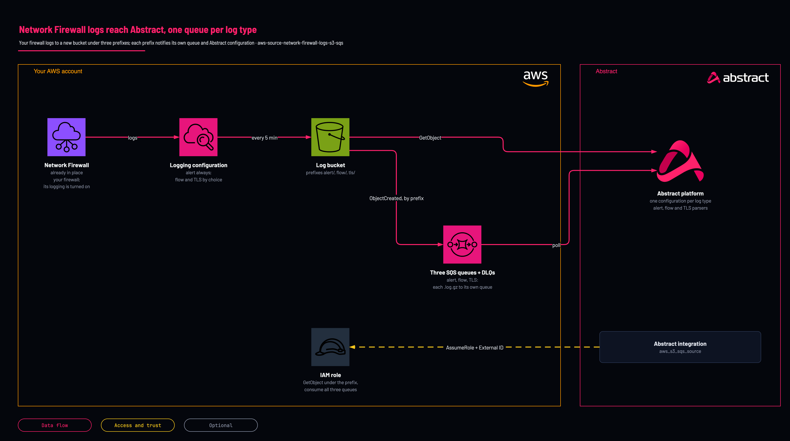

# Network Firewall logs to Abstract: bucket and three queues

<!-- Generated from template.yml by `python -m tools.templates generate`. Do not edit. -->

Creates a hardened log bucket, turns on S3 logging for your existing AWS Network Firewall (alert logs always, flow and TLS logs by choice, each under its own prefix), one SQS queue per log type and the role Abstract assumes to read them. Each log type is its own shape and becomes its own Abstract configuration. Not yet deployed by Abstract; canary pending.

**Cloud:** aws · **Role:** source · **Scope:** account



Editable source: [diagram.drawio](diagram.drawio)

## When to use

You run AWS Network Firewall and want its alert (and flow or TLS) logs in Abstract.

**Not for:** The firewall already logs to a bucket you keep; add queues for that bucket with aws-source-existing-bucket-queues instead.

Not sure this is the right one, or what to deploy before it? Answer a few questions in [the setup guide](https://github.com/IamABS3C/abstract-cloud-templates/blob/main/docs/aws/GUIDE.md).

## Deploy

From a shell, in this folder:

```bash
./deploy.sh
```

## Prerequisites

- AWS CLI v2, authenticated to the account and Region of the firewall, and jq for deploy.sh
- An existing Network Firewall with no logging configuration yet; a firewall has one logging configuration, so remove an existing one (or keep it and skip this template) first
- The Abstract principal ARN (or account ID) and External ID, from the integration in the Abstract console
- Network Firewall changes one log destination per update: after the stack exists, switch EnableFlowLogs or EnableTlsLogs in separate stack updates, never both at once
- TLS logs exist only for a firewall with a TLS inspection configuration
- In Abstract, one AWS S3 SQS Source configuration per log type you turn on, each with dataformat nd and its own parser: alert, flow and TLS records are different shapes. Abstract has no managed Network Firewall integration

## Cost

S3 storage and one SQS message per 5-minute log file per type; flow logs are the bulk of the volume, and Network Firewall also charges for log delivery.

## Parameters

| Name | Type | Required | Description | Find it |
|---|---|---|---|---|
| `NamePrefix` | string | no | Prefix for created resource names. Lowercase, because it is part of the bucket name. |  |
| `AbstractPrincipalArn` | string | no | The principal Abstract provides. Accepts a full IAM role/user/root ARN or a bare 12-digit account id (expanded to arn:aws:iam::&lt;acct&gt;:root). | `Abstract console: the AWS integration's role step shows the principal and the External ID` |
| `ExternalId` | securestring | no | External ID provided by Abstract, enforced on sts:AssumeRole. It is PER-TENANT: copy it from the integration in the Abstract console, once, and give the same value to whoever deploys the role. | `Abstract console: the AWS integration's role step shows the principal and the External ID` |
| `PermissionsBoundaryArn` | string | no | Optional IAM permissions-boundary policy ARN attached to every role the stack creates. Find it with: aws iam list-policies --scope Local --query Policies[].Arn | `aws iam list-policies --scope Local --query Policies[].Arn` |
| `MaxSessionDurationSeconds` | int | no | Maximum duration of Abstract's assumed session (3600-43200 seconds, the range IAM accepts for a role). |  |
| `LogRetentionDays` | int | no | Days to keep log objects in the bucket before they expire (0 = keep forever). |  |
| `QueueVisibilityTimeoutSeconds` | int | no | Visibility timeout of the notification queue(s); longer than Abstract takes to process one object. |  |
| `DlqMaxReceiveCount` | int | no | Receives before a notification moves to the dead-letter queue. 5 surfaces a permanent failure within minutes. |  |
| `FirewallArn` | string | yes | ARN of your existing Network Firewall in this Region. It must have no logging configuration yet. Find it with: aws network-firewall list-firewalls | `aws network-firewall list-firewalls` |
| `LogPrefix` | string | no | Top-level key prefix for the logs. Each log type goes under &lt;LogPrefix&gt;/&lt;type&gt;. No leading or trailing slash. |  |
| `EnableFlowLogs` | string | no | Send flow logs (every flow the stateful engine sees; by far the larger volume). |  |
| `EnableTlsLogs` | string | no | Send TLS logs. Only a firewall with a TLS inspection configuration writes them. |  |

## Permissions

- **Create IAM roles, S3 buckets, SQS queues and Network Firewall logging configurations** on The target AWS account and Region: Deployer: the stack creates the whole path; deploy.sh passes CAPABILITY_NAMED_IAM because it names the role.
- **s3:PutObject (with bucket-owner-full-control), s3:GetBucketAcl, conditioned on aws:SourceAccount and aws:SourceArn** on The log bucket, under LogPrefix (bucket policy): Log delivery (delivery.logs.amazonaws.com): write the firewall's log files.
- **sts:AssumeRole, conditioned on sts:ExternalId** on &lt;NamePrefix&gt;-nfw-role: Abstract: only the Abstract principal you supply can assume it, and only with the matching External ID.
- **s3:ListBucket, s3:GetBucketLocation, s3:GetObject** on The log bucket, under LogPrefix: Abstract: read the objects each notification points at.
- **sqs:ReceiveMessage, sqs:DeleteMessage, sqs:ChangeMessageVisibility, sqs:GetQueueAttributes, sqs:GetQueueUrl** on The alert, flow and TLS queues: Abstract: consume the notifications.

## Creates

- A hardened log bucket &lt;NamePrefix&gt;-nfw-&lt;account&gt;-&lt;region&gt;: Block Public Access, ACLs disabled, HTTPS-only policy, versioning, lifecycle expiry, retained on stack delete
- Three SQS queues with dead-letter queues (alert, flow, TLS; SSE-SQS). Each is notified only for its own log type's .log.gz files, and the flow and TLS queues stay idle unless their log type is on
- The logging configuration of your existing firewall (alert, plus flow and TLS when chosen): this changes the firewall's logging, and deleting the stack removes it
- A cross-account IAM role &lt;NamePrefix&gt;-nfw-role trusted only by the Abstract principal, with the External ID

## Never touches

- The firewall's policy, rule groups, subnets and endpoints
- Other firewalls in the account

## Outputs

- `AwsRegion`
- `BucketNameOut`
- `RoleArn`
- `AlertQueueUrl`
- `AlertQueueArn`
- `AlertDeadLetterQueueUrl`
- `FlowQueueUrl`
- `FlowQueueArn`
- `FlowDeadLetterQueueUrl`
- `TlsQueueUrl`
- `TlsQueueArn`
- `TlsDeadLetterQueueUrl`

## Verify

| Check | Command | Healthy when |
|---|---|---|
| The stack outputs carry the values each Abstract configuration needs | `aws cloudformation describe-stacks --stack-name <stack-name> --query 'Stacks[0].Outputs' --output table` | RoleArn, BucketNameOut, AwsRegion and one queue URL and ARN per log type are present. |
| The firewall logs to the bucket | `aws network-firewall describe-logging-configuration --firewall-arn <firewall-arn>` | One S3 destination per log type you turned on, each with the bucket and its &lt;LogPrefix&gt;/&lt;type&gt; prefix. |
| Log files are arriving under each type's path | `aws s3 ls s3://<bucket>/<LogPrefix>/alert/ --recursive \| tail -3` | .log.gz files appear within about 5 minutes of traffic (Network Firewall publishes every 5 minutes). |
| Nothing is failing into a dead-letter queue | `aws sqs get-queue-attributes --queue-url <dead-letter-queue-url> --attribute-names ApproximateNumberOfMessagesVisible` | Zero messages on each. |
