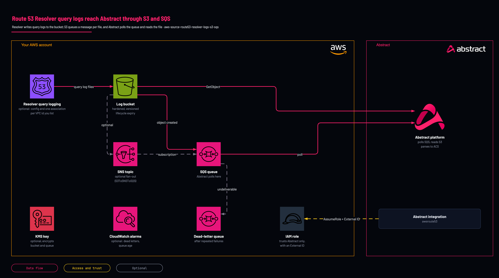

# Route 53 Resolver query logs

<!-- Generated from template.yml by `python -m tools.templates generate`. Do not edit. -->

Creates a Route 53 Resolver query-logging configuration for a list of VPCs, its hardened S3 bucket, the SQS queue S3 notifies, and the cross-account role Abstract assumes to read them.

**Cloud:** aws · **Role:** source · **Scope:** account



Editable source: [diagram.drawio](diagram.drawio)

## When to use

You want DNS query logs from your VPCs in Abstract.

**Not for:** Query logs already land in a bucket: use the read role for an existing bucket and queue.

Not sure this is the right one? See [the chooser](https://github.com/IamABS3C/abstract-cloud-templates/blob/main/docs/aws/CHOOSE.md).

## Deploy

[](https://us-east-1.console.aws.amazon.com/cloudformation/home?region=us-east-1#/stacks/create/review?templateURL=https%3A%2F%2Fabstract-cloud-templates-launch.s3.us-east-1.amazonaws.com%2Ftemplates%2Faws%2Faws-source-route53-resolver-logs-s3-sqs%2Ftemplate.yaml&stackName=abstract-source-route53-resolver-logs-s3-sqs)

Opens the CloudFormation console in us-east-1. For another Region, change `us-east-1` in both places in the link, or use the Region picker in the onboarding app.

Or from a shell, in this folder:

```bash
./deploy.sh
```

## Prerequisites

- AWS CLI v2, authenticated to the target account and region, and jq for deploy.sh
- The Abstract principal ARN (or 12-digit account ID) and the External ID, copied from the integration in the Abstract console
- With BucketMode=UseExisting, wire the bucket's notifications and the log producer yourself; the stack does not write them on a bucket it does not own
- The VPC IDs whose DNS queries to log (Route53VpcIds)
- Keep NamePrefix short: the auto-generated bucket name must stay within S3's 63 characters

## Cost

Query logging to S3 is billed per GB by CloudWatch vended-logs pricing; busy VPCs produce many small objects.

## Parameters

| Name | Type | Required | Description | Find it |
|---|---|---|---|---|
| `NamePrefix` | string | no | Prefix for all created resource names. |  |
| `AuthMode` | string | no | AssumeRole (recommended) creates a cross-account role Abstract assumes with an External ID. AccessKey creates a long-lived IAM user + keys (use only when Abstract cannot assume a role). |  |
| `AbstractPrincipalArn` | string | no | Required for AssumeRole. The principal Abstract provides (full IAM ARN or bare 12-digit account ID, expanded to :root). Abstract supplies this and it is PER-TENANT — copy it from the integration in the Abstract console. Note the console regenerates the External ID on each pass, so mint it once and give the SAME value to whoever deploys the role. | `Abstract console: the AWS integration's role step shows the principal and the External ID` |
| `ExternalId` | securestring | no | Required for AssumeRole. Shared secret from Abstract, enforced on sts:AssumeRole (confused-deputy protection). Abstract supplies this and it is PER-TENANT — copy it from the integration in the Abstract console. Note the console regenerates the External ID on each pass, so mint it once and give the SAME value to whoever deploys the role. | `Abstract console: the AWS integration's role step shows the principal and the External ID` |
| `MaxSessionDurationSeconds` | int | no | Maximum duration of an assumed session. |  |
| `PermissionsBoundaryArn` | string | no | Optional IAM permissions-boundary policy ARN attached to the created role/user. Only if your account mandates a boundary on every role. Find it with: aws iam list-policies --scope Local --query Policies[].Arn | `aws iam list-policies --scope Local --query Policies[].Arn` |
| `StoreCredentialsInSecretsManager` | string | no | When AuthMode=AccessKey, store the generated access key in AWS Secrets Manager (encrypted, never shown in stack outputs) instead of emitting the secret as a plaintext output. Recommended for production. |  |
| `ExportToSsm` | string | no | Publish the non-secret outputs (role ARN, queue URL, bucket name) to SSM Parameter Store under /NamePrefix/SourceType/* so other stacks, regions, or tooling can look them up later with aws ssm get-parameter. |  |
| `BucketMode` | string | no | CreateNew provisions a hardened bucket (and the producer, where possible). UseExisting references a bucket you already have (you wire notifications/producer yourself). |  |
| `BucketName` | string | no | For UseExisting, the existing bucket name (required). For CreateNew, an optional explicit name; leave blank to auto-generate. WAF requires the name to start with aws-waf-logs-. Find it with: aws s3 ls | `aws s3 ls` |
| `LogPrefix` | string | no | Key prefix that scopes reads/writes (e.g. AWSLogs/). CloudTrail and VPC Flow Logs prepend AWSLogs/ automatically; leave blank for those unless you want a custom top-level prefix. |  |
| `LogRetentionDays` | int | no | Lifecycle expiration for current log objects (0 = keep forever). |  |
| `NoncurrentRetentionDays` | int | no | Days to keep noncurrent (overwritten/deleted) versions before expiry. |  |
| `NotificationPath` | string | no | How notifications reach the queue. S3ToSQS = S3 event -&gt; SQS (most sources). S3ToSNSToSQS = S3 event -&gt; SNS -&gt; SQS (fan-out). CloudTrailToSNSToSQS = Trail -&gt; SNS -&gt; SQS (CloudTrail's native delivery). None = create the queue only (you wire delivery yourself; required when BucketMode=UseExisting and you cannot grant the stack notification rights). |  |
| `QueueMode` | string | no | Create a new SQS queue (+DLQ) or attach policy/subscription to an existing queue. |  |
| `ExistingQueueArn` | string | no | Required when QueueMode=UseExisting. Find it with: aws sqs get-queue-attributes --queue-url QUEUE_URL --attribute-names QueueArn | `aws sqs get-queue-attributes --queue-url QUEUE_URL --attribute-names QueueArn` |
| `ExistingQueueUrl` | string | no | Required when QueueMode=UseExisting (used for the output and Abstract wizard). Find it with: aws sqs list-queues | `aws sqs list-queues` |
| `QueueVisibilityTimeoutSeconds` | int | no | Visibility timeout for the created queue. |  |
| `MessageRetentionSeconds` | int | no | How long SQS retains a message (default 4 days, max 14). |  |
| `DlqMaxReceiveCount` | int | no | Number of failed receives before a message is moved to the dead-letter queue. |  |
| `SubscriptionEmail` | string | no | Optional email subscribed to the SNS topic for operational alerts (only when an SNS path is used). |  |
| `BucketEncryption` | string | no | SSE-S3 (AES256, AWS-managed) or SSE-KMS (customer-managed key). |  |
| `QueueEncryption` | string | no | SSE-SQS (AWS-managed) or SSE-KMS (customer-managed key). |  |
| `KmsMode` | string | no | When any encryption is SSE-KMS, choose CreateNew (the stack makes a CMK with the right key policy) or UseExisting (supply ExistingKmsKeyArn). |  |
| `ExistingKmsKeyArn` | string | no | Required when KmsMode=UseExisting. Find it with: aws kms list-aliases | `aws kms list-aliases` |
| `RequireAclHeader` | string | no | Require s3:x-amz-acl=bucket-owner-full-control on PutObject. "auto" uses the correct default per source (CloudTrail/ALB/Route53/VPC need it; others don't). |  |
| `RestrictBySourceAccount` | string | no | Add aws:SourceAccount = this account to the PutObject condition (recommended). |  |
| `SourceArnCondition` | string | no | Optional aws:SourceArn value to further restrict who may write (e.g. a specific trail or distribution ARN). |  |
| `LogDeliveryPrincipalOverride` | string | no | Override the log-delivery service principal (advanced; leave blank to use the correct default for the SourceType). |  |
| `Route53VpcIds` | array | no | VPC IDs to associate with the Route 53 Resolver query-logging config (SourceType=Route53Resolver, CreateNew bucket). Find it with: aws ec2 describe-vpcs --query Vpcs[].VpcId | `aws ec2 describe-vpcs --query Vpcs[].VpcId` |
| `EnableDlqAlarm` | string | no | Create a CloudWatch alarm that fires when messages land in the dead-letter queue (Abstract failing to process). Requires QueueMode=CreateNew. |  |
| `DlqAlarmThreshold` | int | no | Number of visible DLQ messages that triggers the alarm. |  |
| `EnableQueueAgeAlarm` | string | no | Alarm when the oldest message in the main queue exceeds QueueAgeAlarmSeconds (ingestion lag). Requires QueueMode=CreateNew. |  |
| `QueueAgeAlarmSeconds` | int | no | Age (seconds) of the oldest message that triggers the queue-age alarm. |  |
| `EnableDashboard` | string | no | Create a CloudWatch dashboard for the queue/DLQ metrics. Requires QueueMode=CreateNew. |  |
| `AlarmEmail` | string | no | Optional email subscribed to the alarm topic (separate from the notification SubscriptionEmail). |  |

## Permissions

- **Create IAM roles or users, S3, SQS, SNS, KMS and the producer resources** on The target AWS account: Deployer: the stack creates the whole path; deploy.sh passes CAPABILITY_NAMED_IAM because it names IAM resources.
- **sts:AssumeRole, conditioned on sts:ExternalId** on &lt;NamePrefix&gt;-Route53Resolver-role: Abstract: only the Abstract principal you supply can assume it, and only with the matching External ID.
- **s3:ListBucket, s3:GetBucketLocation, s3:GetObject** on The log bucket, scoped to LogPrefix when set: Abstract: read the log objects each notification points at.
- **sqs:ReceiveMessage, sqs:DeleteMessage, sqs:ChangeMessageVisibility, sqs:GetQueueAttributes, sqs:GetQueueUrl** on The notification queue: Abstract: consume the notifications.
- **kms:Decrypt, kms:GenerateDataKey, kms:DescribeKey** on The KMS key, only when SSE-KMS is selected: Abstract: decrypt objects and messages under a customer-managed key.

## Creates

- A hardened S3 log bucket (BucketMode=CreateNew): Block Public Access, ACLs disabled, HTTPS-only policy, versioning, lifecycle expiry, retained on stack delete
- A bucket policy granting PutObject only to this source's log-delivery service principal
- An SQS queue and dead-letter queue with redrive (QueueMode=CreateNew)
- A Route 53 Resolver query-logging configuration and one association per VPC in Route53VpcIds, when the stack owns the bucket
- A cross-account IAM role &lt;NamePrefix&gt;-Route53Resolver-role (AssumeRole), or an IAM user and access key (AccessKey), optionally stored in Secrets Manager
- Optional customer-managed KMS key and alias (KmsMode=CreateNew)
- Optional dead-letter and queue-age alarms and a CloudWatch dashboard (off by default)
- Optional SSM parameters for the bucket name, queue URL and role ARN (ExportToSsm)

## Never touches

- An existing bucket's notification configuration or producer: with BucketMode=UseExisting the bucket is only referenced
- Resolver rules, endpoints and any other query-logging configuration
- The VPCs themselves
- IAM principals other than the role (or user) the stack creates

## Outputs

- `SourceTypeOut`
- `AuthModeOut`
- `AwsRegion`
- `BucketNameOut`
- `SqsQueueUrl`
- `SqsQueueArn`
- `DeadLetterQueueUrl`
- `SnsTopicArn`
- `KmsKeyArnOut`
- `RoleArn`
- `AccessKeyId`
- `SecretAccessKey`
- `CredentialsSecretArn`

## Example parameter profiles

- `default.parameters.json`

## Verify

| Check | Command | Healthy when |
|---|---|---|
| The stack outputs carry the values the Abstract integration needs | `aws cloudformation describe-stacks --stack-name <stack-name> --query 'Stacks[0].Outputs' --output table` | SqsQueueUrl, AwsRegion and RoleArn (or the access-key outputs) are present. |
| The SQS queue is receiving notifications | `aws sqs get-queue-attributes --queue-url <queue-url> --attribute-names ApproximateNumberOfMessagesVisible` | A non-zero count, or a count that returns to zero because Abstract is consuming. |
| Nothing is failing into the dead-letter queue | `aws sqs get-queue-attributes --queue-url <dead-letter-queue-url> --attribute-names ApproximateNumberOfMessagesVisible` | Zero messages. |
