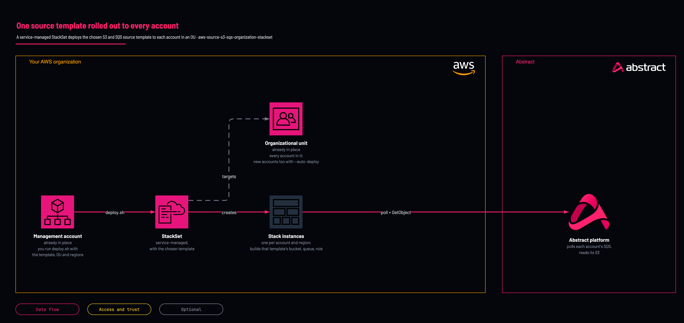

# One source, every account

<!-- Generated from template.yml by `python -m tools.templates generate`. Do not edit. -->

A wrapper around CloudFormation StackSets, service-managed for AWS Organizations, that rolls one Abstract template across every account in an organizational unit and a list of regions. With auto-deployment on, accounts added to the OU later receive the stack too.

**Cloud:** aws · **Role:** source · **Scope:** organization



Editable source: [diagram.drawio](diagram.drawio)

## When to use

The same S3 and SQS source should exist in every account of an organizational unit, including accounts added later, such as VPC Flow Logs or load balancer logs collected per account. Run it once from the management account or a delegated StackSets administrator.

**Not for:** For organization-wide CloudTrail, where a single organization trail (CtIsOrganizationTrail=true with CtOrganizationId) in the management account is preferred over per-account trails.

Not sure this is the right one? See [the chooser](https://github.com/IamABS3C/abstract-cloud-templates/blob/main/docs/aws/CHOOSE.md).

## Deploy

From a shell, in this folder:

```bash
./deploy.sh
```

## Prerequisites

- AWS CLI v2 and jq, authenticated to the management account or a delegated StackSets administrator
- Organizations trusted access enabled for CloudFormation StackSets
- The target OU ID and the list of regions
- Confirm the OU membership before running: the StackSet applies to every account in it

## Parameters

| Name | Type | Required | Description | Find it |
|---|---|---|---|---|
| `TemplateId` | string | yes | The sibling template to roll out, e.g. aws-source-vpc-flow-logs-s3-sqs; its parameters.example.json supplies the stack-set parameters. |  |
| `OrganizationalUnitId` | string | yes | The organizational unit whose accounts receive a stack instance. | `aws organizations list-organizational-units-for-parent --parent-id <root-id>` |
| `Regions` | array | yes | The regions to deploy a stack instance to in each account. |  |

## Permissions

- **CloudFormation StackSets trusted access, plus rights in the Organizations management account** on The organization: Deployer: Only needed for the organization-wide path; a single-account deployment does not require it.

## Creates

- A SERVICE_MANAGED StackSet from the chosen template, with CAPABILITY_NAMED_IAM
- Stack instances in every account of the target OU across the listed regions (failure tolerance 0, up to 5 concurrent)
- With --auto-deploy, stacks in accounts added to the OU later; stacks are removed when an account leaves (RetainStacksOnAccountRemoval=false)

## Never touches

- Accounts outside the target OU (derived from declared deployment targets)

## Outputs


## Verify

| Check | Command | Healthy when |
|---|---|---|
| The script prints every call before it runs |  | Run with --dry-run: create-stack-set and create-stack-instances are printed with the expected OU and regions. |
