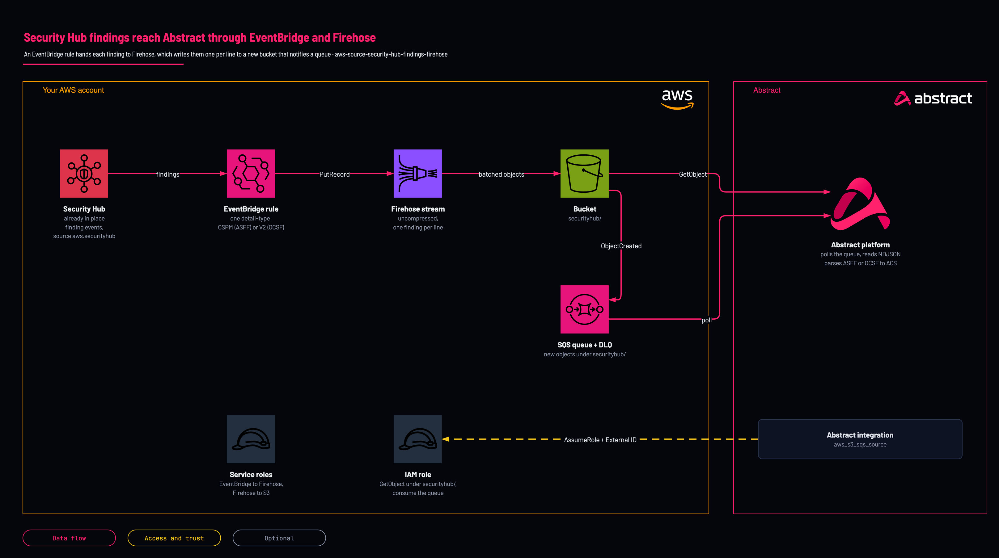

# Security Hub findings to Abstract: EventBridge and Firehose

<!-- Generated from template.yml by `python -m tools.templates generate`. Do not edit. -->

Creates an EventBridge rule for Security Hub's finding events, a Firehose delivery stream that writes them one per line to a new hardened bucket, the SQS queue the bucket notifies and the role Abstract assumes to read them. Security Hub has no S3 export of its own. Deployed in a test account on 2026-10-07. A record put to Firehose landed in the bucket and reached the queue in about five minutes, and the role was assumed with its External ID.

**Cloud:** aws · **Role:** source · **Scope:** account



Editable source: [diagram.drawio](diagram.drawio)

## When to use

You want Security Hub findings in Abstract and do not run Security Lake.

**Not for:** Security Lake is enabled (one subscriber covers Security Hub there), or you only need GuardDuty findings (aws-source-guardduty-findings-s3-sqs reads them at the source).

Not sure this is the right one, or what to deploy before it? Answer a few questions in [the setup guide](https://github.com/IamABS3C/abstract-cloud-templates/blob/main/docs/aws/GUIDE.md).

## Deploy

From a shell, in this folder:

```bash
./deploy.sh
```

## Prerequisites

- AWS CLI v2, authenticated to the account and Region, and jq for deploy.sh
- Security Hub (or Security Hub CSPM) enabled. Deploy in the administrator account's aggregation Region to receive every member account's and linked Region's findings in one stream
- The Abstract principal ARN (or account ID) and External ID, from the AWS S3 SQS Source integration in the Abstract console
- In Abstract, the AWS S3 SQS Source with dataformat nd and a parser for the shape you chose: ASFF for "Security Hub Findings - Imported", OCSF for "Findings Imported V2". Abstract has no managed Security Hub integration
- Findings are stateful: Security Hub re-sends a finding each time it changes, so the same finding id arrives more than once by design
- If Security Lake already collects Security Hub findings, use aws-source-security-lake instead

## Cost

Firehose ingestion is billed per record rounded up to 5 KB, so small findings cost more than their size suggests; plus S3 storage and one SQS message per object.

## Parameters

| Name | Type | Required | Description | Find it |
|---|---|---|---|---|
| `NamePrefix` | string | no | Prefix for created resource names. Lowercase, because it is part of the bucket name. |  |
| `AbstractPrincipalArn` | string | no | The principal Abstract provides. Accepts a full IAM role/user/root ARN or a bare 12-digit account id (expanded to arn:aws:iam::&lt;acct&gt;:root). | `Abstract console: the AWS integration's role step shows the principal and the External ID` |
| `ExternalId` | securestring | no | External ID provided by Abstract, enforced on sts:AssumeRole. It is PER-TENANT: copy it from the integration in the Abstract console, once, and give the same value to whoever deploys the role. | `Abstract console: the AWS integration's role step shows the principal and the External ID` |
| `PermissionsBoundaryArn` | string | no | Optional IAM permissions-boundary policy ARN attached to every role the stack creates. Find it with: aws iam list-policies --scope Local --query Policies[].Arn | `aws iam list-policies --scope Local --query Policies[].Arn` |
| `MaxSessionDurationSeconds` | int | no | Maximum duration of Abstract's assumed session (3600-43200 seconds, the range IAM accepts for a role). |  |
| `LogRetentionDays` | int | no | Days to keep log objects in the bucket before they expire (0 = keep forever). |  |
| `QueueVisibilityTimeoutSeconds` | int | no | Visibility timeout of the notification queue(s); longer than Abstract takes to process one object. |  |
| `DlqMaxReceiveCount` | int | no | Receives before a notification moves to the dead-letter queue. 5 surfaces a permanent failure within minutes. |  |
| `BufferIntervalSeconds` | int | no | Firehose writes an object at least this often (60-900 s). Longer means fewer, larger objects. |  |
| `BufferSizeMB` | int | no | Firehose writes an object when this much data is buffered (1-128 MB), whichever comes first. |  |
| `FindingsDetailType` | string | no | Which finding events to collect. "Security Hub Findings - Imported" is Security Hub CSPM (ASFF). "Findings Imported V2" is Security Hub (OCSF). One shape per stack, so one parser per Abstract configuration; deploy twice for both. |  |

## Permissions

- **Create IAM roles, S3 buckets, SQS queues, Firehose delivery streams and EventBridge rules** on The target AWS account and Region: Deployer: the stack creates the whole path; deploy.sh passes CAPABILITY_NAMED_IAM because it names the role.
- **firehose:PutRecord, firehose:PutRecordBatch** on This stack's delivery stream (a role EventBridge assumes): EventBridge: hand each finding event to Firehose.
- **s3:PutObject, s3:GetObject, s3:AbortMultipartUpload, s3:GetBucketLocation, s3:ListBucket, s3:ListBucketMultipartUploads** on The bucket, objects only under securityhub/ and firehose-errors/securityhub/ (a role Firehose assumes): Firehose: write batched findings and its error objects.
- **sts:AssumeRole, conditioned on sts:ExternalId** on &lt;NamePrefix&gt;-securityhub-role: Abstract: only the Abstract principal you supply can assume it, and only with the matching External ID.
- **s3:ListBucket, s3:GetBucketLocation, s3:GetObject** on The bucket, under securityhub/: Abstract: read the objects each notification points at.
- **sqs:ReceiveMessage, sqs:DeleteMessage, sqs:ChangeMessageVisibility, sqs:GetQueueAttributes, sqs:GetQueueUrl** on The findings queue: Abstract: consume the notifications.

## Creates

- An EventBridge rule on source aws.securityhub and the one detail-type you choose (FindingsDetailType)
- A Firehose delivery stream (encrypted with an AWS owned key) writing uncompressed NDJSON, one finding per line, under securityhub/, and its failed records under firehose-errors/securityhub/, which the queue never sees
- A hardened bucket &lt;NamePrefix&gt;-securityhub-&lt;account&gt;-&lt;region&gt;: Block Public Access, ACLs disabled, HTTPS-only policy, versioning, lifecycle expiry, retained on stack delete
- An SQS queue and dead-letter queue (SSE-SQS), notified for each new object under securityhub/
- Two service roles (EventBridge to Firehose, Firehose to S3) and the cross-account role &lt;NamePrefix&gt;-securityhub-role trusted only by the Abstract principal, with the External ID

## Never touches

- Security Hub itself, its standards, controls, automation rules and other EventBridge rules
- Findings in other Regions, unless this Region is your Security Hub aggregation Region

## Outputs

- `AwsRegion`
- `BucketNameOut`
- `RoleArn`
- `SqsQueueUrl`
- `SqsQueueArn`
- `SqsDeadLetterQueueUrl`
- `DeliveryStreamName`

## Verify

| Check | Command | Healthy when |
|---|---|---|
| The stack outputs carry the values the Abstract integration needs | `aws cloudformation describe-stacks --stack-name <stack-name> --query 'Stacks[0].Outputs' --output table` | RoleArn, SqsQueueUrl, SqsQueueArn, BucketNameOut and AwsRegion are present. |
| The rule is matching findings | `aws cloudwatch get-metric-statistics --namespace AWS/Events --metric-name MatchedEvents --dimensions Name=RuleName,Value=<NamePrefix>-securityhub-findings --start-time <one-hour-ago> --end-time <now> --period 300 --statistics Sum` | A non-zero sum once Security Hub imports or updates a finding. |
| Findings objects are arriving, and no error objects | `aws s3 ls s3://<bucket>/ --recursive \| tail -5` | Objects under securityhub/ after the buffer interval; nothing under firehose-errors/. |
