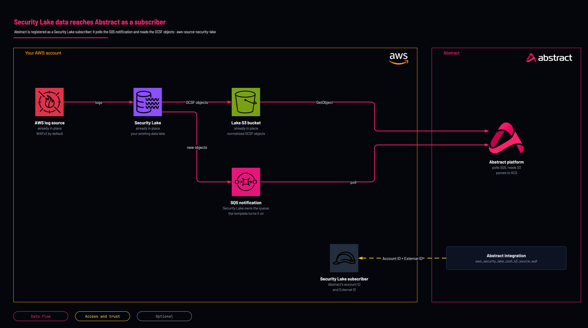

# Security Lake subscriber

<!-- Generated from template.yml by `python -m tools.templates generate`. Do not edit. -->

Registers Abstract as a Security Lake subscriber with S3 data access and an SQS notification, so Abstract is notified of and reads the normalized OCSF objects Security Lake collects. Use it when WAF or other logs are centralised in Security Lake rather than a per-service bucket.

**Cloud:** aws · **Role:** source · **Scope:** account



Editable source: [diagram.drawio](diagram.drawio)

## When to use

WAF or other logs are centralised in Security Lake rather than in a per-service S3 bucket.

Not sure this is the right one? See [the chooser](https://github.com/IamABS3C/abstract-cloud-templates/blob/main/docs/aws/CHOOSE.md).

## Deploy

[](https://us-east-1.console.aws.amazon.com/cloudformation/home?region=us-east-1#/stacks/create/review?templateURL=https%3A%2F%2Fabstract-cloud-templates-launch.s3.us-east-1.amazonaws.com%2Ftemplates%2Faws%2Faws-source-security-lake%2Ftemplate.yaml&stackName=abstract-source-security-lake)

Opens the CloudFormation console in us-east-1. For another Region, change `us-east-1` in both places in the link, or use the Region picker in the onboarding app.

Or from a shell, in this folder:

```bash
./deploy.sh
```

## Prerequisites

- AWS CLI v2, authenticated, and jq for deploy.sh
- An existing Security Lake data lake in the region
- The Abstract 12-digit AWS account ID and External ID for your tenant
- SourceName selects the Security Lake source; the Abstract integration named here is the WAF one, so for another SourceName pick the matching integration in Abstract

## Parameters

| Name | Type | Required | Description | Find it |
|---|---|---|---|---|
| `SubscriberName` | string | no | Name for the Security Lake subscriber. |  |
| `AbstractAccountId` | string | yes | The AWS account ID Abstract provides (the subscriber principal). Abstract supplies this and it is PER-TENANT — copy it from the integration in the Abstract console. Note the console regenerates the External ID on each pass, so mint it once and give the SAME value to whoever deploys the role. | `Abstract console: the AWS integration's role step shows the principal and the External ID` |
| `ExternalId` | securestring | yes | External ID provided by Abstract (confused-deputy protection on the subscription). Abstract supplies this and it is PER-TENANT — copy it from the integration in the Abstract console. Note the console regenerates the External ID on each pass, so mint it once and give the SAME value to whoever deploys the role. | `Abstract console: the AWS integration's role step shows the principal and the External ID` |
| `DataLakeArn` | string | yes | ARN of the Security Lake data lake in this region (arn:aws:securitylake:REGION:ACCOUNT:data-lake/default). Find it with: aws securitylake list-data-lakes | `aws securitylake list-data-lakes` |
| `SourceName` | string | no | Which AWS log source in Security Lake to subscribe Abstract to. WAFV2 = AWS WAF. |  |
| `SourceVersion` | string | no | Source schema version (commonly 2.0). |  |
| `AccessType` | string | no | S3 = direct data access (Abstract reads OCSF objects). LAKEFORMATION = query access. |  |

## Permissions

- **Security Lake subscriber identity: account ID plus External ID** on The subscribed log source: Abstract (subscriber principal): AccessType=S3 lets Abstract read the OCSF objects directly; LAKEFORMATION gives query access instead.

## Creates

- A Security Lake subscriber for one AWS log source (WAFV2 by default), with S3 or Lake Formation data access
- An SQS subscriber notification
- Outputs for the subscriber role ARN Security Lake creates, the RAM resource share ARN and the Security Lake bucket ARN

## Never touches

- The Security Lake data bucket and notification queue: Security Lake owns them and the template only wires the subscriber

## Outputs

- `SubscriberArn`
- `SubscriberRoleArn`
- `ResourceShareArn`
- `S3BucketArn`
- `AwsRegion`

## Verify

| Check | Command | Healthy when |
|---|---|---|
| The subscriber role ARN is available for Abstract | `aws cloudformation describe-stacks --stack-name abstract-securitylake --query 'Stacks[0].Outputs' --output table` | SubscriberArn, SubscriberRoleArn and S3BucketArn are present. |
