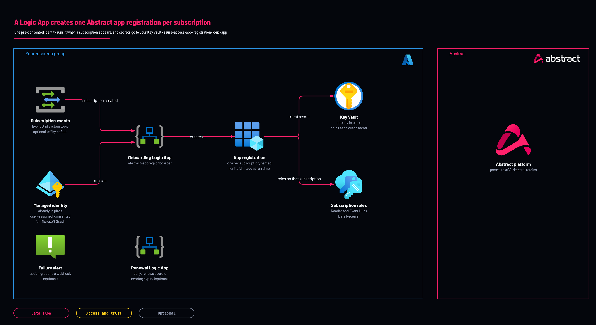

# App registrations, by Logic App

<!-- Generated from template.yml by `python -m tools.templates generate`. Do not edit. -->

The recommended path for per-subscription app registrations: one Logic App in one resource group, running as one pre-consented identity, calls Microsoft Graph directly when a subscription is created or tagged. Same outcome as the policy path with one identity to audit, no per-subscription compute and a single run history.

**Cloud:** azure · **Role:** access · **Scope:** resource-group



Editable source: [diagram.drawio](diagram.drawio)

## When to use

Per-subscription app registrations for Microsoft Graph or Microsoft 365 collection, unless governance mandates Azure Policy.

**Not for:** Event Hub collection, which needs no app registration.

## Deploy

[](https://portal.azure.com/#create/Microsoft.Template/uri/https%3A%2F%2Fraw.githubusercontent.com%2FIamABS3C%2Fabstract-cloud-templates%2Fmain%2Ftemplates%2Fazure%2Fazure-access-app-registration-logic-app%2Fazuredeploy.json/createUIDefinitionUri/https%3A%2F%2Fraw.githubusercontent.com%2FIamABS3C%2Fabstract-cloud-templates%2Fmain%2Ftemplates%2Fazure%2Fazure-access-app-registration-logic-app%2FcreateUiDefinition.json)

Or from a shell, in this folder:

```bash
./deploy.sh
```

## Prerequisites

- A user-assigned managed identity, created and consented with the Bootstrap action
- A central Key Vault that already exists
- Keep the tag gate (default abstract-onboard=true) so only opted-in subscriptions are onboarded
- Restrict Managed Identity Operator on the identity; it controls who can use it

## Cost

No per-subscription compute and no per-run cost.

## Parameters

| Name | Type | Required | Description | Find it |
|---|---|---|---|---|
| `location` | string | no | Region for the Logic App and Event Grid subscription. |  |
| `workflowName` | string | no | Name of the Logic App workflow. |  |
| `tags` | object | no | Tags applied to every resource created here. |  |
| `managedIdentityResourceId` | string | yes | Resource ID of a user-assigned managed identity holding Graph Application.ReadWrite.All + AppRoleAssignment.ReadWrite.All (admin-consented). Create and consent it with scripts/Deploy-AbstractAppReg.sh -a Bootstrap. Treat as tier-0. Find it with: az identity list --query [].id -o tsv | `az identity list --query "[].id" -o tsv` |
| `managedIdentityClientId` | string | no | Client ID of that identity. Unused by the Logic App itself (it authenticates by resource ID) but recorded in outputs so the two paths stay interchangeable. |  |
| `keyVaultName` | string | yes | Central Key Vault that receives every generated client secret. Must already exist; grant the identity Key Vault Secrets Officer on it. Find it with: az keyvault list --query [].name -o tsv | `az keyvault list --query "[].name" -o tsv` |
| `keyVaultInThisSubscription` | bool | no | Set false if the Key Vault lives in a different subscription - then supply keyVaultUri instead. |  |
| `keyVaultUri` | string | no | Full vault URI (https://&lt;name&gt;.vault.azure.net/) when the vault is in another subscription. |  |
| `appNamePattern` | string | no | App display-name pattern. {sub} is replaced with the subscription ID. Also the idempotency key. |  |
| `graphPermissions` | array | no | Microsoft Graph APPLICATION permissions requested for each app. VERIFIED against the live Graph service principal on 2026-08-03 (707 application appRoles). "Security.Read.All" is deliberately ABSENT - it exists as neither an application nor a delegated permission; coverage comes from SecurityEvents.Read.All plus SecurityAlert.Read.All and SecurityIncident.Read.All. |  |
| `secretMonths` | int | no | Client-secret lifetime in months. |  |
| `subscriptionRoleDefinitionIds` | array | no | Azure RBAC roles granted to each service principal on ITS OWN subscription. This is the only real per-subscription boundary: Graph application permissions are inherently tenant-wide. |  |
| `managementGroupId` | string | no | Management group whose subscription events are watched. Leave empty to watch the whole tenant root. |  |
| `tagName` | string | no | Only onboard subscriptions carrying this tag. STRONGLY recommended - without it every subscription that appears is onboarded. Empty means no gate. |  |
| `tagValue` | string | no | Required tag value when tagName is set. |  |
| `enableEventTrigger` | bool | no | Create the Event Grid subscription for automatic triggering. Set false to deploy the workflow and drive it manually first - the safest way to start. |  |
| `enableRenewal` | bool | no | Renew client secrets before they expire. A second workflow runs daily, finds this automation's secrets in the vault that expire within 30 days, and re-runs the onboarder for each subscription, which mints a new secret. Without it a secret is never renewed after the first onboarding. |  |
| `failureWebhookUrl` | securestring | no | Optional webhook (Teams/Slack/ASTRO) that receives a message when an onboarding run fails or consent verification falls short. |  |

## Permissions

- **Global Administrator** on The Entra tenant: Deployer: Once per tenant, to consent Application.ReadWrite.All and AppRoleAssignment.ReadWrite.All to the identity.
- **Microsoft Graph Application.ReadWrite.All and AppRoleAssignment.ReadWrite.All** on The Entra tenant: Pre-consented managed identity: Creates apps and grants consent; tier-0 whichever path is used.
- **Key Vault Secrets Officer** on The central Key Vault: Pre-consented managed identity: Stores each client secret.
- **Owner, or Contributor plus User Access Administrator** on Each target subscription: Pre-consented managed identity: The workflow assigns RBAC there.

## Creates

- A Logic App (Consumption) workflow, default name abstract-appreg-onboarder, using the existing user-assigned identity
- An optional action group posting to a failure webhook (failureWebhookUrl)
- An optional Event Grid system topic for subscription events (enableEventTrigger, off by default); its event subscription is wired to the workflow callback URL by hand
- Per onboarded subscription, at run time: an Entra app Abstract-&lt;subscription-id&gt;, its service principal, verified Graph consent, a client secret in Key Vault, and Reader plus Azure Event Hubs Data Receiver on that subscription

## Never touches

- Subscriptions that do not carry the tag gate, which are never onboarded
- Apps and service principals that this workflow did not create
- Other Entra ID configuration, users, groups and Conditional Access
- The managed identity and its Graph consent, which must already exist and are never created or changed here
- The Key Vault itself, which must already exist; only secrets are written to it

## Outputs

- `workflowName`
- `renewalWorkflowName`
- `identityPrincipalId`
- `identityClientId`
- `triggerUrlHint`
- `nextSteps`

## Verify

| Check | Command | Healthy when |
|---|---|---|
| One subscription onboards end to end | `./deploy.sh onboard -g rg-abstract-automation -s <subscription-id>` | The run succeeds; a consent shortfall returns HTTP 500 with the verified and expected counts and creates no secret. |
| Consent is complete | `./deploy.sh verify --app-id <app-id>` | No missing permissions are reported. |
| Current state | `../_modules/deploy-appreg.sh -a Status -g rg-abstract-automation` | Identity, consent, apps and secrets are listed as expected. |
