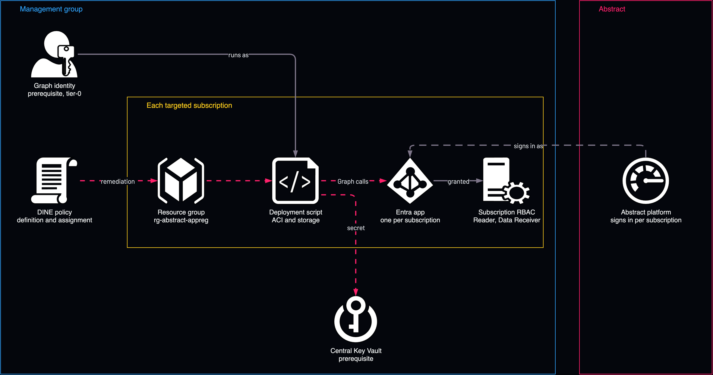

# Abstract access to every subscription: app registrations by Policy

<!-- Generated from template.yml by `python -m tools.templates generate`. Do not edit. -->

Azure Policy cannot create Entra objects, so this policy deploys a deployment script that runs as a pre-consented managed identity and calls Microsoft Graph. Each in-scope subscription gets its own app, credential and subscription-scoped RBAC. The event-driven automation path is safer for most customers.

**Cloud:** azure · **Role:** access · **Scope:** management-group



Editable source: [diagram.drawio](diagram.drawio)

## When to use

Only when governance mandates that every control arrive through Azure Policy.

**Not for:** Event Hub collection, which needs no app registration; and most estates, where the event-driven automation path keeps the privileged identity in one place.

Not sure this is the right one, or what to deploy before it? Answer a few questions in [the setup guide](https://github.com/IamABS3C/abstract-cloud-templates/blob/main/docs/azure/GUIDE.md).

## Deploy

[](https://portal.azure.com/#create/Microsoft.Template/uri/https%3A%2F%2Fraw.githubusercontent.com%2FIamABS3C%2Fabstract-cloud-templates%2Fmain%2Ftemplates%2Fazure%2Fazure-access-app-registration-management-group-policy%2Fazuredeploy.json/uiFormDefinitionUri/https%3A%2F%2Fraw.githubusercontent.com%2FIamABS3C%2Fabstract-cloud-templates%2Fmain%2Ftemplates%2Fazure%2Fazure-access-app-registration-management-group-policy%2FuiFormDefinition.json)

Or from a shell, in this folder:

```bash
./deploy.sh
```

## Prerequisites

- A user-assigned managed identity already holding the two Graph permissions with admin consent
- A central Key Vault for every generated secret
- Microsoft.ContainerInstance and Microsoft.Storage registered in each target subscription
- A tag gate (default abstract-onboard=true) so only chosen subscriptions are onboarded

## Cost

Each remediation run creates a storage account and container instance in the target subscription and costs a few cents.

## Parameters

| Name | Type | Required | Description | Find it |
|---|---|---|---|---|
| `assignmentLocation` | string | no | Region for the policy assignment managed identity and the deploymentScript container. |  |
| `namePrefix` | string | no | Prefix for the policy assignment name. Capped at 6 - management-group policy assignment names are limited to 24 characters. |  |
| `effect` | string | no | Policy effect. AuditIfNotExists reports which subscriptions LACK an Abstract app without creating anything - always start here. |  |
| `enforcementMode` | string | no | DoNotEnforce creates the assignment without acting. Combined with AuditIfNotExists this is a completely inert dry run. |  |
| `managedIdentityResourceId` | string | yes | Resource ID of a user-assigned managed identity that ALREADY holds Microsoft Graph Application.ReadWrite.All and AppRoleAssignment.ReadWrite.All, consented by a Global Administrator. Policy cannot create or consent this - see scripts/ Deploy-AbstractAppReg.sh -a Bootstrap for the one-time setup. This identity can grant itself any directory permission. Treat it as tier-0. Find it with: az identity list --query [].id -o tsv | `az identity list --query "[].id" -o tsv` |
| `managedIdentityClientId` | string | yes | Client ID of that same identity. The script needs it for `az login --identity --username <clientId>`; the resource ID alone is not enough. Find it with: az identity list --query [].clientId -o tsv | `az identity list --query "[].clientId" -o tsv` |
| `centralKeyVaultName` | string | yes | Name of a CENTRAL Key Vault that receives every generated client secret. Deliberately central: per-subscription vaults would scatter tier-0 secrets across the estate. Find it with: az keyvault list --query [].name -o tsv | `az keyvault list --query "[].name" -o tsv` |
| `centralKeyVaultResourceGroup` | string | yes | Resource group of the central Key Vault. Find it with: az group list --query [].name -o tsv | `az keyvault list --query "[].resourceGroup" -o tsv` |
| `centralKeyVaultSubscriptionId` | string | yes | Subscription ID of the central Key Vault. Find it with: az account list --query [].id -o tsv | `az account list --query "[].id" -o tsv` |
| `appNamePattern` | string | no | App display-name pattern. {sub} is replaced with the target subscription ID, giving one app per subscription. Also the idempotency key - the script reuses an app of the same name rather than creating a second one. |  |
| `graphPermissions` | array | no | Microsoft Graph APPLICATION permissions granted to each created app. VERIFIED against the live Graph service principal on 2026-08-03. Note that "Security.Read.All" is NOT in this list and must never be added - it does not exist as an application permission (nor as a delegated scope); the real coverage is SecurityEvents.Read.All + SecurityAlert.Read.All + SecurityIncident.Read.All. |  |
| `secretMonths` | int | no | Client-secret lifetime in months. |  |
| `subscriptionRoleDefinitionIds` | array | no | Azure RBAC roles granted to each created service principal ON ITS OWN SUBSCRIPTION. Default is Reader plus Azure Event Hubs Data Receiver. This - not the Graph permissions - is what makes the app per-subscription: Graph permissions are inherently tenant-wide. |  |
| `scriptResourceGroup` | string | no | Resource group created in each target subscription to host the deploymentScript and its storage. Nothing sensitive lands here. |  |
| `azCliVersion` | string | no | az CLI version for the deploymentScript container. |  |
| `tagName` | string | no | Only act on subscriptions carrying this tag. STRONGLY recommended: it is the difference between "onboard what we chose" and "onboard everything the management group ever contains". Leave tagName empty to act on all in-scope subscriptions. |  |
| `tagValue` | string | no | Required tag value when tagName is set. |  |

## Permissions

- **Global Administrator or Privileged Role Administrator** on The Entra tenant: Deployer: Once per tenant, to consent Application.ReadWrite.All and AppRoleAssignment.ReadWrite.All to the managed identity.
- **Microsoft Graph Application.ReadWrite.All and AppRoleAssignment.ReadWrite.All** on The Entra tenant: Pre-consented managed identity: Creates the apps and grants their permissions; it can grant itself anything, so treat it as tier-0.
- **Owner, or Contributor plus User Access Administrator** on Each target subscription: Policy assignment identity: The deployment script assigns RBAC there.
- **Key Vault Secrets Officer** on The central Key Vault: Policy assignment identity: Stores each generated client secret.
- **Graph application permissions (AuditLog, security alerts, events and incidents, directory, identity risk, threat hunting, users, groups, devices)** on The Entra tenant: Each created app: Graph application permissions are tenant-wide and cannot be scoped to a subscription.

## Creates

- A custom DeployIfNotExists policy definition and one assignment (&lt;namePrefix&gt;-appreg) with a system-assigned identity
- Per targeted subscription, on remediation: a resource group (default rg-abstract-appreg) hosting a deploymentScripts run, which creates a storage account and container instance
- Per targeted subscription: an Entra app named Abstract-&lt;subscription-id&gt; and its service principal, reused by display name on re-runs
- Admin consent for the configured Graph application permissions, verified by reading the assignments back
- A client secret stored only in the central Key Vault
- Reader and Azure Event Hubs Data Receiver on the app's own subscription

## Never touches

- Subscriptions that do not carry the tag gate, which are out of scope for the policy
- Apps and service principals that were not created by this policy; an existing app is only reused when its display name matches appNamePattern
- Other Entra ID configuration, users, groups and Conditional Access
- The managed identity and its Graph consent, which must already exist and are never created or changed here

## Outputs

- `policyDefinitionId`
- `assignmentName`
- `assignmentPrincipalId`
- `nextSteps`

## Verify

| Check | Command | Healthy when |
|---|---|---|
| See which subscriptions would be onboarded before anything is created |  | With effect AuditIfNotExists, Policy compliance lists exactly the subscriptions that lack an Abstract app. |
| Consent is complete for a created app | `./deploy.sh verify --app-id <app-id>` | No missing permissions are reported. |
