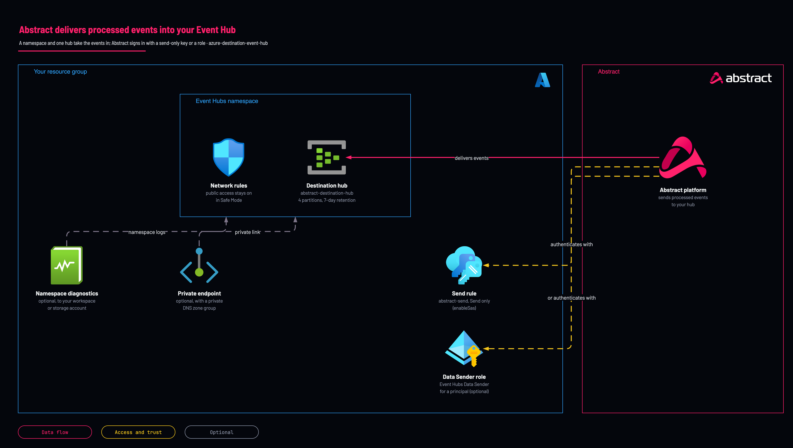

# Abstract to your Event Hub: namespace and hub

<!-- Generated from template.yml by `python -m tools.templates generate`. Do not edit. -->

Provisions the Azure side of the Abstract Azure EventHub Destination: an Event Hubs namespace and one hub that Abstract delivers processed events into, with a Send-only SAS rule or an RBAC grant. Safe Mode keeps public access on so Abstract can always reach the hub during onboarding.

**Cloud:** azure · **Role:** destination · **Scope:** resource-group



Editable source: [diagram.drawio](diagram.drawio)

Not sure this is the right one, or what to deploy before it? Answer a few questions in [the setup guide](https://github.com/IamABS3C/abstract-cloud-templates/blob/main/docs/azure/GUIDE.md).

## Deploy

[](https://portal.azure.com/#create/Microsoft.Template/uri/https%3A%2F%2Fraw.githubusercontent.com%2FIamABS3C%2Fabstract-cloud-templates%2Fmain%2Ftemplates%2Fazure%2Fazure-destination-event-hub%2Fazuredeploy.json/createUIDefinitionUri/https%3A%2F%2Fraw.githubusercontent.com%2FIamABS3C%2Fabstract-cloud-templates%2Fmain%2Ftemplates%2Fazure%2Fazure-destination-event-hub%2FcreateUiDefinition.json)

Or from a shell, in this folder:

```bash
./deploy.sh
```

## Prerequisites

- A globally unique namespace name, 6 to 50 characters, starting with a letter
- Abstract egress must be able to reach the hub; with safeMode=false, include Abstract egress IPs in allowedIpRanges
- For RBAC delivery, the service principal's Enterprise Application object ID, not its client ID

## Parameters

| Name | Type | Required | Description | Find it |
|---|---|---|---|---|
| `location` | string | no | Azure region for all resources. |  |
| `namespaceName` | string | yes | Event Hubs namespace name - globally unique, 6-50 chars, letters/numbers/hyphens, must start with a letter. Becomes &lt;name&gt;.servicebus.windows.net. You are CREATING this, so it is a name you choose - globally unique across Azure. Check with: az eventhubs namespace list --query [].name -o tsv | `az eventhubs namespace exists --name <candidate-name> --query nameAvailable -o tsv` |
| `sku` | string | no | Namespace pricing tier. Abstract requires Standard as the minimum tier. |  |
| `capacity` | int | no | Throughput Units (Standard, 1-40) or Processing Units (Premium: 1, 2, 4, 8, 16). |  |
| `autoInflate` | bool | no | Enable Auto-Inflate so the namespace scales Throughput Units automatically (Standard tier only). |  |
| `maxThroughputUnits` | int | no | Auto-Inflate ceiling in Throughput Units (Standard only, max 40). |  |
| `minimumTlsVersion` | string | no | Minimum TLS version the namespace accepts. |  |
| `tags` | object | no | Tags applied to every resource created by this template. |  |
| `eventHubName` | string | no | Name of the Event Hub that Abstract delivers events to. Enter this in the "EventHub Name" field of the Abstract destination integration. |  |
| `partitionCount` | int | no | Partition count for the destination hub. Abstract docs recommend at least 4. Cannot be reduced after creation; max 32 on Standard. |  |
| `retentionDays` | int | no | Message retention in days. Size this to ride out delivery delays. Standard allows 1-7. |  |
| `enableSas` | bool | no | Create the Send-only SAS rule used for "EventHub Connection String" auth in the Abstract destination modal. When false, local (SAS) auth is fully DISABLED and only Entra ID / RBAC works. |  |
| `sendRuleName` | string | no | Name of the least-privilege Send SAS rule created at namespace level. Use its primary connection string in the Abstract destination modal instead of RootManageSharedAccessKey. |  |
| `enableRbac` | bool | no | Also assign Azure RBAC (Azure Event Hubs Data Sender) so Abstract can deliver events using a service principal / managed identity instead of a connection string. |  |
| `principalId` | string | no | Object ID of the service principal Abstract authenticates as (the Enterprise Application object ID, NOT the app/client ID). Required only when enableRbac = true. | `az ad sp show --id <application-client-id> --query id -o tsv` |
| `roleDefinitionName` | string | no | Built-in Event Hubs data-plane role granted to the principal. A destination only needs to SEND, so Data Sender is the least-privilege choice. |  |
| `principalType` | string | no | Type of the principal being granted RBAC (avoids PrincipalNotFound on freshly created SPNs). |  |
| `allowedIpRanges` | array | no | Public IP ranges (CIDR) allowed through the namespace firewall - Abstract egress IPs plus your admin ranges. A non-empty list flips the firewall default action to Deny (unless Safe Mode is on). Empty entries are filtered out. |  |
| `allowAzureServices` | bool | no | Allow trusted Microsoft services through the firewall. |  |
| `disablePublicNetwork` | bool | no | Disable ALL public network access on the namespace (Private Endpoint only). Only honored when safeMode = false. NOTE: blocks Abstract (external SaaS) unless it reaches the namespace privately. |  |
| `enablePrivateEndpoint` | bool | no | Create a Private Endpoint for the namespace. |  |
| `subnetId` | string | no | Resource ID of the subnet that will host the Private Endpoint NIC. |  |
| `privateDnsZoneId` | string | no | Resource ID of the privatelink.servicebus.windows.net Private DNS zone (recommended with the Private Endpoint). |  |
| `safeMode` | bool | no | Safe Mode guardrails for external SaaS delivery (Abstract): true -&gt; public network access stays ON, the IP allowlist is ignored, and the firewall default action stays Allow so Abstract can always deliver. false -&gt; disablePublicNetwork / allowedIpRanges are honored exactly as set. Ship customers safeMode=true for onboarding; harden later. |  |
| `enableDiagnostics` | bool | no | Enable diagnostic settings on the destination namespace so you can monitor the health of the delivery pipeline itself. |  |
| `logAnalyticsWorkspaceId` | string | no | Resource ID of the Log Analytics workspace for namespace diagnostics. |  |
| `diagnosticsStorageAccountId` | string | no | Optional storage account resource ID for diagnostics archive. |  |

## Permissions

- **Send on the abstract-send SAS rule** on The namespace: Abstract: Least privilege for a producer; use its connection string in the destination modal.
- **Azure Event Hubs Data Sender** on The namespace, only when enableRbac=true: Abstract: Deliver with a service principal instead of a connection string.

## Creates

- An Event Hubs namespace (Standard minimum, TLS 1.2, Auto-Inflate on)
- One destination hub (default abstract-destination-hub, 4 partitions, 7-day retention)
- A Send-only SAS rule abstract-send at namespace level (enableSas); keys are never emitted in outputs
- Optional Azure Event Hubs Data Sender for a service principal (enableRbac)
- Network rules, with an optional private endpoint and private DNS zone group
- Optional namespace diagnostic settings (enableDiagnostics)

## Never touches

- Existing Event Hubs namespaces, hubs and authorization rules, including RootManageSharedAccessKey
- Abstract's destination configuration (you enter the hub name and connection string there yourself)
- Workload resources in the resource group

## Outputs

- `namespaceName`
- `namespaceFqdn`
- `eventHubName`
- `sendRuleName`
- `publicAccess`
- `firewallDefaultAction`
- `safeModeEnabled`
- `rbacEnabled`
- `abstractDestinationOnboarding`

## Example parameter profiles

- `default.parameters.json`

## Verify

| Check | Command | Healthy when |
|---|---|---|
| The destination fields are available | `az deployment group show -g <resource-group> -n <deployment-name> --query properties.outputs.abstractDestinationOnboarding.value` | eventHubName and the location of the Send-only connection string are listed. |
