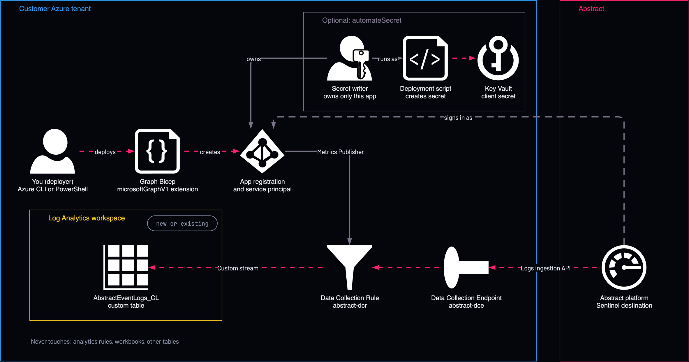

# Abstract to Sentinel: app registration created by Graph

<!-- Generated from template.yml by `python -m tools.templates generate`. Do not edit. -->

Creates the Entra app registration and service principal as the person deploying, using the Microsoft Graph Bicep extension, then calls the standard destination template. No managed identity has to exist first; optional secret automation adds one that owns only this app. CLI only: needs the Microsoft Graph Bicep extension (Azure CLI or PowerShell).

**Cloud:** azure · **Role:** destination · **Scope:** resource-group



Editable source: [diagram.drawio](diagram.drawio)

## When to use

Production, when the template should create the app registration and no pre-existing privileged identity is acceptable.

**Not for:** Portal-only deployments; Microsoft Graph Bicep is documented only for Azure CLI and PowerShell.

Not sure this is the right one, or what to deploy before it? Answer a few questions in [the setup guide](https://github.com/IamABS3C/abstract-cloud-templates/blob/main/docs/azure/GUIDE.md).

## Deploy

From a shell, in this folder:

```bash
./deploy.sh
```

## Prerequisites

- Azure CLI or Azure PowerShell; there is no portal wizard for Microsoft Graph Bicep
- The bicepconfig.json that enables the Microsoft Graph extension, alongside the template
- Deploy in Incremental mode only
- Deleting the resource group does not delete the app registration

## Cost

Ingestion into the Abstract table is charged at the table's plan (Analytics by default), and ASIM, when on, adds a further copy of each mapped event. Retention beyond the free period is charged; DCE and DCR billing is not verified.

## Parameters

| Name | Type | Required | Description | Find it |
|---|---|---|---|---|
| `location` | string | no | Azure region for the DCE, DCR and (when automateSecret) the identity, Key Vault and script. |  |
| `tags` | object | no | Tags applied to every created Azure resource that supports tags. |  |
| `tagsByResource` | object | no | Resource-specific tags, keyed by fully qualified Azure resource type. |  |
| `appDisplayName` | string | no | Display name of the app registration Abstract signs in as. |  |
| `appUniqueName` | string | no | Tenant-wide unique key for the app registration (Microsoft Graph uniqueName). It makes redeploys update the same app instead of creating another. Immutable once the app exists. |  |
| `automateSecret` | bool | no | Create the client secret automatically: adds a managed identity that owns only this app (Graph Application.ReadWrite.OwnedBy), a Key Vault and a deployment script. Needs a Privileged Role Administrator or Global Administrator deployer. Off: create the secret yourself afterwards (see the secretCommand output). |  |
| `keyVaultName` | string | no | Key Vault to create for the client secret (automateSecret only). Empty generates abskv-&lt;hash&gt;. |  |
| `secretName` | string | no | Name of the Key Vault secret that holds the client secret (automateSecret only). |  |
| `secretValidityYears` | int | no | Client secret lifetime in years (automateSecret only). |  |
| `forceSecretRotation` | bool | no | Mint a new secret even if the stored one is still valid (automateSecret only). |  |
| `secretReaderObjectId` | string | no | Object ID of a user or group that may read the secret from Key Vault (Key Vault Secrets User), so someone can paste it into Abstract (automateSecret only). Empty: grant it yourself; the deployer is not given access automatically. | `az ad user show --id <user-principal-name> --query id -o tsv` |
| `azCliVersion` | string | no | Azure CLI version for the deployment script (automateSecret only). |  |
| `createWorkspace` | bool | no | Create a new Log Analytics workspace. Set false to target an EXISTING workspace in THIS resource group. |  |
| `workspaceName` | string | no | Workspace name. Creating: empty auto-generates abstract-sentinel-&lt;hash&gt;. Existing: the exact name (in this resource group). |  |
| `existingWorkspaceLocation` | string | no | Region of the EXISTING workspace (Existing mode only). Empty = the deployment location. |  |
| `workspaceSku` | string | no | Workspace pricing tier. PerGB2018 is the standard pay-as-you-go tier. |  |
| `workspaceRetentionDays` | int | no | Workspace retention in days. Only applied when creating a new workspace. |  |
| `enableSentinel` | bool | no | Enable Microsoft Sentinel on a new workspace. |  |
| `dataCollectionEndpointName` | string | no | Name of the Data Collection Endpoint (DCE) that receives data from Abstract. |  |
| `dataCollectionRuleName` | string | no | Name of the Data Collection Rule (DCR) that routes data into the workspace table. |  |
| `customTableName` | string | no | Custom log table name. MUST end in _CL. Enter this (as the stream Custom-&lt;table&gt;) in the "Log Stream Name" field of the Abstract destination modal. |  |
| `customTableRetentionDays` | int | no | Retention of the Abstract table in days. 0 (default) sends no retention, so an existing table keeps its retention and a new table uses the workspace default. A value shortens or lengthens the table's total retention; shortening deletes data older than the new value. |  |
| `customTablePlan` | string | no | Table plan for the Abstract table. Keep (default) keeps the plan an existing table already has, and create a new table as Analytics: a redeploy then never changes a table's plan, or its cost, by accident. Analytics runs analytics rules and our content pack on it. Auxiliary is the Sentinel data lake tier: cheap long retention and KQL jobs, but no analytics rules or alerts. Basic sits between them. Setting a plan on an existing table switches it; Azure applies the new plan to the whole table. |  |
| `enableDcrErrorLogs` | bool | no | Send the Data Collection Rule's ingestion errors (rejected requests, malformed payloads, limit and transformation errors) to the DCRLogErrors table in the workspace. Without it, data Azure refuses or drops is invisible to the customer and to Abstract. |  |
| `enableAsim` | bool | no | Also write each event into Microsoft's ASIM normalized tables (ASimAuthenticationEventLogs and the others listed in asimSchemas), mapped from the Abstract Common Schema by solutions/asim. Off by default. Microsoft's built-in ASIM parsers read those tables, so once this is on every ASIM analytics rule, hunting query and workbook already running in the workspace also sees Abstract data: expect new alerts, duplicates where Microsoft's own connector collects the same vendor, and a second copy of each mapped event in billing. Turn it on in a staging workspace first, or one schema at a time with asimSchemas. Needs Microsoft Sentinel on the workspace and the generated Abstract schema (tableColumns left empty). Every event still also lands in the Abstract table. |  |
| `asimSchemas` | array | no | ASIM schemas to write, by name (for example ['Authentication', 'NetworkSession']). ['*'] (default) writes every schema solutions/asim maps; [] writes none. |  |
| `grantMonitoringContributor` | bool | no | Also grant Monitoring Contributor on the DCR. Off by default: sending data through the Logs Ingestion API needs only Monitoring Metrics Publisher, and Monitoring Contributor would let a leaked Abstract credential rewrite or delete the DCR and its error-log setting. Turn on only if your Abstract destination setup specifically asks for it. |  |

## Permissions

- **Rights to register an app (the default user setting, or Application Developer)** on The Entra tenant: Deployer: The app is created as the person deploying.
- **Owner, or Contributor plus User Access Administrator** on The resource group: Deployer: Create the role assignments.
- **Privileged Role Administrator or Global Administrator** on The Entra tenant: Deployer: Only with automateSecret, to grant the secret writer its Graph permission.
- **Microsoft Graph Application.ReadWrite.OwnedBy, and Key Vault Secrets Officer on the new vault** on This app and the new vault: Secret writer identity: Adds and stores the secret; measured unable to change apps it does not own.
- **Monitoring Metrics Publisher** on The DCR only: Abstract runtime app: All the Logs Ingestion API needs.

## Creates

- Everything the standard Sentinel destination creates, via the standard template as a module, with the new service principal as principalId
- An Entra app registration with no API permissions, tagged abstract:sentinel-destination; uniqueName keeps redeploys on the same app
- The app's service principal
- With automateSecret: a user-assigned identity abstract-sentinel-secret-writer that owns only this app, holding Graph Application.ReadWrite.OwnedBy
- With automateSecret: a Key Vault for the client secret and a deployment script that creates and stores it

## Never touches

- Microsoft Sentinel analytics rules, automation rules, hunting queries, bookmarks, incidents, watchlists, workbooks, data connectors, threat intelligence or settings
- Workspace functions, saved searches or parsers, including every ASIM parser
- Any table other than the Abstract table
- An existing workspace's SKU, retention, daily cap, access mode, network settings or workspace transformation DCR
- Any other DCR, DCE or diagnostic setting, unless it has the same name as one the template creates

## Outputs

- `clientId`
- `applicationTenantId`
- `servicePrincipalObjectId`
- `dataCollectionRuleImmutableId`
- `dataCollectionEndpointUrl`
- `logStreamName`
- `workspaceName`
- `clientSecretKeyVaultUri`
- `secretCommand`
- `secretWriterNote`

## Verify

| Check | Command | Healthy when |
|---|---|---|
| The outputs carry the three values the Abstract destination needs | `az deployment group show -g <resource-group> -n <deployment-name> --query properties.outputs` | dataCollectionRuleImmutableId, dataCollectionEndpointUrl and logStreamName (Custom-AbstractEventLogs_CL) are present. |
| Events are landing in the Abstract table | `AbstractEventLogs_CL \| where TimeGenerated > ago(1h) \| summarize count() by vendor, product` | A count that matches the event count Abstract reports for the route. |
| Azure is not rejecting rows | `DCRLogErrors \| where TimeGenerated > ago(1h) \| summarize count() by OperationName, Message` | No rows. |
