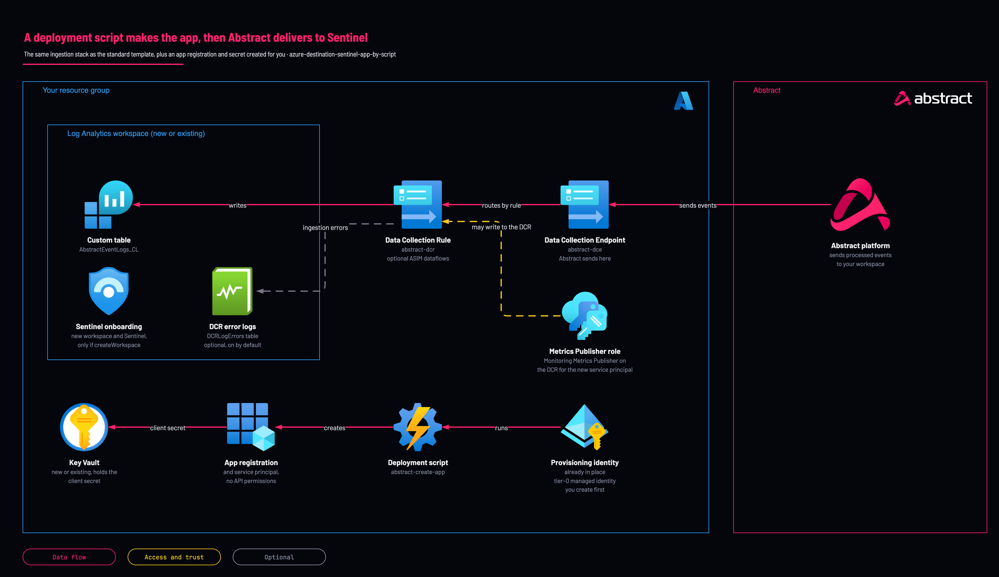

# Abstract to Sentinel: app registration created by script

<!-- Generated from template.yml by `python -m tools.templates generate`. Do not edit. -->

The portal-wizard variant of the Sentinel destination: a deployment script creates the Entra app registration and, with Key Vault, its client secret, then the template builds the same ingestion stack. It runs as a tier-0 managed identity you create beforehand, so it suits portal-only teams and labs.

**Cloud:** azure · **Role:** destination · **Scope:** resource-group



Editable source: [diagram.drawio](diagram.drawio)

## When to use

Portal-only teams and labs.

**Not for:** Production where a standing privileged identity is unwelcome; the standard or Graph template avoids it.

Not sure this is the right one, or what to deploy before it? Answer a few questions in [the setup guide](https://github.com/IamABS3C/abstract-cloud-templates/blob/main/docs/azure/GUIDE.md).

## Deploy

[](https://portal.azure.com/#create/Microsoft.Template/uri/https%3A%2F%2Fraw.githubusercontent.com%2FIamABS3C%2Fabstract-cloud-templates%2Fmain%2Ftemplates%2Fazure%2Fazure-destination-sentinel-app-by-script%2Fazuredeploy.json/createUIDefinitionUri/https%3A%2F%2Fraw.githubusercontent.com%2FIamABS3C%2Fabstract-cloud-templates%2Fmain%2Ftemplates%2Fazure%2Fazure-destination-sentinel-app-by-script%2FcreateUiDefinition.json)

Or from a shell, in this folder:

```bash
./deploy.sh
```

## Prerequisites

- A user-assigned managed identity granted Graph Application.ReadWrite.All with admin consent by a Global Administrator
- Keep that identity in a resource group only administrators can write to, and remove its Graph permission after onboarding
- For an existing vault in another resource group, role-assignment rights there too
- Deploy in Incremental mode only

## Cost

Ingestion into the Abstract table is charged at the table's plan (Analytics by default), and ASIM, when on, adds a further copy of each mapped event. Retention beyond the free period is charged; DCE and DCR billing is not verified. The with-app variant adds Key Vault operations and a few cents per deployment-script run.

## Parameters

| Name | Type | Required | Description | Find it |
|---|---|---|---|---|
| `location` | string | no | Azure region for the workspace, DCE, DCR, Key Vault and deployment script. |  |
| `tags` | object | no | Tags applied to every created resource that supports tags. |  |
| `tagsByResource` | object | no | Resource-specific tags, keyed by fully qualified Azure resource type. |  |
| `managedIdentityResourceId` | string | yes | Resource ID of the user-assigned provisioning identity. Tenant bootstrap must grant it Microsoft Graph Application.ReadWrite.All with admin consent; this template does not use AppRoleAssignment.ReadWrite.All. | `az identity list --query "[].{name:name,id:id}" -o table` |
| `appDisplayName` | string | no | Display name for the Entra app registration created for Abstract. |  |
| `secretValidityYears` | int | no | Client-secret validity in years when a Key Vault mode generates the secret. |  |
| `secretReaderObjectId` | string | no | Optional user or group object ID granted Key Vault Secrets User when Key Vault is enabled. | `az ad user show --id <user-principal-name> --query id -o tsv` |
| `azCliVersion` | string | no | Azure CLI version for the deployment script container. Verify the selected image version is available before changing this value. |  |
| `secretName` | string | no | Name of the Key Vault secret holding the client secret. |  |
| `forceSecretRotation` | bool | no | Force a NEW client secret even when the vault already holds a valid one. Leave false. The script now rotates only when no secret exists or the existing one expires within 30 days, which makes re-running this template safe - the previous behaviour minted a fresh secret on every deployment, so a re-run silently created a new Key Vault version while Abstract kept using the old value. Set true only for a deliberate rotation, and update Abstract with the new value. |  |
| `keyVaultMode` | string | no | Create a new Key Vault, use an existing vault by resource ID, or skip Key Vault. In None mode, create the client secret in Entra after deployment. |  |
| `keyVaultName` | string | no | Key Vault name (3-24 lowercase alphanumerics/hyphens, globally unique). Leave empty to auto-generate abstract-kv-&lt;hash&gt;. |  |
| `existingKeyVaultResourceId` | string | no | Full resource ID of the existing Key Vault. Used only when keyVaultMode is Existing. |  |
| `createWorkspace` | bool | no | Create a new Log Analytics workspace. Set false to target an EXISTING workspace in THIS resource group. |  |
| `workspaceName` | string | no | Workspace name. Creating: empty auto-generates abstract-sentinel-&lt;hash&gt;. Existing: the exact name (in this resource group). |  |
| `existingWorkspaceLocation` | string | no | Region of the EXISTING workspace (Existing mode only). DCE/DCR must match it. Empty = use the deployment location. |  |
| `workspaceSku` | string | no | Workspace pricing tier. PerGB2018 is the standard pay-as-you-go tier. |  |
| `workspaceRetentionDays` | int | no | Workspace data retention in days. Only applied when creating a new workspace; an existing workspace is never modified. The Abstract table's own retention is customTableRetentionDays. |  |
| `enableSentinel` | bool | no | Enable Microsoft Sentinel on the workspace (only applied when creating a new workspace; assumed already enabled for existing workspaces). |  |
| `dataCollectionEndpointName` | string | no | Name of the Data Collection Endpoint (DCE) that receives data from Abstract. |  |
| `dataCollectionRuleName` | string | no | Name of the Data Collection Rule (DCR) that routes data into the workspace table. |  |
| `customTableName` | string | no | Custom log table name. MUST end in _CL. |  |
| `tableColumns` | array | no | Custom table columns. Leave empty (recommended) to use the generated ACS schema: one column per top-level key of the event Abstract sends, with a DCR transformation that sets TimeGenerated. Supply columns only for a custom payload shape; the DCR stream then uses the same columns and transformKql. |  |
| `transformKql` | string | no | DCR transformation used only when tableColumns is supplied. The generated schema carries its own transformation. |  |
| `enableDcrErrorLogs` | bool | no | Send the Data Collection Rule's ingestion errors (rejected requests, malformed payloads, limit and transformation errors) to the DCRLogErrors table in the workspace. Without it, data Azure refuses or drops is invisible to the customer and to Abstract. |  |
| `enableAsim` | bool | no | Also write each event into Microsoft's ASIM normalized tables (ASimAuthenticationEventLogs and the others listed in asimSchemas), mapped from the Abstract Common Schema by solutions/asim. Off by default. Microsoft's built-in ASIM parsers read those tables, so once this is on every ASIM analytics rule, hunting query and workbook already running in the workspace also sees Abstract data: expect new alerts, duplicates where Microsoft's own connector collects the same vendor, and a second copy of each mapped event in billing. Turn it on in a staging workspace first, or one schema at a time with asimSchemas. Needs Microsoft Sentinel on the workspace and the generated Abstract schema (tableColumns left empty). Every event still also lands in the Abstract table. |  |
| `asimSchemas` | array | no | ASIM schemas to write, by name (for example ['Authentication', 'NetworkSession']). ['*'] (default) writes every schema solutions/asim maps; [] writes none. |  |
| `customTableRetentionDays` | int | no | Retention of the Abstract table in days. 0 (default) sends no retention, so an existing table keeps its retention and a new table uses the workspace default. A value shortens or lengthens the table's total retention; shortening deletes data older than the new value. |  |
| `grantMonitoringContributor` | bool | no | Also grant Monitoring Contributor on the DCR. Off by default: sending data through the Logs Ingestion API needs only Monitoring Metrics Publisher, and Monitoring Contributor would let a leaked Abstract credential rewrite or delete the DCR and its error-log setting. Turn on only if your Abstract destination setup specifically asks for it. |  |
| `customTablePlan` | string | no | Table plan for the Abstract table. Keep (default) keeps the plan an existing table already has, and create a new table as Analytics: a redeploy then never changes a table's plan, or its cost, by accident. Analytics runs analytics rules and our content pack on it. Auxiliary is the Sentinel data lake tier: cheap long retention and KQL jobs, but no analytics rules or alerts. Basic sits between them. Setting a plan on an existing table switches it; Azure applies the new plan to the whole table. |  |

## Permissions

- **Owner, or Contributor plus User Access Administrator** on The resource group: Deployer: Create the role assignments.
- **Microsoft Graph Application.ReadWrite.All, admin-consented once** on The Entra tenant: Provisioning identity (user-assigned): Creates the app and secret; it can add a credential to any app, so treat it as tier-0.
- **Key Vault Secrets Officer** on The new vault, or your existing vault: Provisioning identity (user-assigned): Stores the client secret.
- **Monitoring Metrics Publisher** on The DCR only: Abstract runtime app: All the Logs Ingestion API needs.

## Creates

- Everything the standard Sentinel destination creates, with the DCR role assignment always going to the service principal the script creates
- A Key Vault (RBAC authorization, soft delete, purge protection) when keyVaultMode=Create
- Key Vault Secrets Officer for the provisioning identity on the new or existing vault; Key Vault Secrets User for secretReaderObjectId when supplied
- A deployment script abstract-create-app that runs as the provisioning identity
- In Entra ID, outside ARM: an app registration with no API permissions, its service principal, and one client secret when a Key Vault is used

## Never touches

- Microsoft Sentinel analytics rules, automation rules, hunting queries, bookmarks, incidents, watchlists, workbooks, data connectors, threat intelligence or settings
- Workspace functions, saved searches or parsers, including every ASIM parser
- Any table other than the Abstract table
- An existing workspace's SKU, retention, daily cap, access mode, network settings or workspace transformation DCR
- Any other DCR, DCE or diagnostic setting, unless it has the same name as one the template creates

## Outputs

- `clientId`
- `applicationTenantId`
- `servicePrincipalObjectId`
- `clientSecretKeyVaultUri`
- `keyVaultName`
- `workspaceName`
- `customTableName`
- `dataCollectionRuleImmutableId`
- `dataCollectionEndpointUrl`
- `logStreamName`
- `secretCreationInstructions`
- `abstractModalHint`

## Example parameter profiles

- `default.parameters.json`

## Verify

| Check | Command | Healthy when |
|---|---|---|
| The outputs carry the three values the Abstract destination needs | `az deployment group show -g <resource-group> -n <deployment-name> --query properties.outputs` | dataCollectionRuleImmutableId, dataCollectionEndpointUrl and logStreamName (Custom-AbstractEventLogs_CL) are present. |
| Events are landing in the Abstract table | `AbstractEventLogs_CL \| where TimeGenerated > ago(1h) \| summarize count() by vendor, product` | A count that matches the event count Abstract reports for the route. |
| Azure is not rejecting rows | `DCRLogErrors \| where TimeGenerated > ago(1h) \| summarize count() by OperationName, Message` | No rows. |
