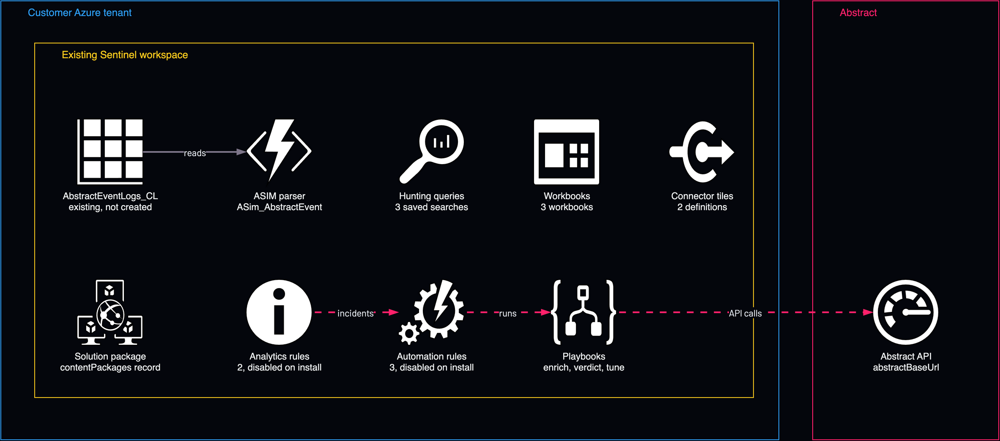

# Sentinel content for Abstract data: rules and workbooks

<!-- Generated from template.yml by `python -m tools.templates generate`. Do not edit. -->

A self-contained approximation of the Abstract Microsoft Sentinel solution that installs connector tiles, an ASIM parser function, analytics and automation rules, hunting queries, workbooks and playbooks into an existing Sentinel workspace. Sufficient for a lab or private install; not a substitute for the certified Content Hub package.

**Cloud:** azure · **Role:** destination · **Scope:** resource-group



Editable source: [diagram.drawio](diagram.drawio)

## When to use

A lab or private install of the Abstract Sentinel content.

**Not for:** An official Content Hub or marketplace listing, which needs Microsoft's packaging and validation tooling run against the source.

Not sure this is the right one, or what to deploy before it? Answer a few questions in [the setup guide](https://github.com/IamABS3C/abstract-cloud-templates/blob/main/docs/azure/GUIDE.md).

## Deploy

[](https://portal.azure.com/#create/Microsoft.Template/uri/https%3A%2F%2Fraw.githubusercontent.com%2FIamABS3C%2Fabstract-cloud-templates%2Fmain%2Ftemplates%2Fazure%2Fazure-destination-sentinel-content-pack%2Fazuredeploy.json/createUIDefinitionUri/https%3A%2F%2Fraw.githubusercontent.com%2FIamABS3C%2Fabstract-cloud-templates%2Fmain%2Ftemplates%2Fazure%2Fazure-destination-sentinel-content-pack%2FcreateUiDefinition.json)

Or from a shell, in this folder:

```bash
./deploy.sh
```

## Prerequisites

- An existing Log Analytics workspace with Microsoft Sentinel enabled, where the Abstract table AbstractEventLogs_CL lives
- A Key Vault secret URI for the Abstract API key (keyVaultSecretUri)
- The Abstract API base URL and vendor account ID for the playbooks, or configure them later
- Review each rule and enable the ones you want; they install disabled

## Parameters

| Name | Type | Required | Description | Find it |
|---|---|---|---|---|
| `workspace` | string | yes | Log Analytics / Sentinel workspace name. | `az monitor log-analytics workspace list --query "[].{name:name,location:location,resourceGroup:resourceGroup}" -o table` |
| `workspaceLocation` | string | no | Region of the existing Sentinel workspace. Every content resource is created in it; it must match the workspace's region. |  |
| `customTableName` | string | no | Custom table the Abstract Sentinel Destination writes to. |  |
| `logoUrl` | string | no | Connector tile logo. Defaults to the embedded Abstract Security mark (self-contained data URI). |  |
| `abstractBaseUrl` | string | no | Abstract API base URL (used by the playbooks). |  |
| `abstractVendorAccountId` | string | no | Abstract vendor account id for the playbooks (x-as-vendor-account-id). Leave blank to configure later. |  |
| `keyVaultSecretUri` | string | no | Key Vault secret URI for the Abstract API key, for example https://&lt;vault&gt;.vault.azure.net/secrets/abstract-api-key. Playbooks fetch it at runtime through their managed identity (grant each 'Key Vault Secrets User'). The key is never stored in the template. Leave empty to install the playbooks without it; they fail until it is set. |  |
| `lookbackHours` | int | no | Enrich-incident playbook lookback window (hours). |  |

## Permissions

- **Key Vault Secrets User** on The Key Vault secret holding the Abstract API key: Each playbook's managed identity: Playbooks fetch the key at runtime; the template never stores it.
- **Microsoft Sentinel Responder** on The workspace: Each playbook's managed identity: Playbooks comment on and update incidents.

## Creates

- The solution package record (contentPackages) with linked metadata
- Two data connector definitions (connector tiles)
- The ASim_AbstractEvent parser function (saved search)
- Three hunting queries: Abstract_RareProduct, Abstract_HighRiskIdentities, Abstract_DailyValueSummary
- Two scheduled analytics rules, installed disabled
- Three automation rules, installed disabled and scoped to this pack's two rules
- Three workbooks
- Three playbooks as nested deployments: enrich, verdict and tune

## Never touches

- Your own analytics rules, automation rules, workbooks and playbooks; it only adds its own items
- Incident status; the Verdict playbook comments and can raise severity, never closes

## Outputs

