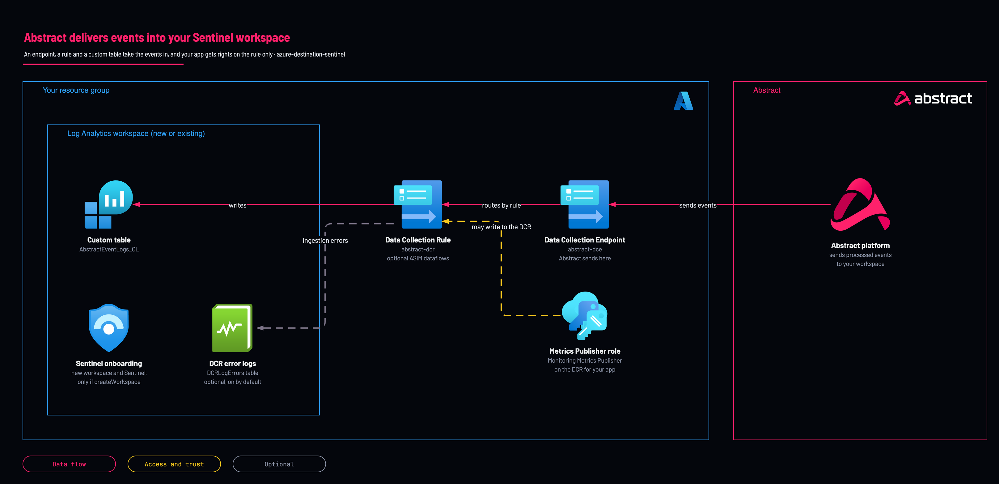

# Abstract to Microsoft Sentinel: with your app registration

<!-- Generated from template.yml by `python -m tools.templates generate`. Do not edit. -->

Prepares Azure for the Abstract Azure Sentinel Destination: a Data Collection Endpoint, a Data Collection Rule and the custom Abstract table, in a new or existing workspace, with Monitoring Metrics Publisher on the DCR for the app you created. Recommended for production; no privileged identity is involved.

**Cloud:** azure · **Role:** destination · **Scope:** resource-group



Editable source: [diagram.drawio](diagram.drawio)

## When to use

Production, when you create the Entra app registration yourself.

**Not for:** When the template should create the app registration for you; use the Graph variant.

Not sure this is the right one, or what to deploy before it? Answer a few questions in [the setup guide](https://github.com/IamABS3C/abstract-cloud-templates/blob/main/docs/azure/GUIDE.md).

## Deploy

[](https://portal.azure.com/#create/Microsoft.Template/uri/https%3A%2F%2Fraw.githubusercontent.com%2FIamABS3C%2Fabstract-cloud-templates%2Fmain%2Ftemplates%2Fazure%2Fazure-destination-sentinel%2Fazuredeploy.json/createUIDefinitionUri/https%3A%2F%2Fraw.githubusercontent.com%2FIamABS3C%2Fabstract-cloud-templates%2Fmain%2Ftemplates%2Fazure%2Fazure-destination-sentinel%2FcreateUiDefinition.json)

Or from a shell, in this folder:

```bash
./deploy.sh
```

## Prerequisites

- An Entra app registration for Abstract; run scripts/new-app-registration.sh first to create it (it can also call this template), then pass its service principal object ID (not the client ID) as principalId
- For an existing workspace: it must be in this resource group, and the DCE and DCR must match its region (existingWorkspaceLocation)
- Unique DCE and DCR names per destination; a same-named DCR in the resource group is replaced
- Deploy in Incremental mode only; Complete mode would delete an existing workspace and everything else in the resource group
- Check whether AbstractEventLogs_CL already exists; columns not in the generated schema are removed on update

## Cost

Ingestion into the Abstract table is charged at the table's plan (Analytics by default), and ASIM, when on, adds a further copy of each mapped event. Retention beyond the free period is charged; DCE and DCR billing is not verified.

## Parameters

| Name | Type | Required | Description | Find it |
|---|---|---|---|---|
| `location` | string | no | Azure region for the workspace, DCE and DCR. Keep these consistent (the DCE/DCR must be in the same region as the workspace). |  |
| `tags` | object | no | Tags applied to every created resource that supports tags. |  |
| `tagsByResource` | object | no | Resource-specific tags, keyed by fully qualified Azure resource type. |  |
| `createWorkspace` | bool | no | Create a new Log Analytics workspace. Set false to target an EXISTING workspace in THIS resource group (provide its name in workspaceName). |  |
| `workspaceName` | string | no | Workspace name. When creating: leave empty to auto-generate (abstract-sentinel-&lt;hash&gt;). When using an existing workspace: the exact name of that workspace (must live in this resource group). | `az monitor log-analytics workspace list -g <resource-group> --query [].name -o tsv` |
| `workspaceSku` | string | no | Workspace pricing tier. PerGB2018 is the standard pay-as-you-go tier. |  |
| `workspaceRetentionDays` | int | no | Workspace data retention in days. Only applied when creating a new workspace; an existing workspace is never modified. The Abstract table's own retention is customTableRetentionDays. |  |
| `enableSentinel` | bool | no | Enable Microsoft Sentinel on the workspace (only applied when creating a new workspace; assumed already enabled for existing workspaces). |  |
| `existingWorkspaceLocation` | string | no | Region of the EXISTING workspace (Existing mode only). The DCE and DCR MUST be created in the same region as the target workspace, so if your existing workspace is in a different region than this deployment, set it here (e.g. eastus2). Leave empty to use the deployment location. |  |
| `dataCollectionEndpointName` | string | no | Name of the Data Collection Endpoint (DCE) that receives data from Abstract. |  |
| `dataCollectionRuleName` | string | no | Name of the Data Collection Rule (DCR) that routes data into the workspace table. |  |
| `customTableName` | string | no | Custom log table name. MUST end in _CL. Enter this (as the stream Custom-&lt;table&gt;) in the "Log Stream Name" field of the Abstract destination modal. |  |
| `tableColumns` | array | no | Custom table columns. Leave empty (recommended) to use the generated ACS schema: one column per top-level key of the event Abstract sends, with a DCR transformation that sets TimeGenerated. Supply columns only for a custom payload shape; the DCR stream then uses the same columns and transformKql. |  |
| `transformKql` | string | no | DCR transformation used only when tableColumns is supplied. The generated schema carries its own transformation. |  |
| `enableDcrErrorLogs` | bool | no | Send the Data Collection Rule's ingestion errors (rejected requests, malformed payloads, limit and transformation errors) to the DCRLogErrors table in the workspace. Without it, data Azure refuses or drops is invisible to the customer and to Abstract. |  |
| `enableAsim` | bool | no | Also write each event into Microsoft's ASIM normalized tables (ASimAuthenticationEventLogs and the others listed in asimSchemas), mapped from the Abstract Common Schema by solutions/asim. Off by default. Microsoft's built-in ASIM parsers read those tables, so once this is on every ASIM analytics rule, hunting query and workbook already running in the workspace also sees Abstract data: expect new alerts, duplicates where Microsoft's own connector collects the same vendor, and a second copy of each mapped event in billing. Turn it on in a staging workspace first, or one schema at a time with asimSchemas. Needs Microsoft Sentinel on the workspace and the generated Abstract schema (tableColumns left empty). Every event still also lands in the Abstract table. |  |
| `asimSchemas` | array | no | ASIM schemas to write, by name (for example ['Authentication', 'NetworkSession']). ['*'] (default) writes every schema solutions/asim maps; [] writes none. |  |
| `customTableRetentionDays` | int | no | Retention of the Abstract table in days. 0 (default) sends no retention, so an existing table keeps its retention and a new table uses the workspace default. A value shortens or lengthens the table's total retention; shortening deletes data older than the new value. |  |
| `customTablePlan` | string | no | Table plan for the Abstract table. Keep (default) keeps the plan an existing table already has, and create a new table as Analytics: a redeploy then never changes a table's plan, or its cost, by accident. Analytics runs analytics rules and our content pack on it. Auxiliary is the Sentinel data lake tier: cheap long retention and KQL jobs, but no analytics rules or alerts. Basic sits between them. Setting a plan on an existing table switches it; Azure applies the new plan to the whole table. |  |
| `grantMonitoringContributor` | bool | no | Also grant Monitoring Contributor on the DCR. Off by default: sending data through the Logs Ingestion API needs only Monitoring Metrics Publisher, and Monitoring Contributor would let a leaked Abstract credential rewrite or delete the DCR and its error-log setting. Turn on only if your Abstract destination setup specifically asks for it. |  |
| `principalId` | string | no | Object ID of the service principal Abstract authenticates as (the Enterprise Application object ID, NOT the Application/client ID). Leave empty to skip role assignments and grant them yourself later. | `az ad sp show --id <application-client-id> --query id -o tsv` |
| `principalType` | string | no | Type of the principal being granted RBAC (avoids PrincipalNotFound on freshly created SPNs). |  |

## Permissions

- **Owner, or Contributor plus User Access Administrator** on The resource group: Deployer: Create the resources and the DCR role assignments.
- **Rights to register an app** on The Entra tenant: Deployer: Create the Abstract app registration beforehand.
- **Monitoring Metrics Publisher** on The DCR only: Abstract runtime app: All the Logs Ingestion API needs; it cannot read data or change rules.
- **Monitoring Contributor** on The DCR, only if grantMonitoringContributor: Abstract runtime app: Off by default: it would let a leaked credential rewrite or delete the DCR.

## Creates

- A Log Analytics workspace and Microsoft Sentinel onboarding, only when createWorkspace=true
- The custom table AbstractEventLogs_CL, with columns generated from the ACS catalog
- A Data Collection Endpoint (default abstract-dce) and a Data Collection Rule (default abstract-dcr)
- A diagnostic setting abstract-dcr-errors sending the DCR's ingestion errors to DCRLogErrors (enableDcrErrorLogs, on by default)
- Monitoring Metrics Publisher on the DCR for the supplied service principal, and Monitoring Contributor only if grantMonitoringContributor
- Optional ASIM dataflows into Microsoft's ASim tables (enableAsim, off by default)

## Never touches

- Microsoft Sentinel analytics rules, automation rules, hunting queries, bookmarks, incidents, watchlists, workbooks, data connectors, threat intelligence or settings
- Workspace functions, saved searches or parsers, including every ASIM parser
- Any table other than the Abstract table
- An existing workspace's SKU, retention, daily cap, access mode, network settings or workspace transformation DCR
- Any other DCR, DCE or diagnostic setting, unless it has the same name as one the template creates

## Outputs

- `workspaceName`
- `workspaceResourceId`
- `customTableName`
- `dataCollectionRuleImmutableId`
- `dataCollectionEndpointUrl`
- `logStreamName`
- `rbacAssigned`
- `abstractSentinelOnboarding`

## Example parameter profiles

- `default.parameters.json`

## Verify

| Check | Command | Healthy when |
|---|---|---|
| The outputs carry the three values the Abstract destination needs | `az deployment group show -g <resource-group> -n <deployment-name> --query properties.outputs` | dataCollectionRuleImmutableId, dataCollectionEndpointUrl and logStreamName (Custom-AbstractEventLogs_CL) are present. |
| Events are landing in the Abstract table | `AbstractEventLogs_CL \| where TimeGenerated > ago(1h) \| summarize count() by vendor, product` | A count that matches the event count Abstract reports for the route. |
| Azure is not rejecting rows | `DCRLogErrors \| where TimeGenerated > ago(1h) \| summarize count() by OperationName, Message` | No rows. |
