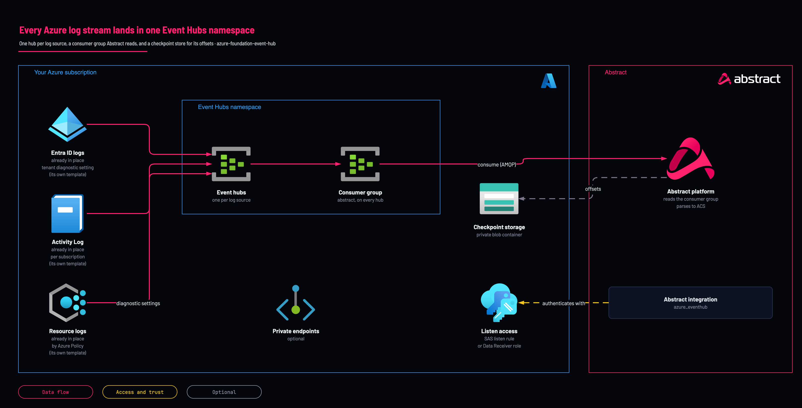

# Azure first step: Event Hub that receives all logs

<!-- Generated from template.yml by `python -m tools.templates generate`. Do not edit. -->

Azure Monitor cannot send diagnostic data directly to a third party, so every Azure onboarding starts here: an Event Hubs namespace with one hub per log source, a consumer group Abstract reads from, and a checkpoint storage account. Deploy it first; the Activity Log, Entra ID and policy templates consume its outputs.

**Cloud:** azure · **Role:** foundation · **Scope:** resource-group



Editable source: [diagram.drawio](diagram.drawio)

## When to use

Any time Azure telemetry needs to reach Abstract: Activity Log, Entra ID sign-in and audit logs, Defender XDR streaming, or resource logs.

**Not for:** Microsoft Graph API and Microsoft 365 unified-audit collection, which are API-pull integrations behind an Entra app registration and need no hub.

Not sure this is the right one, or what to deploy before it? Answer a few questions in [the setup guide](https://github.com/IamABS3C/abstract-cloud-templates/blob/main/docs/azure/GUIDE.md).

## Deploy

[](https://portal.azure.com/#create/Microsoft.Template/uri/https%3A%2F%2Fraw.githubusercontent.com%2FIamABS3C%2Fabstract-cloud-templates%2Fmain%2Ftemplates%2Fazure%2Fazure-foundation-event-hub%2Fazuredeploy.json/createUIDefinitionUri/https%3A%2F%2Fraw.githubusercontent.com%2FIamABS3C%2Fabstract-cloud-templates%2Fmain%2Ftemplates%2Fazure%2Fazure-foundation-event-hub%2FcreateUiDefinition.json)

Or from a shell, in this folder:

```bash
./deploy.sh
```

## Prerequisites

- Register the Microsoft.EventHub resource provider on the subscription if it has never been used there
- A globally unique namespace name, 6 to 50 characters, starting with a letter
- Decide the ingestion mode first; it determines whether createStorageAccount should be true
- If the namespace firewall will deny by default, keep allowAzureServices true or Azure Monitor cannot deliver
- Choose at least 4 partitions; partition count cannot be reduced later

## Cost

Throughput or processing units are a step charge for provisioned capacity. Auto-Inflate scales throughput units up and never back down, so review provisioned units monthly and lower them by hand.

## Parameters

| Name | Type | Required | Description | Find it |
|---|---|---|---|---|
| `location` | string | no | Azure region for all resources. Event Hubs must be in the same region as the resources being monitored when those resources are regional. |  |
| `namespaceName` | string | yes | Event Hubs namespace name - globally unique, 6-50 chars, letters/numbers/hyphens, must start with a letter. You are CREATING this, so it is a name you choose - globally unique across Azure. Check yours are not taken with: az eventhubs namespace list --query [].name -o tsv | `az eventhubs namespace check-name-availability --name <candidate-name> --query nameAvailable` |
| `sku` | string | no | Namespace pricing tier. Abstract requires STANDARD as the minimum tier (Basic lacks custom consumer groups, IP firewall and &gt;1 day retention; it is allowed here only for lab scenarios). |  |
| `capacity` | int | no | Throughput Units (Basic/Standard, 1-40) or Processing Units (Premium: 1/2/4/6/8/10/12/16, max 16). NOTE the @maxValue(40) below is the STANDARD ceiling - Bicep cannot express a per-SKU range, so a Premium value above 16 passes here and is rejected by ARM. Sizing: ~1 TU per 1 MB/s of expected ingress. |  |
| `autoInflate` | bool | no | Enable Auto-Inflate so the namespace scales Throughput Units automatically with load (Standard tier only; ignored on Basic/Premium). |  |
| `maxThroughputUnits` | int | no | Auto-Inflate ceiling in Throughput Units (Standard only, max 40). |  |
| `minimumTlsVersion` | string | no | Minimum TLS version the namespace accepts. Leave at 1.2 unless a legacy producer forces otherwise. |  |
| `tags` | object | no | Tags applied to every resource created by this template. |  |
| `autoHubNaming` | bool | no | true = generate hub names as &lt;hubPrefix&gt;-&lt;environment&gt;-&lt;source&gt; from hubSources; false = use the eventHubs array verbatim. |  |
| `hubPrefix` | string | no | Prefix for auto-generated hub names (e.g. "abs" -&gt; abs-prod-entra). |  |
| `environment` | string | no | Environment token used in auto-generated hub names (prod, staging, dev, ...). |  |
| `hubSources` | array | no | Log sources - one Event Hub is generated per entry when autoHubNaming = true. Typical sources: activity (Azure Activity Log), entra (Entra ID sign-in/audit), defender (Defender XDR streaming), m365, resource (Azure Resource Logs). |  |
| `eventHubs` | array | no | Explicit hub definitions, used only when autoHubNaming = false: [{ name, partitionCount, retentionDays }]. |  |
| `defaultPartitionCount` | int | no | Partition count for auto-generated hubs. Abstract docs recommend AT LEAST 4. Partitions cannot be reduced after creation; max 32 on Standard. |  |
| `defaultRetentionDays` | int | no | Message retention in days for auto-generated hubs. Size this to ride out ingestion downtime/delay (Abstract docs). Standard allows 1-7; Basic is forced to 1. |  |
| `consumerGroupName` | string | no | Consumer group created on every hub for the Abstract platform. Enter this value in the "Event Hub Consumer Group" field of the Abstract integration. Ignored on Basic SKU (only $Default exists there). |  |
| `enableSas` | bool | no | Create SAS authorization rules for Connection String authentication in Abstract. When false, local (SAS) auth is fully DISABLED on the namespace and only Entra ID / RBAC works. |  |
| `sasRuleName` | string | no | Name of the least-privilege SAS rule created at namespace level (and per hub when perHubSasRules = true). Prefer this over RootManageSharedAccessKey when pasting a connection string into Abstract. |  |
| `sasRights` | array | no | Rights for the SAS rule. Listen is all Abstract needs to consume; include Send only if log producers will share the same rule. |  |
| `perHubSasRules` | bool | no | Also create a per-hub SAS rule with the same name/rights - a tighter blast radius than the namespace-level rule. |  |
| `createDiagnosticsSendRule` | bool | no | Create a dedicated Send-only SAS rule for LOG PRODUCERS (Azure diagnostic settings: Activity Log, Entra ID, Defender, resource logs). This is separate from the Listen-only Abstract consumer rule and is what the subscription Activity Log export uses. Requires local auth (enableSas = true). |  |
| `diagnosticsSendRuleName` | string | no | Name of the diagnostics SAS rule used by log producers / diagnostic settings. |  |
| `diagnosticsRuleRights` | string | no | Rights on the diagnostics rule. ManageSendListen is what Microsoft documents as required for Event Hubs streaming and is the default; SendOnly is narrower but UNVERIFIED - if it does not work, every Azure log path silently collects nothing. See the comment above this parameter. |  |
| `enableRbac` | bool | no | Assign Azure RBAC roles for Service Principal (role-based) authentication in Abstract: Event Hubs role on the namespace + Storage Blob Data role on the checkpoint storage account. |  |
| `principalId` | string | no | Object ID of the service principal (or managed identity) Abstract will authenticate as. Find it on the Enterprise Application blade - this is the SP object ID, NOT the app/client ID. | `az ad sp show --id <abstract-app-client-id> --query id -o tsv` |
| `roleDefinitionName` | string | no | Built-in Event Hubs data-plane role assigned on the namespace. Abstract docs specify Azure Event Hubs Data Receiver. |  |
| `storageRoleDefinitionName` | string | no | Built-in Storage data-plane role assigned on the checkpoint storage account. Abstract docs specify Storage Blob Data Contributor. |  |
| `principalType` | string | no | Type of the principal being granted RBAC (setting this avoids PrincipalNotFound failures from directory replication delay on freshly created SPNs). |  |
| `createStorageAccount` | bool | no | Create the checkpoint Storage Account + blob container required by the Abstract integration. Set false only if you will point Abstract at an existing storage account you manage yourself. |  |
| `storageAccountName` | string | no | Checkpoint storage account name (3-24 lowercase letters/numbers, globally unique). Leave EMPTY to auto-generate a unique name (abs&lt;hash&gt;). |  |
| `storageSkuName` | string | no | Replication SKU for the checkpoint storage account. LRS is sufficient - checkpoints are rebuildable consumer state, not log data. |  |
| `blobContainerName` | string | no | Private blob container that stores Event Hub processing checkpoints. Enter this value in the "Storage Blob Container Name" field of the Abstract integration. Lowercase letters, numbers and dashes. |  |
| `storageAllowSharedKeyAccess` | bool | no | Allow shared-key (connection string) access on the storage account. REQUIRED true for Connection String authentication in Abstract. Set false only for pure Service Principal deployments. |  |
| `storageApplyIpRules` | bool | no | Mirror the Event Hub IP allowlist onto the storage account firewall. NOTE: the storage firewall rejects /31 and /32 prefixes - list single addresses as bare IPs. |  |
| `createStoragePrivateEndpoint` | bool | no | Also create a Private Endpoint (blob sub-resource) for the checkpoint storage account when private networking is used. |  |
| `storageBlobPrivateDnsZoneId` | string | no | Resource ID of the privatelink.blob.core.windows.net Private DNS zone (recommended with the storage Private Endpoint). | `az network private-dns zone show -g <dns-resource-group> -n privatelink.blob.core.windows.net --query id -o tsv` |
| `enablePrivateEndpoint` | bool | no | Create a Private Endpoint for the Event Hubs namespace (Standard/Premium only). |  |
| `subnetId` | string | no | Resource ID of the subnet that will host the Private Endpoint NIC(s). | `az network vnet subnet show -g <vnet-resource-group> --vnet-name <vnet> -n <subnet> --query id -o tsv` |
| `privateDnsZoneId` | string | no | Resource ID of the privatelink.servicebus.windows.net Private DNS zone (recommended with the namespace Private Endpoint). | `az network private-dns zone show -g <dns-resource-group> -n privatelink.servicebus.windows.net --query id -o tsv` |
| `allowedIpRanges` | array | no | Public IP ranges (CIDR) allowed through the namespace firewall - e.g. Abstract egress IPs plus your admin ranges. A non-empty list flips the firewall default action to Deny (unless Safe Mode is on). Empty entries are filtered out automatically. |  |
| `allowAzureServices` | bool | no | Allow trusted Microsoft services (Azure Monitor diagnostic settings, Defender streaming, ...) through the firewall. REQUIRED when the firewall is in Deny mode and Azure services stream logs into these hubs. |  |
| `disablePublicNetwork` | bool | no | Disable ALL public network access on the namespace (Private Endpoint only). Only honored when safeMode = false. |  |
| `safeMode` | bool | no | Safe Mode guardrails for external SaaS ingestion (Abstract): true -&gt; public network access stays ON for BOTH the namespace and the checkpoint storage account, the IP allowlist is ignored, and the firewall default action stays Allow. Private Endpoints may still be created (hybrid connectivity), but they can never lock Abstract out. false -&gt; disablePublicNetwork / allowedIpRanges are honored exactly as set. Ship customers safeMode=true for onboarding; flip to false in a hardening phase once Abstract egress IPs are in the allowlist or private connectivity is up. |  |
| `enableDiagnostics` | bool | no | Enable diagnostic settings on the namespace so you can monitor the health of the log pipeline itself. |  |
| `logAnalyticsWorkspaceId` | string | no | Resource ID of the Log Analytics workspace for namespace diagnostics. | `az monitor log-analytics workspace show -g <resource-group> -n <workspace> --query id -o tsv` |
| `storageAccountId` | string | no | Optional storage account resource ID for diagnostics archive (this is for namespace diagnostics - NOT the checkpoint storage account). | `az storage account show -g <resource-group> -n <storage-account> --query id -o tsv` |

## Permissions

- **Contributor** on The target resource group: Deployer: Create the namespace, hubs, consumer groups and checkpoint storage account.
- **User Access Administrator or Owner** on The target resource group: Deployer: Only when enableRbac=true: creating role assignments is a separate right that Contributor lacks.
- **Azure Event Hubs Data Receiver** on The namespace, or a single hub: Abstract: Abstract reads events; Receiver is sufficient.
- **Storage Blob Data Contributor** on The checkpoint storage account: Abstract: AMQP ingestion mode only: the consumer writes lease and checkpoint blobs.

## Creates

- An Event Hubs namespace (Standard by default, TLS 1.2, Auto-Inflate on)
- One hub per log source, auto-named &lt;hubPrefix&gt;-&lt;environment&gt;-&lt;source&gt; (defaults activity, entra, defender)
- A consumer group named abstract on every hub
- A checkpoint storage account and private blob container for the Abstract consumer
- A Listen SAS rule abstract-access at namespace level, and optional per-hub rules
- A separate diagnostics Send rule abstract-diagnostics-send, emitted as abstractDiagnosticsAuthRuleId
- Optional role assignments when enableRbac=true: Azure Event Hubs Data Receiver on the namespace and Storage Blob Data Contributor on the checkpoint storage
- Networking guardrails: public, IP allowlist or private endpoints, with Safe Mode
- Optional namespace diagnostic settings to Log Analytics or archive storage

## Never touches

- Existing Event Hubs namespaces, hubs and consumer groups in the subscription
- Existing diagnostic settings on the subscription, the tenant or any resource
- Workload resources in the target resource group
- Existing storage accounts, unless you point storageAccountId at one for diagnostics archive only

## Outputs

- `namespaceName`
- `namespaceId`
- `namespaceFqdn`
- `eventHubNames`
- `consumerGroup`
- `sasRuleName`
- `storageAccountName`
- `storageAccountUrl`
- `blobContainerName`
- `publicAccess`
- `firewallDefaultAction`
- `safeModeEnabled`
- `privateEndpointEnabled`
- `abstractDiagnosticsAuthRuleId`
- `abstractOnboarding`

## Example parameter profiles

- `abstract-recommended.parameters.json`
- `hybrid.parameters.json`
- `ip-allowlist.parameters.json`
- `private-only.parameters.json`
- `safe-mode.parameters.json`

## Verify

| Check | Command | Healthy when |
|---|---|---|
| The namespace is active and the hubs and consumer group exist | `az eventhubs namespace show -g <resource-group> -n <namespace> --query "{status:status,sku:sku.name,tls:minimumTlsVersion}" az eventhubs eventhub list -g <resource-group> --namespace-name <namespace> --query "[].name" az eventhubs eventhub consumer-group list -g <resource-group> --namespace-name <namespace> --eventhub-name <hub> --query "[].name"` | Status Active, SKU Standard, and a consumer group named abstract alongside $Default. |
| Messages are arriving in the hub (the producer side works) |  | Namespace metrics show a continuous non-zero Incoming Messages line after a diagnostic setting points at the hub. |
| Abstract is consuming (the consumer side works) |  | Outgoing Messages tracks Incoming Messages with no persistent gap. |
| Events are landing in Abstract and parsing into ACS |  | A non-zero count for the Azure integration over the last 15 minutes, with cloud.project_id, cloud.origin.account_id, related.user and cloud.region populated. |
