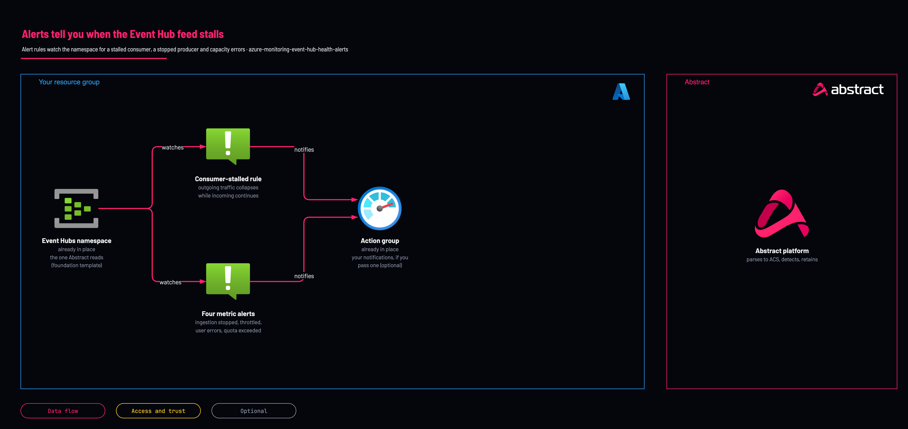

# Pipeline health alerts

<!-- Generated from template.yml by `python -m tools.templates generate`. Do not edit. -->

Event Hubs publishes no consumer-lag metric, so when the Abstract consumer stalls, incoming traffic keeps arriving, nothing errors, and retention quietly expires the backlog. These alert rules watch for outgoing traffic collapsing while incoming continues, plus the producer-side and capacity failures.

**Cloud:** azure · **Role:** monitoring · **Scope:** resource-group



Editable source: [diagram.drawio](diagram.drawio)

## When to use

Immediately after the Event Hub source, on every deployment.

**Not for:** As a replacement for absence-of-data alerting on the Abstract side, which catches failures after the hub; both layers are needed.

## Deploy

[](https://portal.azure.com/#create/Microsoft.Template/uri/https%3A%2F%2Fraw.githubusercontent.com%2FIamABS3C%2Fabstract-cloud-templates%2Fmain%2Ftemplates%2Fazure%2Fazure-monitoring-event-hub-health-alerts%2Fazuredeploy.json/createUIDefinitionUri/https%3A%2F%2Fraw.githubusercontent.com%2FIamABS3C%2Fabstract-cloud-templates%2Fmain%2Ftemplates%2Fazure%2Fazure-monitoring-event-hub-health-alerts%2FcreateUiDefinition.json)

Or from a shell, in this folder:

```bash
./deploy.sh
```

## Prerequisites

- An existing Event Hubs namespace; deploy azure-foundation-event-hub first, into the same resource group
- An Action Group, if anyone is to be notified
- The namespace's platform metrics must reach a Log Analytics workspace the stall rule can query

## Cost

Four metric alert rules and one log search rule, a fixed cost per namespace. The template does not alert on the Auto-Inflate throughput-unit ratchet; review provisioned units by hand monthly.

## Parameters

| Name | Type | Required | Description | Find it |
|---|---|---|---|---|
| `namespaceName` | string | yes | Name of the existing Event Hubs namespace to monitor. Must already exist - deploy eventhub-source.bicep first. Find it with: az eventhubs namespace list --query [].name -o tsv | `az eventhubs namespace list -g <resource-group> --query [].name -o tsv` |
| `location` | string | no | Location for the scheduled query rule. Metric alerts are global; this only affects the log-search rule. |  |
| `alertPrefix` | string | no | Prefix for every alert rule name created here. |  |
| `actionGroupId` | string | no | Action Group resource ID to notify. Leave empty to create the rules WITHOUT notifications - they will still show in Azure Monitor, but nobody will be told. Strongly recommended to supply one. | `az monitor action-group list -g <resource-group> --query [].id -o tsv` |
| `createDisabled` | bool | no | Create the rules in a disabled state so they can be reviewed before they start firing. |  |
| `tags` | object | no | Tags applied to every resource created by this template. |  |
| `consumerStallWindowMinutes` | int | no | Minutes of collapsed outgoing traffic before the consumer is considered stalled. Keep this comfortably longer than the consumer poll interval so a normal quiet period does not page anyone. |  |
| `minIncomingToAlert` | int | no | Incoming messages over the window ABOVE which a flat outgoing count is treated as a stall. Guards against alerting on a genuinely idle hub, where zero-in/zero-out is correct and healthy. |  |
| `ingestionStoppedWindowMinutes` | int | no | Minutes with zero incoming messages before ingestion is considered stopped. This is the producer side - a deleted diagnostic setting, a revoked Send key, or a firewall change. |  |
| `throttleThreshold` | int | no | Throttled requests over 5 minutes before alerting. Any sustained throttling means throughput units are saturated. |  |
| `dataLossSeverity` | int | no | Severity for the data-loss alerts (consumer stalled, ingestion stopped). 0 = critical. |  |
| `capacitySeverity` | int | no | Severity for the capacity and cost alerts. |  |

## Permissions

- **Monitoring Contributor** on The resource group holding the Event Hubs namespace: Deployer: Create metric alert rules and scheduled query rules.

## Creates

- A scheduled query rule that fires when outgoing traffic collapses while incoming continues (consumer stalled)
- A metric alert for ingestion stopped (no incoming messages)
- A metric alert for throttled requests
- A metric alert for user errors, usually an expired or revoked SAS key
- A metric alert for quota-exceeded errors

## Never touches

- The Event Hubs namespace, its hubs, consumer groups and authorization rules (it only reads their metrics)
- Existing alert rules, action groups and diagnostic settings
- Workload resources in the resource group

## Outputs

- `consumerStalledRuleId`
- `ingestionStoppedRuleId`
- `alertRuleNames`
- `notificationsConfigured`
- `monitoringSummary`

## Verify

| Check | Command | Healthy when |
|---|---|---|
| The five rules exist and are enabled | `az monitor metrics alert list -g <resource-group> --query "[?contains(name,'abstract-eh')].{name:name,enabled:enabled,severity:severity}" -o table az monitor scheduled-query list -g <resource-group> --query "[?contains(name,'abstract-eh')].{name:name,enabled:enabled}" -o table` | Four metric alerts and one scheduled query rule, all enabled. |
| The consumer-stall rule is evaluating, not sitting in Insufficient data |  | The rule's history shows evaluations on schedule with a result. |
| The alert path works end to end |  | A test notification from the Action Group arrives. |
