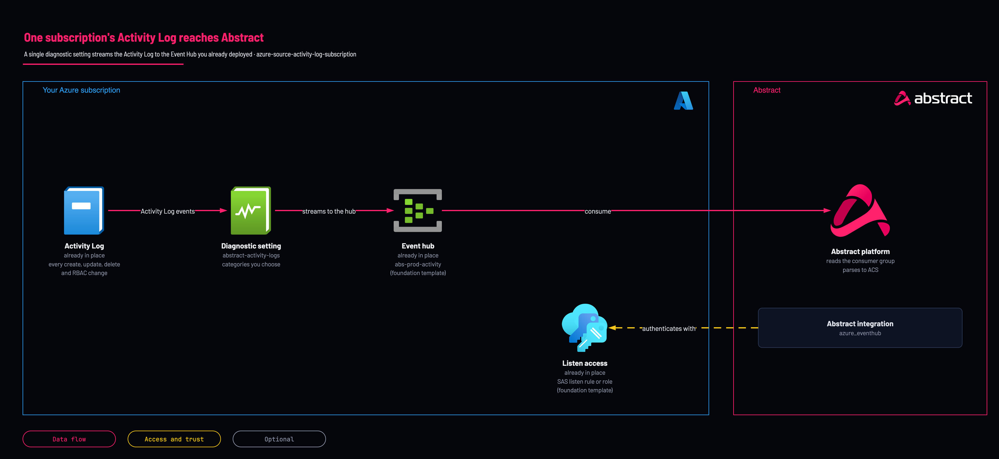

# Activity Log to Abstract: one subscription

<!-- Generated from template.yml by `python -m tools.templates generate`. Do not edit. -->

The pilot path: streams one subscription's Activity Log, every ARM create, update and delete and every RBAC change, to the Abstract Event Hub. Use it to prove the pipeline on one subscription, then move to the management-group policy for the estate.

**Cloud:** azure · **Role:** source · **Scope:** subscription



Editable source: [diagram.drawio](diagram.drawio)

## When to use

A single-subscription estate, a pilot, or a proof before committing to estate-wide governance, including when management-group rights are not yet granted.

**Not for:** Any estate you intend to cover fully: this covers exactly one subscription and nothing extends it to new ones. Use the management-group policy instead of deploying it many times.

Not sure this is the right one, or what to deploy before it? Answer a few questions in [the setup guide](https://github.com/IamABS3C/abstract-cloud-templates/blob/main/docs/azure/GUIDE.md).

## Deploy

[](https://portal.azure.com/#create/Microsoft.Template/uri/https%3A%2F%2Fraw.githubusercontent.com%2FIamABS3C%2Fabstract-cloud-templates%2Fmain%2Ftemplates%2Fazure%2Fazure-source-activity-log-subscription%2Fazuredeploy.json/uiFormDefinitionUri/https%3A%2F%2Fraw.githubusercontent.com%2FIamABS3C%2Fabstract-cloud-templates%2Fmain%2Ftemplates%2Fazure%2Fazure-source-activity-log-subscription%2FuiFormDefinition.json)

Or from a shell, in this folder:

```bash
./deploy.sh
```

## Prerequisites

- The Event Hub and a Send-capable authorization rule already exist; deploy azure-foundation-event-hub first
- At most 5 diagnostic settings per subscription, including existing exports
- The target hub must not be a compacted event hub
- A redeploy replaces the named diagnostic setting's category list rather than merging it; read it back first: az monitor diagnostic-settings subscription list --query "value[].{name:name,hub:eventHubName,cats:logs[?enabled].category}" -o json

## Cost

The diagnostic setting is free; the charge is the volume into the hub. Alert, Autoscale, Recommendation and ResourceHealth add volume with little detection value, and the template's default category list still includes all eight.

## Parameters

| Name | Type | Required | Description | Find it |
|---|---|---|---|---|
| `settingName` | string | no | Name of the subscription diagnostic setting (max 5 per subscription, unique name). |  |
| `eventHubAuthorizationRuleId` | string | yes | Full resource ID of an Event Hubs namespace authorization rule with Send rights. Use the abstractDiagnosticsAuthRuleId output of the main template. Find it with: az eventhubs namespace authorization-rule list -g RESOURCE_GROUP --namespace-name NAMESPACE --query [].id -o tsv | `az eventhubs namespace authorization-rule list -g <resource-group> --namespace-name <namespace> --query "[?name=='abstract-diagnostics-send'].id" -o tsv` |
| `eventHubName` | string | no | Event Hub that receives the Activity Log stream. main.bicep auto-names hubs &lt;hubPrefix&gt;-&lt;environment&gt;-&lt;source&gt;, so the default source stack creates abs-prod-activity. | `az eventhubs eventhub list -g <resource-group> --namespace-name <namespace> --query [].name -o tsv` |
| `categories` | array | no | Activity Log categories to export. Default = all eight (recommended by Abstract Security). |  |

## Permissions

- **Monitoring Contributor** on The subscription, not a resource group: Deployer: A subscription-scope diagnostic setting is not a resource-group resource.
- **listKeys on the Event Hub authorization rule** on The Event Hubs namespace, often in a different subscription: Deployer: Creating a setting that streams to an Event Hub requires ListKey on the target rule.

## Creates

- One subscription-scope diagnostic setting (default name abstract-activity-logs) streaming the Activity Log to the hub
- Exported categories set by the categories parameter; the default list is all eight

## Never touches

- Any subscription other than the one deployed to
- Existing diagnostic settings on the subscription (the setting is added beside them, within the limit of five)
- The Event Hub and its authorization rule, which must already exist
- Workload resources in any resource group

## Outputs

- `diagnosticSettingName`
- `subscriptionId`
- `exportedCategories`

## Verify

| Check | Command | Healthy when |
|---|---|---|
| The setting exists with the intended categories | `az monitor diagnostic-settings subscription list --query "value[].{name:name,hub:eventHubName,cats:logs[?enabled].category}" -o json` | The named setting is present, pointing at the expected hub, with the chosen categories enabled. |
| Messages are arriving on the Activity Log hub |  | Incoming Messages non-zero within 90 minutes. |
| A deliberate control-plane action appears end to end | `az group update -n <test-resource-group> --tags probe=abstract # then remove it` | The tag write appears in Abstract within minutes, with the acting identity populated. |
