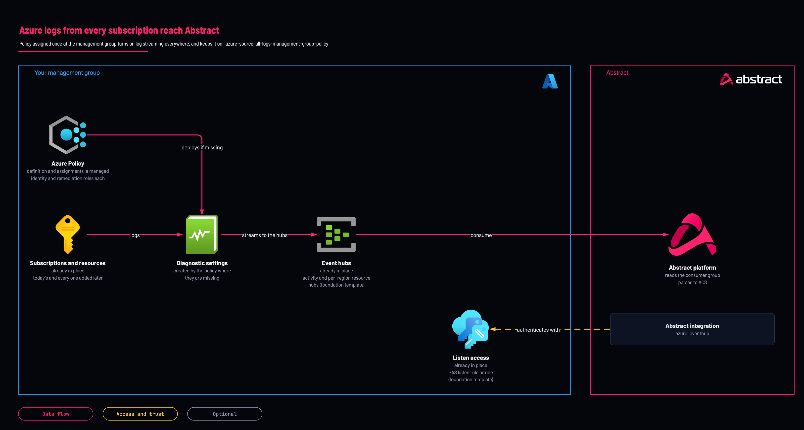

# Azure logs, every subscription

<!-- Generated from template.yml by `python -m tools.templates generate`. Do not edit. -->

Assign once at a management group and every subscription in it, today's and every one added later, streams to the Abstract Event Hub and drifts back into compliance if a setting is removed. Covers the Activity Log, resource logs, Azure SQL auditing and Defender for Cloud export, each a separate Azure mechanism.

**Cloud:** azure · **Role:** source · **Scope:** management-group



Editable source: [diagram.drawio](diagram.drawio)

## When to use

Any estate with more than about three subscriptions, or any estate that will grow.

**Not for:** A genuine single-subscription estate or short pilot (use the Activity Log template), and Entra ID identity logs, which are tenant-scope.

## Deploy

[](https://portal.azure.com/#create/Microsoft.Template/uri/https%3A%2F%2Fraw.githubusercontent.com%2FIamABS3C%2Fabstract-cloud-templates%2Fmain%2Ftemplates%2Fazure%2Fazure-source-all-logs-management-group-policy%2Fazuredeploy.json/uiFormDefinitionUri/https%3A%2F%2Fraw.githubusercontent.com%2FIamABS3C%2Fabstract-cloud-templates%2Fmain%2Ftemplates%2Fazure%2Fazure-source-all-logs-management-group-policy%2FuiFormDefinition.json)

Or from a shell, in this folder:

```bash
./deploy.sh
```

## Prerequisites

- Deploy the Event Hub source stack first; one namespace per region that holds regional resources, each with a Send-capable rule
- Hub names passed here must match hubs the source stack actually created; add resource to its hubSources for a resource-log hub
- Decide report-only versus enforce before assigning. ./deploy.sh assigns report-only by default (examples/default.parameters.json: effect AuditIfNotExists, enforcementMode DoNotEnforce), which changes nothing; read the compliance counts, then re-run with --enforce to use parameters.example.json and the template defaults (DeployIfNotExists, Default), which write settings everywhere
- At most 5 diagnostic settings per resource; existing exports count

## Cost

Azure Policy and diagnostic settings are free; the volume they switch on is not. Run report-only first and read the resource counts before enforcing, because allLogs across an uninventoried estate is the surprise.

## Parameters

| Name | Type | Required | Description | Find it |
|---|---|---|---|---|
| `assignmentLocation` | string | no | Region the policy assignments' managed identities are created in. Unrelated to where logs are collected - any region you operate in is fine. |  |
| `namePrefix` | string | no | Prefix for every policy assignment name created here. Capped at 6: management-group policy assignment names have a 24-character limit (verified in the Azure resource naming rules), and the longest name built here is &lt;prefix&gt;-r-&lt;13-char hash&gt; = 22. |  |
| `effect` | string | no | Policy effect. Use AuditIfNotExists for a dry run that reports what WOULD be onboarded without changing anything, then switch to DeployIfNotExists. |  |
| `enforcementMode` | string | no | Assignments are created but not enforced when DoNotEnforce - use it to preview compliance before letting the policy deploy anything. |  |
| `enableActivityLog` | bool | no | Onboard every subscription's Activity Log to the Abstract Event Hub. |  |
| `activityLogAuthorizationRuleId` | string | no | Resource ID of an Event Hubs namespace authorization rule with Send rights, used for the Activity Log stream. Use the abstractDiagnosticsAuthRuleId output of main.bicep. Format: /subscriptions/{sub}/resourceGroups/{rg}/providers/Microsoft.EventHub/namespaces/{ns}/authorizationrules/{rule} | `az eventhubs namespace authorization-rule list -g <resource-group> --namespace-name <namespace> --query "[?name=='abstract-diagnostics-send'].id" -o tsv` |
| `activityLogEventHubName` | string | no | Event Hub that receives the Activity Log stream. It must already exist - Azure Policy never creates hubs. | `az eventhubs eventhub list -g <resource-group> --namespace-name <namespace> --query [].name -o tsv` |
| `activityLogCategories` | array | no | Activity Log categories to export. Default is all eight. |  |
| `enableResourceLogs` | bool | no | Onboard resource logs (Key Vault, NSG, Front Door, AKS, Cosmos DB, ~140 resource types) to the Abstract Event Hub. |  |
| `categoryGroup` | string | no | Which category group to collect. allLogs is everything the resource emits; audit is the control-plane/data-access subset. allLogs is the Abstract default - filtering happens in the pipeline, not at the source. |  |
| `regions` | array | no | One entry per region that holds regional resources. Azure Monitor REQUIRES the Event Hub to be in the same region as the monitored resource, so each region needs its own namespace and its own assignment. [ { location: 'eastus', authorizationRuleId: '/subscriptions/.../authorizationrules/abstract-diagnostics-send', eventHubName: 'abs-prod-resource' } ] |  |
| `resourceTypeList` | array | no | Restrict the resource-log initiative to specific resource types. Empty = every supported type (recommended). |  |
| `diagnosticSettingName` | string | no | Name given to the diagnostic settings the policy creates. Pick something recognisable so operators know not to delete it by hand. |  |
| `enableSqlAuditing` | bool | no | Also enable Azure SQL server auditing to the Event Hub. SQL auditing is NOT a diagnostic setting, so the resource-log initiative does not cover it. |  |
| `enableDefenderExport` | bool | no | Also export Defender for Cloud alerts, recommendations and secure-score data to the Event Hub. Another separate mechanism (continuous export), not a diagnostic setting. |  |
| `defenderExportResourceGroup` | string | no | Resource group the Defender continuous-export resource is created in, inside every in-scope subscription. |  |
| `defenderEventHubAuthorizationRuleId` | string | no | HUB-level Event Hubs authorization rule for the Defender export. Unlike the other policies here this one wants a rule scoped to the hub, not the namespace: /subscriptions/{sub}/resourceGroups/{rg}/providers/Microsoft.EventHub/namespaces/{ns}/eventhubs/{hub}/authorizationRules/{rule}. Set perHubSasRules=true in main.bicep to have one created. | `az eventhubs eventhub authorization-rule list -g <resource-group> --namespace-name <namespace> --eventhub-name <hub> --query [].id -o tsv` |
| `defenderExportedDataTypes` | array | no | Defender for Cloud data types to export. |  |
| `defenderAlertSeverities` | array | no | Alert severities exported from Defender for Cloud. |  |

## Permissions

- **Resource Policy Contributor** on The target management group: Deployer: Create the policy definition and assignments.
- **User Access Administrator or Role Based Access Control Administrator** on The target management group: Deployer: The assignment creates role assignments for the DeployIfNotExists identities.
- **Global Administrator with Access management for Azure resources elevation** on Tenant root management group only: Deployer: Required only when assigning at the tenant root.
- **Monitoring Contributor** on The management group: Policy remediation identity: Writes diagnostic settings across in-scope subscriptions.
- **listKeys on the Event Hub authorization rule** on The Event Hubs namespace, usually in a different subscription: Policy remediation identity: Needed to create settings that stream to the hub; the Grant action gives Azure Event Hubs Data Owner, which works but is broader than a custom listKeys role.

## Creates

- A custom DeployIfNotExists policy definition and assignment for Activity Log to Event Hub (no Microsoft built-in exists for it)
- One assignment of the built-in resource-log initiative per region
- One assignment of the built-in Azure SQL auditing policy per region
- An optional Defender for Cloud continuous-export assignment
- A system-assigned managed identity per assignment, with role assignments at the management group for remediation

## Never touches

- Event Hubs: Azure Policy never creates hubs, so every hub name passed in must already exist

## Outputs

- `managementGroupId`
- `eventHubsDataOwnerRoleId`
- `activityLogPrincipalId`
- `resourceLogPrincipalIds`
- `sqlAuditPrincipalIds`
- `onboardingSummary`

## Example parameter profiles

- `default.parameters.json`

## Verify

| Check | Command | Healthy when |
|---|---|---|
| The assignments exist and carry managed identities | `az policy assignment list --scope /providers/Microsoft.Management/managementGroups/<mg-id> --query "[].{name:name,identity:identity.principalId,enforcement:enforcementMode}"` | One assignment per enabled feature, each with a non-null principalId. |
| Compliance is being evaluated | `az policy state summarize --management-group <mg-id>` | Non-zero resource counts, with non-compliant resources falling after remediation. |
| A remediation task actually ran and succeeded |  | Policy, Remediation shows a completed task, not merely a compliance report. |
| Diagnostic settings now exist on a sample resource | `az monitor diagnostic-settings list --resource <resource-id> --query "[].{name:name,eventHub:eventHubName}"` | A setting pointing at the expected hub. |
