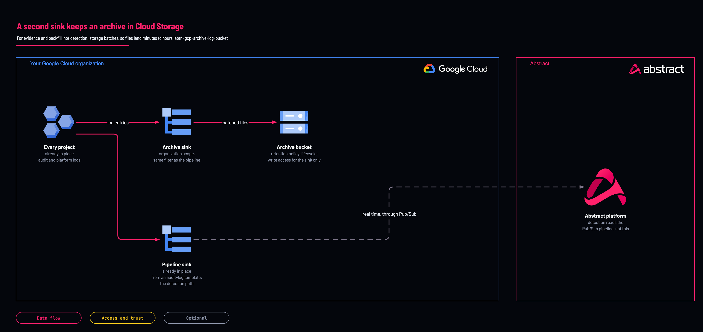

# Log archive bucket

<!-- Generated from template.yml by `python -m tools.templates generate`. Do not edit. -->

A second organization sink writing to a Cloud Storage bucket for evidence and backfill, because a sink has exactly one destination. It is not the detection path: storage batches, so latency is minutes to hours.

**Cloud:** gcp · **Role:** archive · **Scope:** organization



Editable source: [diagram.drawio](diagram.drawio)

## When to use

Evidence retention and backfill alongside the Pub/Sub stream.

**Not for:** Anything you alert on; keep Pub/Sub for detection.

## Deploy

[](https://shell.cloud.google.com/cloudshell/editor?cloudshell_git_repo=https://github.com/IamABS3C/abstract-cloud-templates&cloudshell_git_branch=main&cloudshell_workspace=templates/gcp/gcp-archive-log-bucket&cloudshell_tutorial=TUTORIAL.md)

Or from a shell, in this folder:

```bash
./deploy.sh
```

## Prerequisites

- Use the streaming deployment's effective_filter exactly, or read it through remote_state_bucket
- Decide retention deliberately: a retention lock is irreversible for the life of the bucket

## Cost

Cloud Storage at Standard, then Nearline after archive_nearline_after_days; no retention lock and no deletion by default, so storage grows until a lifecycle or retention policy is chosen.

## Parameters

| Name | Type | Required | Description | Find it |
|---|---|---|---|---|
| `org_id` | string | yes | Organization ID the archive sink binds to. Find it with: gcloud organizations list | `gcloud organizations list --format='value(ID)'` |
| `log_project` | string | yes | DEDICATED logging or security project holding the archive sink. Find it with: gcloud projects list. If no dedicated logging project exists yet, create one first with templates/gcp/gcp-foundation-logging-project (set create_project = true) — do not point this at a workload project. | `gcloud projects list --format='value(projectId)'` |
| `archive_bucket_name` | string | yes | Globally unique across ALL of GCS, so prefix it with your org: acme-abstract-audit-archive. Existing buckets: gcloud storage buckets list |  |
| `filter` | string | no | Fallback filter, used only when remote_state_bucket and stream_filter are both empty. Prefer remote state: an archive that quietly captures LESS than the stream is worse than no archive, because you will trust it during an investigation. |  |
| `sink_name` | string | no | Name of the Cloud Logging sink. |  |
| `archive_bucket_location` | string | no | US, EU, or a region. Consider data-residency obligations before defaulting. |  |
| `archive_retention_days` | int | no | Retention period in days; 0 disables. On its own this is a DEFAULT that anyone with storage.buckets.update can shorten or remove. Pair it with archive_retention_locked to make it immutable. |  |
| `archive_nearline_after_days` | int | no | Move archived objects to Nearline after this many days. |  |
| `labels` | object | no | Labels applied to every resource this template creates. |  |
| `archive_retention_locked` | bool | no | LOCK the retention policy. IRREVERSIBLE — once set, the period cannot be shortened or removed for the life of the bucket, by anyone. This is what makes the archive evidentiary; it is also why it is not the default. |  |
| `archive_versioning` | bool | no | Keep superseded object versions. |  |
| `archive_cmek_key` | string | no | Customer-managed KMS key. The Cloud Storage service agent needs roles/cloudkms.cryptoKeyEncrypterDecrypter on it. |  |
| `stream_filter` | string | no | Optional. Paste `terraform output -raw effective_filter` from gcp-source-audit-logs-organization here and a check block asserts the archive matches the stream. Empty skips the check — but then nothing stops the two diverging. |  |
| `remote_state_bucket` | string | no | GCS bucket holding gcp-source-audit-logs-organization's state. Set it and the value below is READ rather than retyped. Empty uses the literal. |  |
| `remote_state_prefix` | string | no | State key of gcp-source-audit-logs-organization. It keeps that folder's original name, 01-organization, so existing state is found. |  |

## Permissions

- **roles/storage.admin** on The logging project: Deployer: Create the bucket.
- **roles/storage.objectCreator** on The bucket: Archive sink writer identity: Distinct from the streaming sink's identity; each sink needs its own grant.

## Creates

- A Cloud Storage archive bucket, with optional retention policy, versioning, CMEK and Nearline transition
- An organization archive sink with its own writer identity
- roles/storage.objectCreator for that writer identity on the bucket

## Never touches

- The streaming Pub/Sub pipeline and its sink: the archive is a second sink with its own writer identity
- Existing buckets: it creates a new bucket by name
- A retention lock: none unless archive_retention_locked is set, which is irreversible

## Outputs

- `archive_bucket`

## Verify

| Check | Command | Healthy when |
|---|---|---|
| Objects are landing in the bucket |  | The bucket fills; if it stays empty, check the archive writer identity's binding. |
