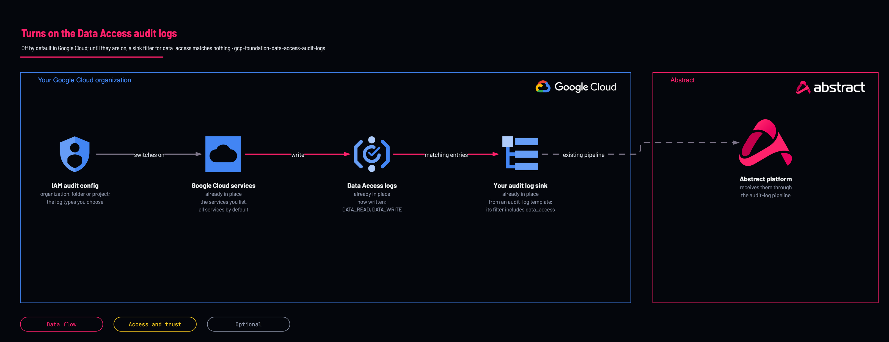

# Data Access audit logging

<!-- Generated from template.yml by `python -m tools.templates generate`. Do not edit. -->

Admin Activity audit logs are always on; Data Access logs are off by default, and until they are on a sink filter referencing data_access matches nothing. This deployment enables the chosen Data Access log types in separate state from the log-export pipeline.

**Cloud:** gcp · **Role:** foundation · **Scope:** organization



Editable source: [diagram.drawio](diagram.drawio)

## When to use

Data Access signal (BigQuery reads, Cloud Storage object reads, KMS use) is needed, decided per service.

**Not for:** To change Admin Activity logs, which are always on; or before reading the current audit config, because this resource is authoritative per service.

## Deploy

[](https://shell.cloud.google.com/cloudshell/editor?cloudshell_git_repo=https://github.com/IamABS3C/abstract-cloud-templates&cloudshell_git_branch=main&cloudshell_workspace=templates/gcp/gcp-foundation-data-access-audit-logs&cloudshell_tutorial=TUTORIAL.md)

Or from a shell, in this folder:

```bash
./deploy.sh
```

## Prerequisites

- Read the preflight output first: the resource is authoritative per service, so a narrower set removes log types you did not list
- acknowledge_authoritative_overwrite when services resolves to allServices, and acknowledge_data_read for DATA_READ

## Cost

BigQuery DATA_READ on a BigQuery-heavy estate can move total volume by one to two orders of magnitude; scope it to BigQuery and regulated buckets rather than refusing it.

## Parameters

| Name | Type | Required | Description | Find it |
|---|---|---|---|---|
| `scope` | string | no | organization \| folder \| project. Inheritance is ONE-WAY — a project can add Data Access logging but cannot disable what the organization enabled. |  |
| `org_id` | string | no | Organization ID, when scope = organization. Find it with: gcloud organizations list | `gcloud organizations list --format='value(ID)'` |
| `folder_id` | string | no | Folder ID, when scope = folder. Find it with: gcloud resource-manager folders list --organization=&lt;org-id&gt; | `gcloud resource-manager folders list --organization=<org-id>` |
| `project_id` | string | no | Project ID, when scope = project. |  |
| `log_types` | array | no | ADMIN_READ \| DATA_WRITE \| DATA_READ. ADMIN_WRITE is rejected — that is Admin Activity, always on. |  |
| `services` | array | no | Empty means allServices. With DATA_READ that is the expensive option and needs acknowledge_data_read. |  |
| `exempted_members` | array | no | Principals excluded. One chatty ETL service account can dominate DATA_READ volume while carrying no security signal — this is the most-missed cost lever. |  |
| `acknowledge_data_read` | bool | no | Required for DATA_READ when services is empty (allServices). |  |
| `acknowledge_authoritative_overwrite` | bool | no | Required for allServices. See tools/gcp-guided-setup/preflight.sh output first — this resource can REMOVE audit log types it does not list. |  |

## Permissions

- **Organization Admin (resourcemanager.organizations.setIamPolicy)** on The organization: Deployer: This modifies the organization IAM policy.

## Creates

- An IAM audit config at the chosen scope (organization, folder or project) enabling the listed Data Access log types

## Never touches

- Admin Activity audit logs: always on, and nothing here can turn them off
- The log-export pipeline: this is deliberately separate state

## Outputs

- `enabled`

## Verify

| Check | Command | Healthy when |
|---|---|---|
| See what is already enabled | `tools/gcp-guided-setup/preflight.sh --project <project-id> --org-id <org-id>` | The audit config lists exactly the services and log types you chose. |
