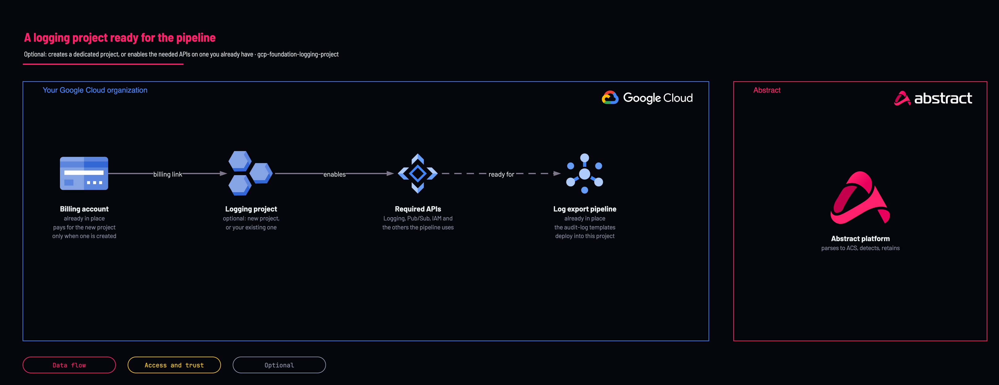

# Logging project

<!-- Generated from template.yml by `python -m tools.templates generate`. Do not edit. -->

Optional: enables the APIs the pipeline needs on an existing project, or creates a dedicated logging project with a billing account. Most customers already have a security or logging project and can skip it.

**Cloud:** gcp · **Role:** foundation · **Scope:** project



Editable source: [diagram.drawio](diagram.drawio)

## When to use

Greenfield, or when the only candidate is a workload project.

**Not for:** When a security or logging project already exists; point gcp-source-audit-logs-organization at it instead.

## Deploy

[](https://shell.cloud.google.com/cloudshell/editor?cloudshell_git_repo=https://github.com/IamABS3C/abstract-cloud-templates&cloudshell_git_branch=main&cloudshell_workspace=templates/gcp/gcp-foundation-logging-project&cloudshell_tutorial=TUTORIAL.md)

Or from a shell, in this folder:

```bash
./deploy.sh
```

## Prerequisites

- A billing account, when creating the project; a project without one cannot publish to Pub/Sub

## Cost

Enabling APIs is free; a created project costs nothing until resources in it are billed.

## Parameters

| Name | Type | Required | Description | Find it |
|---|---|---|---|---|
| `create_project` | bool | no | FALSE (default) only enables APIs on an existing project. TRUE also creates it, which needs billing_account_id and project-creator rights. |  |
| `project_id` | string | yes | Project ID to use, or to create when create_project = true (globally unique, 6-30 characters, lowercase). |  |
| `project_name` | string | no | Display name when creating the project. |  |
| `org_id` | string | no | Organization to create the project under (create_project = true). Find it with: gcloud organizations list | `gcloud organizations list --format='value(ID)'` |
| `folder_id` | string | no | Create the project under this folder instead of directly under the organization. | `gcloud resource-manager folders list --organization=<org-id>` |
| `billing_account_id` | string | no | Required when create_project = true. A project with no billing account cannot publish to Pub/Sub. Globally unique, 6-30 chars, lowercase. This is the ID you are creating, not one to look up — confirm it is still free with: gcloud projects list | `gcloud billing accounts list --filter=open=true` |
| `enable_workspace_api` | bool | no | Also enable the Admin SDK API, for gcp-source-google-workspace-logs. |  |
| `enable_scc_api` | bool | no | Also enable the Security Command Center API, for gcp-source-security-command-center-findings. |  |
| `labels` | object | no | Labels applied to every resource this template creates. |  |

## Permissions

- **roles/resourcemanager.projectCreator** on The organization or folder: Deployer: Only with create_project=true.
- **roles/billing.user** on The billing account: Deployer: Only with create_project=true.

## Creates

- The required APIs enabled on the logging project
- Optionally, a new logging project with deletion_policy PREVENT (create_project=true)

## Never touches

- An existing project's IAM policy and resources: with create_project = false it only enables APIs
- Enabled APIs on destroy (disable_on_destroy = false)

## Outputs

- `enabled_apis`
- `preflight`
- `project_id`

## Verify

| Check | Command | Healthy when |
|---|---|---|
| See the grants Terraform cannot verify | `terraform output preflight` | It names the remaining grants, including roles/logging.configWriter at the organization. |
