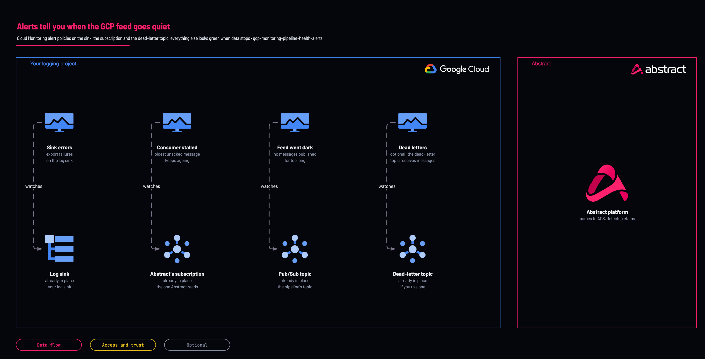

# Google Cloud alerts when the Abstract feed stalls

<!-- Generated from template.yml by `python -m tools.templates generate`. Do not edit. -->

A stalled consumer, a missing IAM grant and a deleted sink all look the same from outside: everything is green and there is no data. These Cloud Monitoring alert policies catch sink export failures, an unconsumed subscription, a feed that went dark and a receiving dead-letter topic.

**Cloud:** gcp · **Role:** monitoring · **Scope:** project



Editable source: [diagram.drawio](diagram.drawio)

## When to use

Alongside gcp-source-audit-logs-organization, not later.

**Not for:** As a replacement for checking the feed in Abstract; these watch the Google side only.

Not sure this is the right one, or what to deploy before it? Answer a few questions in [the setup guide](https://github.com/IamABS3C/abstract-cloud-templates/blob/main/docs/gcp/GUIDE.md).

## Deploy

[](https://shell.cloud.google.com/cloudshell/editor?cloudshell_git_repo=https://github.com/IamABS3C/abstract-cloud-templates&cloudshell_git_branch=main&cloudshell_workspace=templates/gcp/gcp-monitoring-pipeline-health-alerts&cloudshell_tutorial=TUTORIAL.md)

Or from a shell, in this folder:

```bash
./deploy.sh
```

## Prerequisites

- A notification channel; the module refuses to deploy without one unless explicitly acknowledged
- The log-export pipeline deployed, ideally in the same session as connecting Abstract

## Cost

Alert policies are free; Cloud Monitoring bills only for metrics beyond the free allotment, which these do not add.

## Parameters

| Name | Type | Required | Description | Find it |
|---|---|---|---|---|
| `log_project` | string | yes | DEDICATED logging or security project holding this pipeline. Not a workload project. Find it with: gcloud projects list. If no dedicated logging project exists yet, create one first with templates/gcp/gcp-foundation-logging-project (set create_project = true). | `gcloud projects list --format='value(projectId)'` |
| `topic_id` | string | no | Topic NAME (not the full path), from gcp-source-audit-logs-organization. |  |
| `subscription_id` | string | no | Subscription NAME (not the full path), from gcp-source-audit-logs-organization. |  |
| `dead_letter_topic_id` | string | no | Dead-letter topic to watch. Empty disables that policy. |  |
| `notification_channels` | array | no | Channel IDs. List them with: gcloud beta monitoring channels list --format='value(name)' |  |
| `acknowledge_no_channel` | bool | no | Deploy the policies with no notification channel. They then fire into nothing; set it only while a channel is being arranged. |  |
| `retention_days` | int | no | Pub/Sub message retention in days. This is the entire recovery window: unacked messages older than this are deleted. |  |
| `unacked_age_threshold_seconds` | int | no | Fire when the oldest unacked message is older than this. Default one hour, a small fraction of a 7-day window. |  |
| `absence_threshold_seconds` | int | no | Fire when nothing has been published for this long. Default one hour. |  |
| `prefix` | string | no | Alert display-name prefix, so the policies are findable among existing ones. |  |

## Permissions

- **roles/monitoring.editor** on The logging project: Deployer: Create the alert policies.

## Creates

- An alert policy for the sink failing to export (critical)
- An alert policy for Abstract not consuming, firing at one hour against the retention window (critical)
- An alert policy for the feed going dark, using a metric-absence condition (error)
- An alert policy for the dead-letter topic receiving messages (warning)

## Never touches

- The topic, subscription and sink it watches
- Existing alert policies and notification channels

## Outputs

- `alert_policies`

## Verify

| Check | Command | Healthy when |
|---|---|---|
| Every policy is enabled and wired to a channel | `TOKEN=$(gcloud auth print-access-token) curl -s "https://monitoring.googleapis.com/v3/projects/<log-project-id>/alertPolicies" \ -H "Authorization: Bearer $TOKEN"` | Each policy shows enabled true and at least one notification channel. |
| The stall alert before Abstract is connected |  | It fires, correctly, because nothing consumes the subscription yet. |
