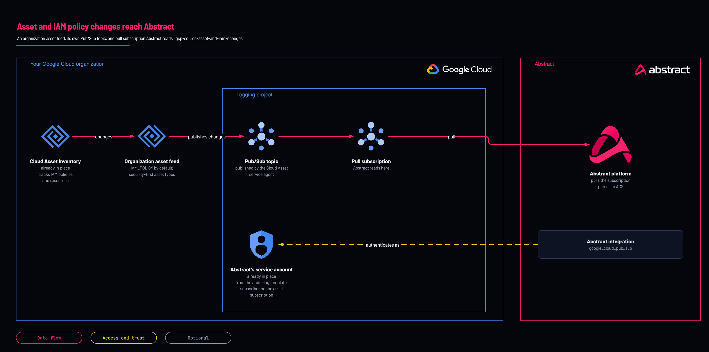

# Asset and IAM changes

<!-- Generated from template.yml by `python -m tools.templates generate`. Do not edit. -->

Cloud Asset Inventory publishes to Pub/Sub through its own feed, which no log sink can carry. It records what an IAM policy now is and what it was before, the diff a detection wants, alongside the audit log of who called which API.

**Cloud:** gcp · **Role:** source · **Scope:** organization



Editable source: [diagram.drawio](diagram.drawio)

## When to use

Alongside gcp-source-audit-logs-organization, for policy diffs and asset inventory.

**Not for:** As a replacement for the audit-log sink; the two answer different questions. Configure it as a separate source in Abstract.

## Deploy

[](https://shell.cloud.google.com/cloudshell/editor?cloudshell_git_repo=https://github.com/IamABS3C/abstract-cloud-templates&cloudshell_git_branch=main&cloudshell_workspace=templates/gcp/gcp-source-asset-and-iam-changes&cloudshell_tutorial=TUTORIAL.md)

Or from a shell, in this folder:

```bash
./deploy.sh
```

## Prerequisites

- Abstract's service account from gcp-source-audit-logs-organization, read from its state or pasted as subscriber_service_account_email
- An empty asset_types feeds every asset type and is refused without acknowledge_all_asset_types
- roles/cloudasset.owner at the organization, and the Cloud Asset API on the billing project, whose service agent (service-&lt;project-number&gt;@gcp-sa-cloudasset.iam.gserviceaccount.com) publishes
- A separate Abstract configuration for this subscription with parsers/cloud-asset-inventory.yml attached to it, never to the audit-log configuration: a configuration-level parser replaces the managed one

## Cost

Asset feeds are free; Pub/Sub throughput follows the rate of IAM and resource changes.

## Parameters

| Name | Type | Required | Description | Find it |
|---|---|---|---|---|
| `org_id` | string | yes | Organization ID the inventory feed binds to. Find it with: gcloud organizations list | `gcloud organizations list --format='value(ID)'` |
| `log_project` | string | yes | DEDICATED logging or security project holding this pipeline. Not a workload project. Find it with: gcloud projects list. If no dedicated logging project exists yet, create one first with templates/gcp/gcp-foundation-logging-project (set create_project = true). | `gcloud projects list --format='value(projectId)'` |
| `remote_state_bucket` | string | no | GCS bucket holding gcp-source-audit-logs-organization's state. Set this and Abstract's identity is READ rather than retyped. Empty falls back to subscriber_service_account_email. |  |
| `remote_state_prefix` | string | no | State key of gcp-source-audit-logs-organization. It keeps that folder's original name, 01-organization, so existing state is found. |  |
| `subscriber_service_account_email` | string | no | Fallback when remote_state_bucket is empty. From gcp-source-audit-logs-organization's abstract_onboarding output. |  |
| `content_type` | string | no | IAM_POLICY (default, highest security value) \| RESOURCE \| ORG_POLICY \| ACCESS_POLICY \| OS_INVENTORY \| RELATIONSHIP |  |
| `asset_types` | array | no | Asset types to watch. Empty means everything and requires acknowledge_all_asset_types. |  |
| `acknowledge_all_asset_types` | bool | no | Required when asset_types is empty, which feeds every asset type in the organization. |  |
| `retention_days` | int | no | Pub/Sub message retention in days. This is the entire recovery window: unacked messages older than this are deleted. |  |
| `labels` | object | no | Labels applied to every resource this template creates. |  |

## Permissions

- **roles/cloudasset.owner** on The organization: Deployer: Create the organization feed.
- **roles/pubsub.publisher** on The topic: Cloud Asset Inventory service agent: The feed publishes as its own agent; without the grant it delivers nothing.
- **roles/pubsub.subscriber** on The asset subscription: Abstract service account: Pull the changes.

## Creates

- A Pub/Sub topic and subscription for asset changes
- roles/pubsub.publisher for the Cloud Asset Inventory service agent on the topic
- An organization asset feed (IAM_POLICY by default) over a security-first set of asset types
- roles/pubsub.subscriber for Abstract's service account on the subscription

## Never touches

- Existing asset feeds
- The audit-log topic, subscription and sink: the feed has its own topic
- Abstract's service account: reused from the audit-log template, not created

## Outputs

- `abstract_onboarding`
- `cai_service_agent`

## Verify

| Check | Command | Healthy when |
|---|---|---|
| The service agent that must publish | `terraform output cai_service_agent` | The agent is listed and holds publisher on the topic. |
