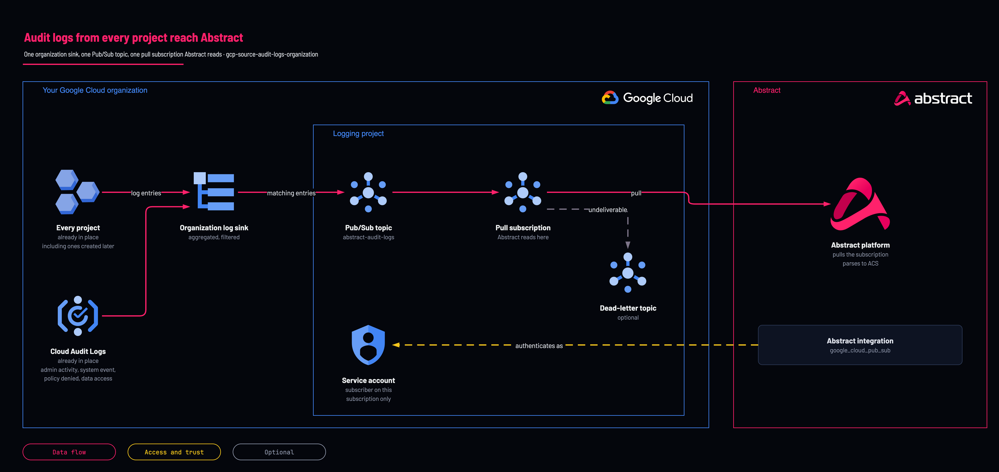

# All Google Cloud audit logs to Abstract: organization sink

<!-- Generated from template.yml by `python -m tools.templates generate`. Do not edit. -->

One aggregated Cloud Logging sink at organization scope routes audit and platform logs from every project into one Pub/Sub topic for Abstract. Projects created later are covered automatically, because the sink's scope is containment rather than a list.

**Cloud:** gcp · **Role:** source · **Scope:** organization



Editable source: [diagram.drawio](diagram.drawio)

## When to use

Every GCP engagement, from a single project up to a multi-folder organization.

**Not for:** Logs already sitting as objects in a bucket, Google Workspace sign-ins, and Security Command Center findings, which each have their own path.

Not sure this is the right one, or what to deploy before it? Answer a few questions in [the setup guide](https://github.com/IamABS3C/abstract-cloud-templates/blob/main/docs/gcp/GUIDE.md).

## Deploy

[](https://shell.cloud.google.com/cloudshell/editor?cloudshell_git_repo=https://github.com/IamABS3C/abstract-cloud-templates&cloudshell_git_branch=main&cloudshell_workspace=templates/gcp/gcp-source-audit-logs-organization&cloudshell_tutorial=TUTORIAL.md)

Or from a shell, in this folder:

```bash
./deploy.sh
```

## Prerequisites

- A dedicated logging or security project, not a workload project
- The organization ID
- Data Access audit logs are off by default; a filter referencing data_access matches nothing until they are enabled
- The org policy constraints/iam.disableServiceAccountKeyCreation blocks the key Abstract authenticates with

## Cost

Pub/Sub throughput is usually the largest line. BigQuery Data Access reads are both the richest exfiltration signal and the biggest cost driver, able to move volume by one to two orders of magnitude.

## Parameters

| Name | Type | Required | Description | Find it |
|---|---|---|---|---|
| `org_id` | string | yes | Organization ID. Find it with: gcloud organizations list | `gcloud organizations list --format='value(ID)'` |
| `log_project` | string | yes | DEDICATED logging or security project holding the topic and subscription. Not a workload project — Pub/Sub publish quota is consumed here, and a workload owner should not be able to read or break the security pipeline. Find it with: gcloud projects list. If no dedicated logging project exists yet, create one first with templates/gcp/gcp-foundation-logging-project (set create_project = true) — do not point this at a workload project. | `gcloud projects list --format='value(projectId)'` |
| `log_categories` | array | no | Named sources to route. See _modules/log-export/log_catalog.tf for the catalog. |  |
| `data_access_services` | array | no | When data_access_all is in log_categories, restrict Data Access logs to these services rather than the whole estate. Empty means allServices, the expensive option. Use the serviceName the events carry - for service account token minting that is iamcredentials.googleapis.com, even though gcp-foundation-data-access-audit-logs turns it on as iam.googleapis.com - and add sts.googleapis.com for Workload Identity Federation. |  |
| `exclusions` | array | no | Sink exclusion filters for known noise (health checks, chatty service accounts). Exclusions cost nothing to evaluate while ingestion and Pub/Sub throughput are billed, so this is the cheapest cost lever. Max 50 per sink. |  |
| `acknowledge_high_volume` | bool | no | Required to select any extreme-tier category (vpc_flows, gke_container_logs, data_access_all). These can dominate the bill; measure a 7-day baseline first. |  |
| `labels` | object | no | Labels applied to every resource this template creates. |  |
| `retention_days` | int | no | Pub/Sub message retention, 1-31. THIS IS YOUR ENTIRE RECOVERY WINDOW: when the oldest unacked message reaches it, the data is deleted permanently with no error and no backfill. 7 gives you a long weekend. |  |
| `ack_deadline_seconds` | int | no | Pub/Sub ack deadline for Abstract's subscription, in seconds. |  |
| `enable_dead_letter` | bool | no | Send repeatedly-failing messages to a dead-letter topic instead of retrying forever. Pair it with gcp-monitoring-pipeline-health-alerts — a dead-letter topic nobody watches converts a loud failure into a silent one. |  |
| `dead_letter_max_delivery_attempts` | int | no | Deliveries attempted before a message is dead-lettered (Pub/Sub allows 5-100). Used only with enable_dead_letter. |  |
| `topic_name` | string | no | Renaming this FORCE-REPLACES the topic and cascades to the subscription, discarding every un-acked message. prevent_destroy blocks it; that is intentional. |  |
| `subscription_name` | string | no | Pull subscription Abstract reads. Renaming it replaces the subscription. |  |
| `sink_name` | string | no | Name of the Cloud Logging sink. |  |
| `service_account_id` | string | no | Account ID of the service account Abstract authenticates as (roles/pubsub.subscriber on the subscription only). |  |
| `custom_filter` | string | no | Replace the assembled filter entirely. Bypasses every guard in the catalog -- you own the volume. |  |
| `platform_log_filters` | array | no | Extra raw logName clauses the catalog does not cover, e.g. cloudaudit.googleapis.com%2Faccess_transparency |  |

## Permissions

- **roles/logging.configWriter** on The organization: Deployer: Create the aggregated sink; the blocking prerequisite, rarely held by whoever owns the project.
- **roles/pubsub.admin** on The logging project: Deployer: Create the topic, subscription and IAM bindings.
- **roles/iam.serviceAccountAdmin** on The logging project: Deployer: Create Abstract's service account.
- **roles/serviceusage.serviceUsageAdmin** on The logging project: Deployer: Enable APIs.
- **roles/pubsub.publisher** on The topic: Sink writer identity: Created with the sink and holding nothing until granted; this module grants it.
- **roles/pubsub.subscriber** on The subscription only: Abstract service account: Abstract pulls; not publisher, not project-wide.

## Creates

- A Pub/Sub topic (default abstract-audit-logs) and a never-expiring pull subscription (default abstract-audit-logs-sub, 7-day retention)
- The roles/pubsub.publisher binding for the sink's writer identity
- A service account (default abstract-pubsub-reader) with roles/pubsub.subscriber on the subscription only
- Optional dead-letter topic (enable_dead_letter, off by default)
- An aggregated organization sink (default abstract-org-audit-sink) with include_children

## Never touches

- Existing sinks, including _Default and _Required
- Data Access audit configuration (gcp-foundation-data-access-audit-logs owns that)
- IAM in workload projects: every grant is on the topic or the subscription

## Outputs

- `abstract_onboarding`
- `effective_filter`
- `selected_log_sources`
- `sink_writer_identity`
- `volume_profile`

## Verify

| Check | Command | Healthy when |
|---|---|---|
| The sink exists and is aggregated | `gcloud logging sinks describe abstract-org-audit-sink --organization="$ORG_ID" --format="value(name,includeChildren,destination)"` | includeChildren is True and the destination is the Abstract topic. |
| The writer identity holds publisher on the topic | `gcloud pubsub topics get-iam-policy abstract-audit-logs --project="$LOG_PROJECT"` | The sink's writer identity has roles/pubsub.publisher. |
| A fresh event flows end to end | `PROBE=abstract-probe-$(date +%s) gcloud pubsub subscriptions create "$PROBE" --topic=abstract-audit-logs --project=<log-project-id> --expiration-period=1d gcloud pubsub topics create abstract-probe-topic --project=<log-project-id> --quiet gcloud pubsub topics delete abstract-probe-topic --project=<log-project-id> --quiet sleep 75 gcloud pubsub subscriptions pull "$PROBE" --project=<log-project-id> --limit=5 --auto-ack gcloud pubsub subscriptions delete "$PROBE" --project=<log-project-id> --quiet` | Your own CreateTopic and DeleteTopic arrive on the probe subscription with principalEmail, resourceName and callerIp populated. Wait five minutes after creating the sink before testing. Never pull from Abstract's own subscription: --auto-ack there deletes events before Abstract reads them. |
| No sink errors | `gcloud logging read 'logName:"logging.googleapis.com%2Fsink_error"' --limit=20 --project=<log-project-id>` | No sink_error entries. |
