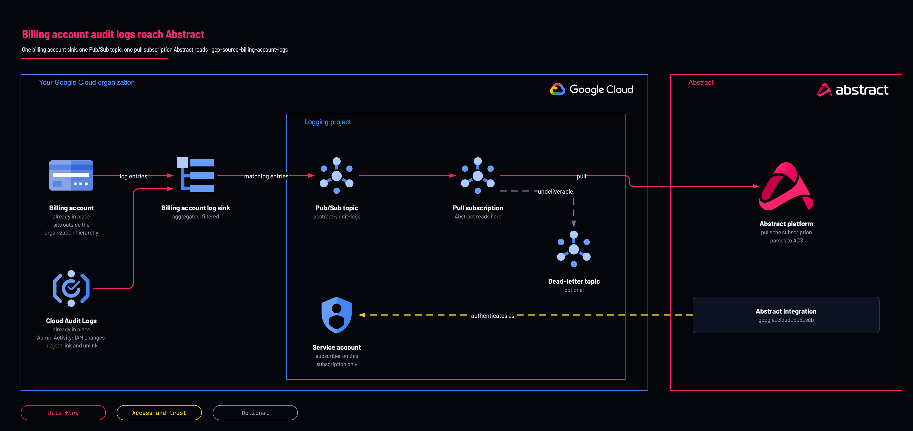

# Billing account audit logs to Abstract: billing sink

<!-- Generated from template.yml by `python -m tools.templates generate`. Do not edit. -->

A Cloud Logging sink on the billing account, which sits outside the organization hierarchy, so no organization sink sees it. It routes the billing account's Admin Activity audit logs (IAM changes, project link and unlink, account changes) to Pub/Sub for Abstract. It is not a cost export.

**Cloud:** gcp · **Role:** source · **Scope:** billing-account



Editable source: [diagram.drawio](diagram.drawio)

## When to use

Detecting billing-account takeover, project link changes and billing IAM changes.

**Not for:** Cost or usage data: that is the Cloud Billing export to BigQuery, not a log sink.

Not sure this is the right one, or what to deploy before it? Answer a few questions in [the setup guide](https://github.com/IamABS3C/abstract-cloud-templates/blob/main/docs/gcp/GUIDE.md).

## Deploy

[](https://shell.cloud.google.com/cloudshell/editor?cloudshell_git_repo=https://github.com/IamABS3C/abstract-cloud-templates&cloudshell_git_branch=main&cloudshell_workspace=templates/gcp/gcp-source-billing-account-logs&cloudshell_tutorial=TUTORIAL.md)

Or from a shell, in this folder:

```bash
./deploy.sh
```

## Prerequisites

- The billing account ID: gcloud billing accounts list --filter=open=true (pick the right one; there may be several)
- A dedicated logging project for the topic and subscription

## Cost

Billing-account audit logs are low volume; Pub/Sub throughput is negligible.

## Parameters

| Name | Type | Required | Description | Find it |
|---|---|---|---|---|
| `billing_account_id` | string | yes | GCP billing account ID formatted e.g. 012345-567890-ABCDEF. Find it with: gcloud billing accounts list | `gcloud billing accounts list --filter=open=true` |
| `log_project` | string | yes | DEDICATED logging or security project holding the topic and subscription. Not a workload project — Pub/Sub publish quota is consumed here, and a workload owner should not be able to read or break the security pipeline. Find it with: gcloud projects list. If no dedicated logging project exists yet, create one first with templates/gcp/gcp-foundation-logging-project (set create_project = true) — do not point this at a workload project. | `gcloud projects list --format='value(projectId)'` |
| `topic_name` | string | no | Renaming this FORCE-REPLACES the topic and cascades to the subscription, discarding every un-acked message. prevent_destroy blocks it; that is intentional. |  |
| `subscription_name` | string | no | Pub/Sub subscription name Abstract pulls from. |  |
| `sink_name` | string | no | Name of the Cloud Logging billing account sink. |  |
| `service_account_id` | string | no | Service account ID created for Abstract Security pull access. |  |
| `retention_days` | int | no | Pub/Sub message retention, 1-31. THIS IS YOUR ENTIRE RECOVERY WINDOW: when the oldest unacked message reaches it, the data is deleted permanently with no error and no backfill. 7 gives you a long weekend. |  |
| `ack_deadline_seconds` | int | no | Pub/Sub subscriber acknowledgement deadline in seconds. |  |
| `labels` | object | no | Resource labels applied to the Pub/Sub topic and subscription. |  |
| `log_categories` | array | no | Named sources to route. Cloud Billing writes Admin Activity audit logs (IAM policy changes, project billing links and unlinks, account create, close, reopen, rename and move) and Data Access audit logs, and no System Event logs (https://docs.cloud.google.com/billing/docs/audit-logging). Defaults to admin_activity. See _modules/log-export/log_catalog.tf for the catalog. |  |
| `exclusions` | array | no | Sink exclusion filters for known noise. Exclusions cost nothing to evaluate while ingestion and Pub/Sub throughput are billed. Max 50 per sink. |  |
| `custom_filter` | string | no | Replace the assembled filter entirely. Bypasses every guard in the catalog -- you own the volume. |  |

## Permissions

- **roles/logging.configWriter** on The billing account: Deployer: Create the billing-account sink.
- **roles/pubsub.admin** on The logging project: Deployer: Create the topic, subscription and IAM bindings.
- **roles/iam.serviceAccountAdmin** on The logging project: Deployer: Create Abstract's service account.
- **roles/pubsub.publisher** on The topic: Sink writer identity: granted by this template.
- **roles/pubsub.subscriber** on The subscription only: Abstract service account: Abstract pulls; not publisher, not project-wide.

## Creates

- A Pub/Sub topic (default abstract-billing-audit-logs) and a never-expiring pull subscription (default abstract-billing-audit-logs-sub)
- A billing-account sink (default abstract-billing-audit-sink) routing Admin Activity audit logs
- roles/pubsub.publisher for the sink's writer identity on the topic
- A service account (default abstract-billing-reader) with roles/pubsub.subscriber on the subscription only

## Never touches

- Organization, folder and project sinks
- Budgets, cost exports and the billing account's own IAM

## Outputs

- `abstract_onboarding`
- `effective_filter`
- `selected_log_sources`
- `service_account_email`
- `sink_writer_identity`
- `subscription_id`
- `topic_id`
- `volume_profile`

## Verify

| Check | Command | Healthy when |
|---|---|---|
| The sink exists and points at the topic | `gcloud logging sinks describe abstract-billing-audit-sink --billing-account=<billing-account-id> --format="value(name,destination,writerIdentity)"` | The destination is the abstract-billing-audit-logs topic. |
| No sink errors | `gcloud logging read 'logName:"logging.googleapis.com%2Fsink_error"' --limit=20 --project=<log-project-id>` | No sink_error entries. |
