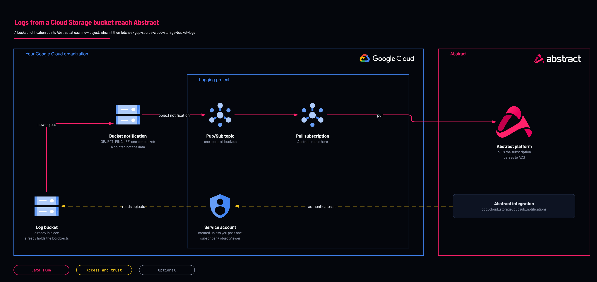

# Logs in a Cloud Storage bucket

<!-- Generated from template.yml by `python -m tools.templates generate`. Do not edit. -->

For logs that are already objects in a bucket, such as a vendor export or an archive being backfilled. The bucket emits an object-created notification to Pub/Sub and Abstract fetches the object; the notification is a pointer, not the data.

**Cloud:** gcp · **Role:** source · **Scope:** project



Editable source: [diagram.drawio](diagram.drawio)

## When to use

A vendor or internal system writes log files to a bucket and cannot stream, or an archive needs backfilling.

**Not for:** Anything that is already a Cloud Logging entry; use the organization sink instead.

## Deploy

[](https://shell.cloud.google.com/cloudshell/editor?cloudshell_git_repo=https://github.com/IamABS3C/abstract-cloud-templates&cloudshell_git_branch=main&cloudshell_workspace=templates/gcp/gcp-source-cloud-storage-bucket-logs&cloudshell_tutorial=TUTORIAL.md)

Or from a shell, in this folder:

```bash
./deploy.sh
```

## Prerequisites

- The bucket already exists and is receiving objects
- A real sample object from the producer
- Scope object_name_prefix; an unscoped config notifies on every object written
- Abstract stores the objects' content only with a parser for their format on this subscription's own configuration; the managed GCP Pub/Sub parser keeps only Cloud Audit Log records

## Cost

Object count rather than size: each object is a notification plus at least one Class B read, so thousands of tiny files cost far more than the same bytes in a few large ones.

## Parameters

| Name | Type | Required | Description | Find it |
|---|---|---|---|---|
| `buckets` | array | no | Buckets to watch, all in bucket_project. |  |
| `bucket_map` | object | no | bucket =&gt; owning project, when buckets span several projects. Each project has its OWN GCS service agent and each must be granted publisher — this is what makes that happen. |  |
| `bucket_project` | string | no | Project owning every bucket in buckets. Its Cloud Storage service agent is the principal that publishes. Ignored when bucket_map is set. |  |
| `log_project` | string | yes | DEDICATED logging or security project holding this pipeline. Not a workload project. Find it with: gcloud projects list. If no dedicated logging project exists yet, create one first with templates/gcp/gcp-foundation-logging-project (set create_project = true). | `gcloud projects list --format='value(projectId)'` |
| `object_name_prefix` | string | no | Scope to a prefix so irrelevant objects never generate a message you then pay to fetch. |  |
| `cmek_crypto_key_id` | string | no | KMS key protecting the bucket, if any. Without the decrypter role every fetch fails with an error that blames Storage rather than KMS. |  |
| `existing_service_account_email` | string | no | Reuse Abstract's identity from the log-export deployment. Empty creates a new one. |  |
| `acknowledge_bucket_sprawl` | bool | no | Required to notify on more buckets than the module's guard allows without acknowledgement. |  |
| `labels` | object | no | Labels applied to every resource this template creates. |  |

## Permissions

- **roles/pubsub.publisher** on The topic: GCS service agent (one per owning project): The notification publishes as the service agent; without it the config delivers nothing.
- **roles/pubsub.subscriber** on The subscription: Abstract service account: Read the pointer.
- **roles/storage.objectViewer** on The bucket, conditioned on the prefix when set: Abstract service account: Fetch the object the pointer points at.
- **roles/cloudkms.cryptoKeyDecrypter** on The KMS key, CMEK buckets only: Abstract service account: Without it every fetch fails with an error that blames Storage.

## Creates

- A Pub/Sub topic and subscription for the notifications
- roles/pubsub.publisher for the GCS service agent of each bucket-owning project
- One OBJECT_FINALIZE notification config per bucket, scoped by object_name_prefix
- A service account for Abstract, unless an existing one is passed
- roles/pubsub.subscriber on the subscription and roles/storage.objectViewer on each bucket, prefix-conditioned when a prefix is set
- Optional roles/cloudkms.cryptoKeyDecrypter on the CMEK key (cmek_crypto_key_id)

## Never touches

- Existing notification configs on the bucket: creating one adds to them rather than replacing them

## Outputs

- `abstract_onboarding`
- `gcs_service_agents`

## Verify

| Check | Command | Healthy when |
|---|---|---|
| The notification config exists and is scoped as intended | `gsutil notification list gs://<bucket>` | One config for the expected topic, event type OBJECT_FINALIZE, and the expected prefix. |
| The service agents that must publish | `terraform output gcs_service_agents` | Each bucket-owning project's agent is listed and granted. |
| A real producer file parses end to end | `gsutil cp <real-sample-file> gs://<bucket>/logs/` | Its contents appear as correctly parsed events in Abstract. |
