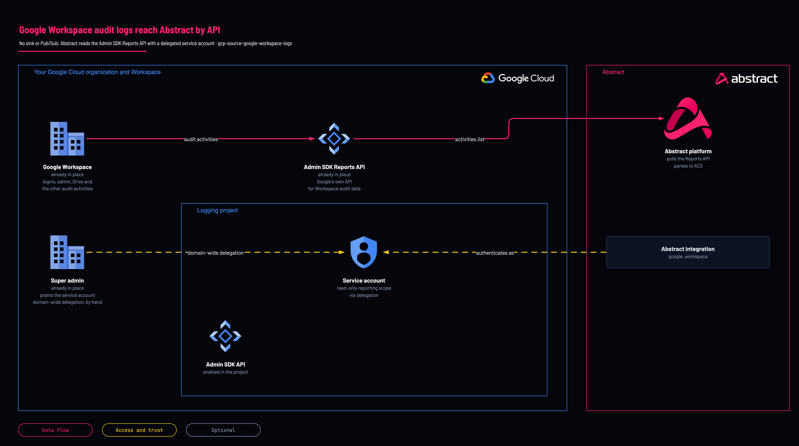

# Google Workspace logs

<!-- Generated from template.yml by `python -m tools.templates generate`. Do not edit. -->

A separate pipeline: Abstract's Google Workspace integration reads Workspace audit data from the Admin SDK Reports API, so no Cloud Logging sink or Pub/Sub topic is involved. Terraform creates the service account; a Workspace super admin then grants domain-wide delegation by hand.

**Cloud:** gcp · **Role:** source · **Scope:** project



Editable source: [diagram.drawio](diagram.drawio)

## When to use

Who signed in to Google Workspace: the identity group covers login, SAML, token, user accounts and context-aware access.

**Not for:** Collecting Workspace logs through a Cloud Logging sink; this template is the Reports API path only.

## Deploy

[](https://shell.cloud.google.com/cloudshell/editor?cloudshell_git_repo=https://github.com/IamABS3C/abstract-cloud-templates&cloudshell_git_branch=main&cloudshell_workspace=templates/gcp/gcp-source-google-workspace-logs&cloudshell_tutorial=TUTORIAL.md)

Or from a shell, in this folder:

```bash
./deploy.sh
```

## Prerequisites

- A Workspace super admin available for the delegation step
- The email of a real Workspace admin for the impersonation subject

## Cost

The data application group (Gmail and Drive) dwarfs everything else; add it only after measuring.

## Parameters

| Name | Type | Required | Description | Find it |
|---|---|---|---|---|
| `log_project` | string | yes | Project that owns the connector service account. Can be the same one used for the Pub/Sub pipeline. Find it with: gcloud projects list | `gcloud projects list --format='value(projectId)'` |
| `workspace_admin_email` | string | yes | A Workspace ADMIN the service account impersonates. Delegation acts as a real user — without a subject the Reports API returns 401, not an empty result. A Google Workspace SUPER ADMIN, used only for domain-wide delegation. No gcloud command lists this — ask whoever administers Workspace. |  |
| `workspace_app_groups` | array | no | identity \| admin \| data \| endpoint \| collaboration \| platform. Individual application names also work. |  |
| `workspace_applications` | array | no | Explicit Reports API application list, overriding workspace_app_groups (for example login, admin, token, saml, drive). |  |
| `workspace_service_account_id` | string | no | Account ID for the Workspace connector service account, separate from the Pub/Sub one so domain-wide delegation can be revoked on its own. |  |
| `acknowledge_high_volume` | bool | no | Required to include gmail or drive. |  |
| `include_directory_enrichment_scopes` | bool | no | Also print the Admin SDK Directory API scopes (admin.directory.user.readonly, admin.directory.group.readonly) in the delegation step. Abstract's Google Workspace integration does not request these scopes today, so leave this false unless another consumer needs them. |  |

## Permissions

- **roles/iam.serviceAccountAdmin** on The logging project: Deployer: Create the delegated service account.
- **Grant domain-wide delegation** on admin.google.com: Workspace super admin: No API or Terraform provider exists for it; a Google Cloud Owner cannot grant it.
- **The two admin.reports readonly scopes, through delegation only** on Google Workspace: Workspace service account: It holds nothing in GCP IAM.

## Creates

- The Admin SDK API enabled on the logging project
- A service account (default abstract-workspace-reader) for domain-wide delegation

## Never touches

- Google Workspace settings: domain-wide delegation is granted by hand in admin.google.com
- Cloud Logging sinks, Pub/Sub and any other pipeline

## Outputs

- `workspace_applications_selected`
- `workspace_onboarding`

## Verify

| Check | Command | Healthy when |
|---|---|---|
| The Reports API answers |  | Events return; a 401 means delegation has not propagated or the admin email is not actually an admin. |
