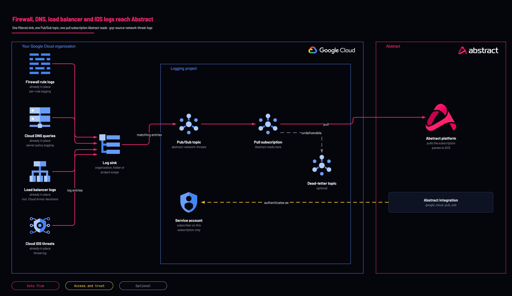

# Firewall, DNS and IDS logs to Abstract: filtered sink

<!-- Generated from template.yml by `python -m tools.templates generate`. Do not edit. -->

Routes firewall rule, Cloud DNS query, load balancer (Cloud Armor) and Cloud IDS threat logs to a Pub/Sub topic for Abstract. Abstract's managed GCP parser does not yet store these logs: it keeps only Cloud Audit Log records, and these are not.

**Cloud:** gcp · **Role:** source · **Scope:** organization



Editable source: [diagram.drawio](diagram.drawio)

## When to use

Network detections need firewall, DNS, Cloud Armor or Cloud IDS logs, and a parser for them is being built.

**Not for:** Expecting these logs to be searchable in Abstract today: the managed parser does not store them.

Not sure this is the right one, or what to deploy before it? Answer a few questions in [the setup guide](https://github.com/IamABS3C/abstract-cloud-templates/blob/main/docs/gcp/GUIDE.md).

## Deploy

[](https://shell.cloud.google.com/cloudshell/editor?cloudshell_git_repo=https://github.com/IamABS3C/abstract-cloud-templates&cloudshell_git_branch=main&cloudshell_workspace=templates/gcp/gcp-source-network-threat-logs&cloudshell_tutorial=TUTORIAL.md)

Or from a shell, in this folder:

```bash
./deploy.sh
```

## Prerequisites

- Logging turned on at each source: per-rule firewall logging, a DNS server policy with logging, logging on the load balancer backend services, and a Cloud IDS endpoint with Packet Mirroring
- A parser for these jsonPayload records on this subscription's own Abstract configuration; until one exists the logs are collected and not stored
- acknowledge_high_volume = true, set only after measuring a 7-day baseline: the default categories are high tier and the plan stops without it

## Cost

DNS query and load balancer logs are high volume and are billed as Cloud Logging ingestion and Pub/Sub throughput. Cloud IDS is billed per endpoint-hour and per GB inspected, and needs Packet Mirroring. Measure a 7-day baseline before acknowledging high volume.

## Parameters

| Name | Type | Required | Description | Find it |
|---|---|---|---|---|
| `sink_scope` | string | no | Where the sink binds: organization Everything, current and future, by containment (recommended). folder All projects within a folder and subfolders. project ONE project (requires acknowledge_pilot_scope = true). sink_scope must be one of: organization, folder, project. |  |
| `org_id` | string | no | Organization ID. Required when sink_scope = organization. Find it with: gcloud organizations list | `gcloud organizations list --format='value(ID)'` |
| `folder_id` | string | no | Folder ID. Required when sink_scope = folder. | `gcloud resource-manager folders list --organization=<org-id>` |
| `sink_project` | string | no | Project to bind the sink to when sink_scope = project. Defaults to log_project. |  |
| `log_project` | string | yes | DEDICATED logging or security project holding the topic and subscription. Find it with: gcloud projects list. | `gcloud projects list --format='value(projectId)'` |
| `acknowledge_pilot_scope` | bool | no | Required when sink_scope = project to acknowledge single-project scope. |  |
| `log_categories` | array | no | Named sources to route from the log catalog. The network threat default is firewall, dns_queries, load_balancer (global external Application Load Balancer, with its Cloud Armor decisions) and load_balancer_regional_internal (regional external and internal Application Load Balancers). |  |
| `platform_log_filters` | array | no | Extra raw logName clauses to route. Defaults to Cloud IDS threat logs (ids.googleapis.com%2Fthreat). |  |
| `audit_streams` | array | no | Cloud Audit Log streams to route. Set to empty by default for network threat focus. |  |
| `acknowledge_high_volume` | bool | no | Required when any high- or extreme-tier category is selected (the defaults dns_queries, load_balancer and load_balancer_regional_internal are high tier). These can dominate the bill; measure a 7-day baseline first. |  |
| `topic_name` | string | no | Pub/Sub topic name for network threat logs. |  |
| `subscription_name` | string | no | Pub/Sub pull subscription name for Abstract. |  |
| `sink_name` | string | no | Log sink name. |  |
| `service_account_id` | string | no | Service account ID for Abstract subscriber identity. |  |
| `retention_days` | int | no | Pub/Sub message retention in days (1-31). This is your recovery window. retention_days must be between 1 and 31. |  |
| `ack_deadline_seconds` | int | no | Pub/Sub subscription acknowledgement deadline in seconds. |  |
| `enable_dead_letter` | bool | no | Send repeatedly failing messages to a dead-letter topic. |  |
| `dead_letter_max_delivery_attempts` | int | no | Deliveries attempted before sending message to dead-letter topic (5-100). |  |
| `custom_filter` | string | no | Override the assembled filter completely. Bypasses catalog compilation. |  |
| `exclusions` | array | no | Sink exclusion filters for known noise (e.g. internal health check probers). |  |
| `labels` | object | no | Resource labels applied to Pub/Sub topic and subscription. |  |

## Permissions

- **roles/logging.configWriter** on The organization (or the folder or project for those scopes): Deployer: Create the sink.
- **roles/pubsub.admin** on The logging project: Deployer: Create the topic, subscription and IAM bindings.
- **roles/iam.serviceAccountAdmin** on The logging project: Deployer: Create Abstract's service account.
- **roles/pubsub.publisher** on The topic: Sink writer identity: granted by this template.
- **roles/pubsub.subscriber** on The subscription only: Abstract service account: Abstract pulls; not publisher, not project-wide.

## Creates

- A Pub/Sub topic (default abstract-network-threats) and a never-expiring pull subscription (default abstract-network-threats-sub)
- A sink (default abstract-network-threats-sink) at organization, folder or project scope routing the chosen categories and the Cloud IDS threat log
- roles/pubsub.publisher for the sink's writer identity on the topic
- A service account (default abstract-net-threat-reader) with roles/pubsub.subscriber on the subscription only

## Never touches

- Firewall rule logging, DNS server policies, load balancer logging and Cloud IDS: it routes their logs and turns none of them on
- Existing sinks

## Outputs

- `abstract_onboarding`
- `effective_filter`
- `selected_log_sources`
- `service_account_email`
- `sink_writer_identity`
- `subscription_id`
- `topic_id`
- `volume_profile`

## Verify

| Check | Command | Healthy when |
|---|---|---|
| The sink exists with the intended filter | `gcloud logging sinks describe abstract-network-threats-sink --organization=<org-id> --format="value(filter,destination)"` | The filter names the chosen categories and ids.googleapis.com%2Fthreat; the destination is the abstract-network-threats topic. |
