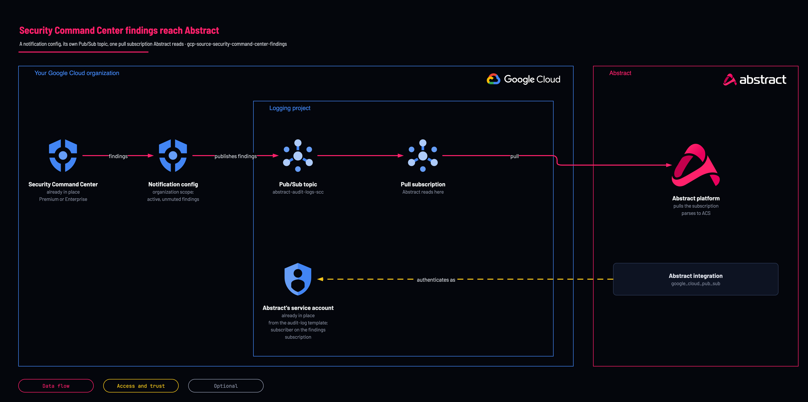

# Security Command Center findings

<!-- Generated from template.yml by `python -m tools.templates generate`. Do not edit. -->

Security Command Center does not flow through the Log Router; it publishes to Pub/Sub through its own notification config, so no sink will ever collect it. This deployment creates that config and a dedicated topic and subscription, reusing Abstract's existing service account.

**Cloud:** gcp · **Role:** source · **Scope:** organization



Editable source: [diagram.drawio](diagram.drawio)

## When to use

Security Command Center Premium or Enterprise is on and its findings should reach Abstract.

**Not for:** As a way to collect audit logs; configure findings as a separate source in Abstract, because their shape differs.

## Deploy

[](https://shell.cloud.google.com/cloudshell/editor?cloudshell_git_repo=https://github.com/IamABS3C/abstract-cloud-templates&cloudshell_git_branch=main&cloudshell_workspace=templates/gcp/gcp-source-security-command-center-findings&cloudshell_tutorial=TUTORIAL.md)

Or from a shell, in this folder:

```bash
./deploy.sh
```

## Prerequisites

- Security Command Center Premium or Enterprise
- Abstract's service account from gcp-source-audit-logs-organization, read from its state (remote_state_bucket) or pasted
- Abstract's managed GCP Pub/Sub parser keeps only Cloud Audit Log records, so findings are collected but NOT stored until a parser built from a captured finding is attached to this subscription's own Abstract configuration (parser pending)

## Cost

SCC notifications are free; Pub/Sub throughput is small (findings, not logs).

## Parameters

| Name | Type | Required | Description | Find it |
|---|---|---|---|---|
| `org_id` | string | yes | Organization ID. SCC NotificationConfig is organization-scoped. Find it with: gcloud organizations list | `gcloud organizations list --format='value(ID)'` |
| `log_project` | string | yes | Project holding the findings topic and subscription. Find it with: gcloud projects list. If no dedicated logging project exists yet, create one first with templates/gcp/gcp-foundation-logging-project (set create_project = true) — do not point this at a workload project. | `gcloud projects list --format='value(projectId)'` |
| `subscriber_service_account_email` | string | no | Fallback when remote_state_bucket is empty. Abstract's identity from gcp-source-audit-logs-organization — reusing it means ONE identity reads every feed instead of several to rotate. |  |
| `scc_config_id` | string | no | Security Command Center notification config ID: lowercase letters, numbers and hyphens. |  |
| `scc_filter` | string | no | SCC streaming filter. The default is active, unmuted findings — muted and resolved findings are noise in a SIEM, and they are the bulk of the volume on a mature SCC deployment. |  |
| `retention_days` | int | no | Pub/Sub message retention in days. This is the entire recovery window: unacked messages older than this are deleted. |  |
| `labels` | object | no | Labels applied to every resource this template creates. |  |
| `remote_state_bucket` | string | no | GCS bucket holding gcp-source-audit-logs-organization's state. Set it and the value below is READ rather than retyped. Empty uses the literal. |  |
| `remote_state_prefix` | string | no | State key of gcp-source-audit-logs-organization. It keeps that folder's original name, 01-organization, so existing state is found. |  |

## Permissions

- **roles/securitycenter.notificationConfigEditor** on The organization: Deployer: Create the notification config.
- **roles/pubsub.subscriber** on The findings subscription: Abstract service account: Pull the findings.

## Creates

- A findings topic and subscription (the log-export names with an -scc suffix)
- An SCC organization notification config, filtering active unmuted findings by default
- roles/pubsub.subscriber for Abstract's service account on the findings subscription

## Never touches

- SCC settings, mute rules and existing notification configs
- The audit-log topic, subscription and sink

## Outputs

- `scc_subscription`
- `scc_topic`

## Verify

| Check | Command | Healthy when |
|---|---|---|
| The notification config and subscription exist | `gcloud scc notifications list --organization=<org-id> gcloud pubsub subscriptions describe abstract-audit-logs-sub-scc --project=<log-project-id>` | The config is listed and the subscription exists. |
